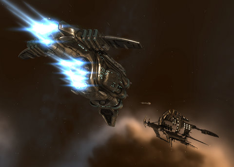

Back to: [West Karana](/posts/westkarana.md) > [2009](/posts/2009/westkarana.md) > [November](./westkarana.md)
# EVE Online: It's Wabbit Season

*Posted by Tipa on 2009-11-04 07:01:39*

Reader Kinolyen pointed out, correctly, that running Minmatar missions wouldn't do much to improve my standings with Amarr and Caldari, who hate me. Since my standings for both are below -2.0, I can't get ANY missions for either faction, and both are just on the verge of sending bullets (of love, no doubt, in the Amarr case) at me whenever I accidentally fly through their space.

It felt really good, though, when in one of the Minmatar missions, I avenged the destruction of a Gallente station. By pirates!

Though my faction with Amarr and Caldari are beyond repairing directly, I did find on the EVE forums where someone said doing missions for factions allied to Amarr and Caldari could indirectly help those standings. So I flew off to Khanid space and started flying Level 1 missions, and just before bed last night, I'd raised standings enough for Level 2 missions. That meant either returning home for another ship -- a distance of 23 jumps there and 23 jumps back with portions of the trip in lowsec -- or just building a new ship out there.

I'd always wanted an excuse to build a Brutix. A pure dps battlecruiser with no room for a decent armor tank and not much chance to put up a fight with shields, either. But the loads and loads of high slots shows that this mean baby wants to get close and give you a hug full of neutrons. It's a PvP ship, and when I'm done raising standings, I'll be using this instead of my PvP Vexor for those kinds of ops.

I'm taking a little bit of a risk saying what section of space I'm flying, since we were all shocked last night to find that OtakuDyne has been wardec'd by the [Universal Peace Operation](http://killboard.eve-ivy.com/?a=corp_detail&crp_id=37095), a mercenary corp that gets hired to make war on other corps. Their corp info says they are friendly to CVA but [CVA says otherwise](http://www.cva-eve.org/kos/index.php). 

C'mon, did someone take offense at my digs against the Caldari yesterday and wardec my corp because of me? If so, that's really petty, but you can leave the rest of my corp alone and come get me in Khanid space, if that's the case.

Otherwise, nobody has a clue why we're wardec'd. The UPO diplo officer wasn't on last night, and the one UPO pilot who would talk to us wasn't initially aware that we were at war, but did explain about their mercenary status.

Red got a list of the names of most of UPO's 22 members so we can keep an eye out for them. I kinda feel, though, that I should head back down to Sinq Laison space and just be ready in case UPO starts harassing folks and we want to take a stand. Cassric has offered the aid of Holowan if the battle strays into their Providence home, and tonight IS nullsec ops night, so who knows. Maybe we'll get a decent battle or two out of this.

But dang, at least be decent and tell us why, k?

## Comments!

**[Akura](http://evemonkey.wordpress.com)** writes: often mercenaries get paid to wardec 0.0 alliances/corporations to disrupt empire logistics in preparation for an offensive in nullsec by those that employed the mercs.. at least, thats what happens to my alliance quite a bit - the monthly privateers wardec has become something of a running joke.

Welcome to 0.0 :-)

also - have you tried training diplomacy - if you get it to lvl 2 or 3 it should make up for your -2 standing and allow you to run lvl 1 agents for those factions you have slighted.

---

**[Tipa](https://chasingdings.com)** writes: My standings are actually below -5 with both factions; my Diplomacy 2 is all that keeps me alive in that space. I'm not sure if even getting to Diplomacy 5 would get me above -2... it MIGHT. I just dunno....

---

**[Shirrath](http://shirrath.blogspot.com/)** writes: If all else fails, every Empire faction likes the Sisters of Eve. Reaching them safely can be a problem, though.

---

**[Magson](http://phoenq-magson.blogspot.com)** writes: There's a Sisters of EVE station in Rens in Minmatar space. All 4 faction grant positive faction for work done for SOE, but they only offer Level 1 missions in Rens, so getting standings up with them would be a LONG slog. The rest of the SOE stuff is all in lowsec and in NPC nullsec -- hard to get to, but I'm told it's fairly worth it, if the standings are what worry you most.

I'm told you can also buy tags for a faction and turn them in at data centers in order to jump standings up as well, but I've never tried that and don't know where these data centers are.

FWIW, I'm told that diplo 5 will take a -5 down to a -2, so if you're below -5, the diplo skill won't help anymore, though it should make it easier to restore a minimal standing, assuming you can get the related scores up from working for allied groups like you're now doing.

---

**Maineiac** writes: I'm currently running SOE L4 missions in highsec and it's completely possible to get up there without going into lowsec. The catch is, the agents are in Caldari space. The Forge to be exact. There are level 1 and 2 agents in Airaken and a level 4 Q0 agent in Osmon. I kept running L2 missions until I was eligible for L4's but it paid off in the long run.

Now I have access to a L4 Q17 SOE agent in Gicodel, highsec Gallente space.

---

**[Toldain](http://toldaintalks.blogspot.com)** writes: Some study of [this](http://killboard.eve-ivy.com/?a=corp_detail&crp_id=37095) is instructive. All their last 10 deaths have been in CVA space (KBP7-G and XHQ-7V). All their last 10 kills were in the Dodixie system, and in the last couple of days. I think they are "friendly" to CVA in the sense of willing to be cat's paws. They will take contracts from CVA corps, while remaining officially KOS to CVA. 

We are not being singled out. They are killing lots of other corps. We just made it on to someone's list. I seriously doubt that they will hunt us down, especially while far away. 

Sadly, trips to Dodixie have been highly profitable for me, and I'll probably have to give them up. One is extremely vulnerable while docking.

---

**[Callan S.](http://philosophergamer.blogspot.com/)** writes: What's your overall goal in playing EVE, anyway, Tipa? With WOW you said it was to take down the old Onyxia and finish MC. What's your goal in eve?

---

