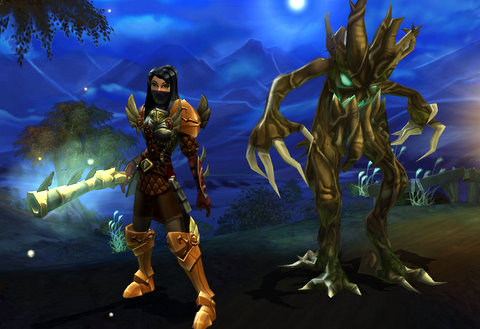
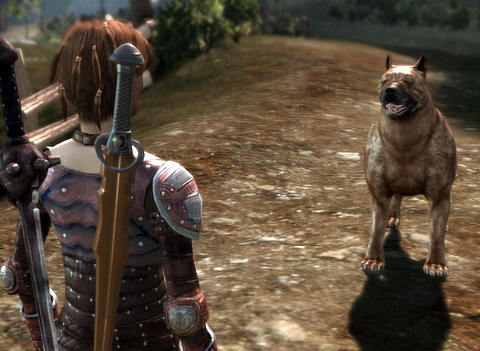

Back to: [West Karana](/posts/westkarana.md) > [2009](/posts/2009/westkarana.md) > [November](./westkarana.md)
# Weekend Gaming: EVE, Torchlight, Dragon Age

*Posted by Tipa on 2009-11-09 08:34:28*

I'd promised myself I wasn't going to play Dragon Age: Origins until I'd finished Torchlight all the way through. Not that this was a huge burden, but I do hate leaving good games unplayed just because another game found its way into my computer.

I knew I was getting to the end of my quest to thwart the power of Alric, Ordrak and the power of Dark Ember when I hit the Black Castle far, far below the shaken inhabitants of Torchlight. You want epic loot? EVERYTHING is epic in the Black Castle. Epic Common Sword. Epic Worn Shoulderpads. Epic Broken Dagger. Epic Clump of Kitty Litter :) All the valueless, vendor-trash loot was epic! The final battle against the awakened Ordrak was satisfyingly, er, epic.

The Vanquisher was a very satisfying class to play, though once I got the two big AE abilities, Explosion and Rain of Arrows, I never again was in much danger. Perhaps I should have been playing in Hard mode.

I started a new Alchemist, but I just wasn't feeling it. If I do start over, it will be as a Vanquisher, the Rogue/Dart-using kind.

It's clear that when Torchlight becomes an MMO, it will be very close to Mythos in nature. A mix of random adventures and set pieces in a world where you never need group. I never grouped once in Mythos itself. I wanted to, but people were very much more interested in rushing through the game, checking off all the Achiever boxes on the form.

I'll likely download Torchlight's level editor tools, but as it stands, I feel it would be difficult to tell a real story in Torchlight. As a quick hack n' slash diversion for an hour or three, it can't be beat.

I biked down to Best Buy Saturday to pick up my pre-order copy of Dragon Age: Origins. I needn't have bothered pre-ordering; there were no special bonuses for doing so, and I had to spend half an hour in the customer service line because I'd brought the empty box they give you, but not the receipt. The box did come with the Stone Prisoner quest code, as well as a trial code for Warhammer Online, which I consider a cruel trick.

Not because WAR is a good or a bad game; I've never played, I have no idea. Just that on the one hand, you have a Story game like DA:O, and now you're trying to get people to try an Achiever game like WAR. I'd have appreciated more a code for Mass Effect or something.

I accidentally switched my forest elf from the character creator from Rogue/Archer to Warrior while pressing buttons randomly. I didn't get far before I understood why I don't play warriors. I like sneaking around. I restarted as a city elf Rogue, confident the game would supply me, as it did in Dragon Age Journeys, with plenty of burly meat-shields to stand between me and danger. And it does! The real problem is forming emotional attachments to those lovable lunks. It's sad when they, inevitably, meet their doom. I cry every time I search their cooling corpses for loot.

Hey, I'm a rogue. Plus, you need SOMEONE to open up all those locked chests and doors.

I am loving their over-the-shoulder view. If Neverwinter Nights 2 had managed it, 90% of my frustrations with that game would have been forgotten. I LOVE that WASD works. Yes. Very happy with character control, and when I switch characters to give orders, I am confident the characters I am not controlling will be doing SOMETHING useful. The Tactics screen is a big help, here.

Almost every battle is a wipe, at first. Always the same trend. I try to be smart and attack the most vulnerable enemy, then they all rush me, I get an understanding of their tactics, we all die, then I restart the fight and we win. I did have a lot of fun in the Tower of Ishal once I realized the lesser darkspawn had no understanding of DOORS. Open door, let an enemy or two through, close door, kill, repeat. The mage always wanted to be meleeing, though -- I had to position him manually FAR from the fight so he would cast SPELLS.

Both the city elf and forest elf origin stories lead to your character joining the Grey Wardens, a quasi-independent multinational band of warriors joined by a mystic bond. I imagine whatever the origin, every character will find their own reason to enlist.

So anyway, I don't want to give spoilers, but there's not much surprising that happened. Some twists could be seen three miles away, at night, in a heavy fog. Why all evil characters must give themselves away by speaking in an evil tone of voice, I don't know. At least Sauron took the trouble to seem like a decent, stand-up kind of guy when he was twisting the Men of Numenor to his service.

I was overjoyed to meet the dog I'd saved back at the ruins along the way. [I named him Barkspawn](http://www.penny-arcade.com/comic/2009/11/6/), of course.

I'll definitely be picking up Bioware's level editing tools. I am already mentally taking notes for a Stout Henry adventure in this war-torn world.

Based on suggestions on how to raise my standings with Amarr and Caldari, I stopped taking missions to kill them. So, that was step 1. Step 2 was finding people who liked them, and helping them out, hoping they would pass the word. Life in Khanid space doing courier missions into lowsec for Khanid Transport was ... boring, at best. My first storyline mission with them netted me only +0.04 in standings with Amarr and Caldari. I calculated it would take me nearly a hundred missions to raise my standings enough so that I could begin taking Level 1 missions from those factions.

Okay, kill me now.

I'd heard from many that Sisters of EVE would be a more exciting path to friendship, and SOE liked me after that epic arc I did as a newbie. Liked me so much that they would offer me Level 3 missions. I found an outpost of theirs in marginally highsec space, and the very first mission the good Sisters gave me... was to destroy Amarr ships.

Sigh. Kill a few hundred Amarrians and suddenly I'm Murder, Inc. 

I declined that one and they gave me a few good kill pirate missions (but wait! Now the PIRATES hate me!) and a few courier missions into lowsec. Well, at least there are SOME combat missions. Combat missions mean ISK. I need ISK. More than I need standings.

I've lost all desire to have the Amarr and Caldari love me. I'll just stop killing them. For now.

Our Wardec should be over in three days or so. I've never seen any of Universal Peace Operation anywhere. They are the worst ever at hunting us down and killing us. By Saturday, I cared so little that I was hauling trade goods all over the galaxy in my Iteron V, where I had more to worry about from the jerks who sit at stargates and scan every incoming industrial ship for loot, presumably to set up an ambush if they like what they see. That took autopiloting off the table.

One of the directors of our corp suggested that, after the UPO non-threat abated, that we form a permanent war with the corp of a friend of his, so that his friend would have ships to shoot at. I believe the words the director used was, "he might hunt you down if he's bored." I fail to see how anyone but his friend would benefit from this. I don't mind the threat of being ganked when I am in low or null-sec. I expect it. But when I am just minding my own business, running missions for loot and cash in high-sec, I do not want to have to deal with random gankers in tech 2/3 ships coming after me because they are bored. I have real trouble understanding why I am paying taxes to a corp that wants me to be the duck in a firing range.

So if he DOES go through with this, I told him in no uncertain terms that I would be leaving the corp. Both he and his friend live in nullsec. If they want to kill each other, more power to them.

Anyway, off to work :) Hope your weekend went well!

## Comments!

**[Magson](http://phoenq-magson.blogspot.com)** writes: Warhammer doesn't need a trial code anymore -- it's an unlimited length trial up through Tier 1 (level 11 is the cap) anymore. You can't send mail or access your faction's capital, but other than that, it's the complete game (I'm told -- I haven't seen a dungeon or anything like that yet). Many bloggers I've read indicate they feel T1 RvR is the most fun anyway and when you get RvR flagged it sets you to level 11 for the duration of your flag in order to be "fair to the newbies" so you can jump right in from minute 1. Well... more like minute 10 if you ran straight to the RvR area from the start point and knew right where you were going.

Totally agree with you about not wanting to be a duck on the firing range while in hi-sec. I'd leave that one if that happened for sure.

---

**[Callan S.](http://philosophergamer.blogspot.com/)** writes: Yeah, sometimes people get odd thoughts in their head and the only reason that works is to seperate away from them. Sometimes people just fail to think what it'd be like to be in the other guys shoes, and think something is just a great idea because hey, they wont be the duck.

And is it just me, but does anyone else wonder about the pirates and how they actually earn a living? Or why they don't give up? They just get beat all the time. I presume they have the same immortal clone technology as PC's (which is something else that grates, actually).

---

**[Tipa](https://chasingdings.com)** writes: Well, the mission always tries to explain the reasons for their nefarious actions. *I* don't get why they just don't hire capsuleers with their largely-crewless but higher performing ships. Even in Level 4 missions, any player could win a 1v1 with any given enemy.

---

**Cj Didge** writes: Yeah that decision by your ceo is an odd one, "yeah thanks for being in my corp and my friend (alt?) is happy also because you’re providing his entertainment."

---

**[milkfilk](http://ubernub.com)** writes: I know what you mean by leaving games unfinished. I've just gotten through the story in Torchlight and am in the Shadow Labs. I don't know if this is the endless dungeon but I'm grinding along for some set pieces. Before I finish up and put it away, I'm going to try out some of the weirder mods. I haven't started Dragon Age, a friend and me have been trying to finish Baldur's Gate II for about 7 years (obviously not playing alot), it's been like a laughing stock of unfinished business. I heard that Dragon Age is a spiritual successor to BG and you could hear a deflating sound.

GL with your backlog!

---

