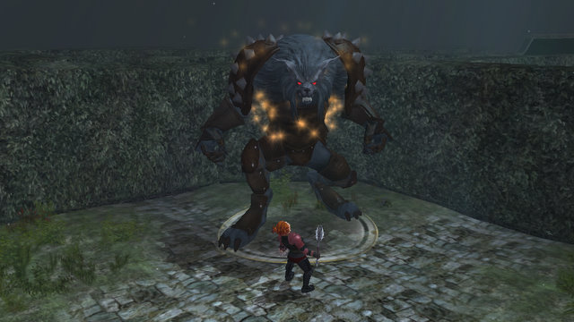

Back to: [West Karana](/posts/westkarana.md) > [2009](/posts/2009/westkarana.md) > [November](./westkarana.md)
# EQ2: Nights of the OMG AAAAAGH Dead

*Posted by Tipa on 2009-11-10 08:04:48*

EQ2's "Nights of the Dead" Halloween event ended last night. I've been meaning for weeks, ever since I fixed my second computer, to get back into the game now that I could two-box again. I really wanted to try the new hedge maze adventure!

This guy on the Nektulos docks was making all sorts of waa waa woe is me sounds with a lot of dry heaving. I thought he looked like a faker. Dera thought I said he looked like a [fakir](http://en.wikipedia.org/wiki/Fakir), and demanded that the guy start walking barefoot over some hot coals and be smart about it. So then I thought that Dera wanted him to be smarter and I was totally confused, until she explained she was using "smart" in its meaning of being prompt.

It was tough to talk about etymology with all this guy's caterwauling and retching, so we moved on down the beach a bit to discuss it further, and ran into a yogi who wanted to talk about Mister Malingerer. He (or she) insisted the faker fakir was, in fact, really sick, which was odd because we'd entirely forgotten about him and certainly wasn't bringing his case to random strangers. Still, she (or he, with Erudites it is impossible to tell) said she knew of a universal cure that might be able to help him.

"LOL," laughed we in that irritating Internet style, "only death cures all ills! There was even [a Merlin episode that made that point](http://www.mania.com/merlin-remedy-to-cure-all-ills_article_116267.html) last season!"

The androgyne just gave us a bleak stare. "No," she hissed. "I DON'T mean death!"

Mister "too sick to work but not too sick to send people to their deaths" Malingerer sent us to investigate a mysterious hedge maze that had sprung up from nowhere some weeks past. In the center, he insisted, would we find his cure.

Turned out this was a solo instance (whoops!) so I had to do it twice.

It's a hedge maze filled with random death and shinies that kill. Occasionally you come to a house hidden in mist and terror and must beg for treats (or open chests that contain same). One chest had a Frictionless Piece of Eight, the most powerful charm EVER CREATED -- no level restrictions and it could be traded! They weren't kidding about it being frictionless, though, as it slipped through my fingers, through a crack in the porch, where it joined a softly glowing pile of OTHER Frictionless Pieces of Eight, as they frictionlessly slid over and around each other, seeking the perfect level.

This made me so mad that I let rage take control and I became a WEREWOLF! Able to take on Epicx2 monsters BY MYSELF!

If only there was an Epicx2 monster around to try it with...

Oh, hai, mysteriously sick person! Turns out you weren't sick at all -- you were just a WEREWOLF. Have at you, etc! Eventually I killed the thing, and it gave me some lockpicks that go to a chest that EQ2 Wiki assures me I wouldn't be able to see until I did all the other Halloween events from other years all over again first.

I went back to the seer on the beach and said we killed the guy. She posed dramatically and shouted, "A-HA! DEATH is the remedy that cures all ills!" And we were like, dude, we said that from the beginning, and it's a common phrase that is hundreds of years old. So she threw some cloaks and wall hangings at us and told us to go away.

Well, whatever.

It was a really fun adventure, replete with some cool appearance armor and a collection quest. If only I had started the adventure before its last night, I would have a chance to see how it all ended... but, oh well! There's always next year.

## Comments!

**[kaozz](http://www.ectmmo.com)** writes: Way to go butterfingers! Doh.. I dropped it too about .. well we won't say how many times. I really loved that instance, I ran it a couple of times yesterday just to get another Raven plushie.

---

