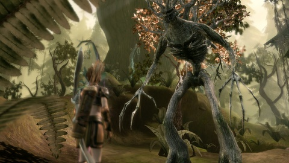
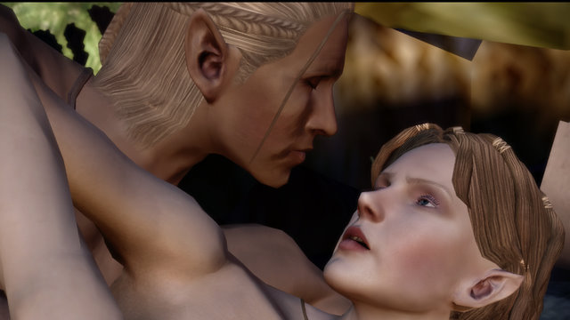
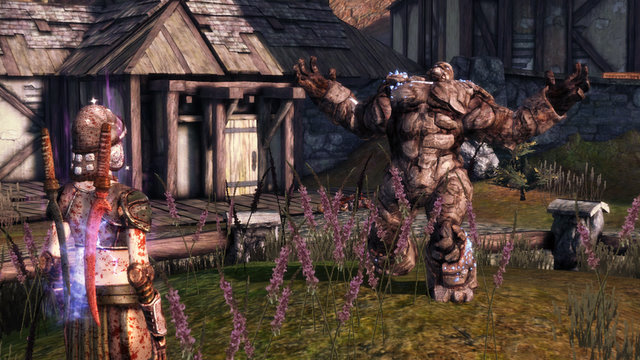
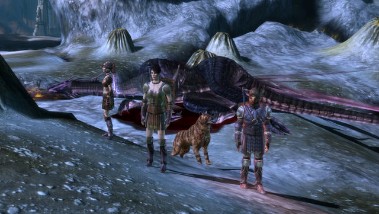
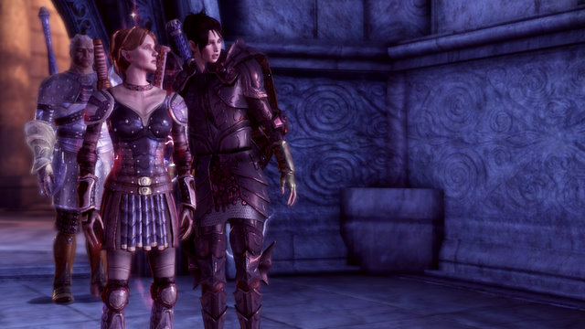
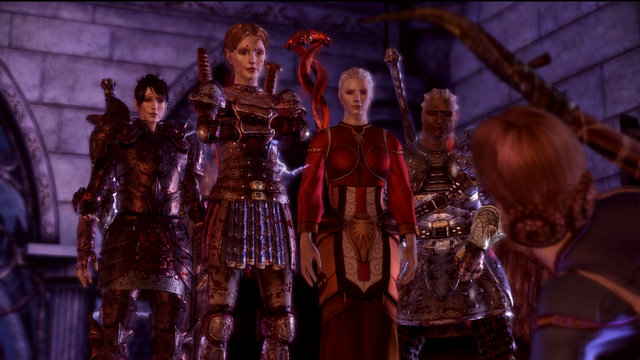
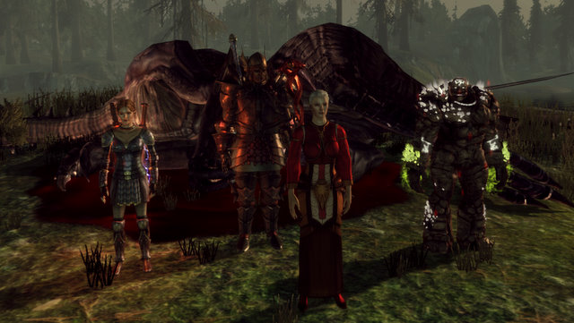

Back to: [West Karana](/posts/westkarana.md) > [2009](/posts/2009/westkarana.md) > [November](./westkarana.md)
# Dragon Age: Origins Picture Diary

*Posted by Tipa on 2009-11-16 07:56:49*

I have about 27 hours into Bioware's Dragon Age: Origins, and have explored about a third of the world. Having enlisted the aid of Arl Eoman, the Circle of Magi and the Dalish Elves to my cause, I am now exploring the depths of Ozrammar, hoping the dwarfs will honor their ancient treaty.

My party is in the vicinity of levels 13-15; it's really nice that characters you don't include in your party still level up along with the main character, always a level behind. My main character, Tipa the City Elf Rogue, has both of her subclasses now -- bard and duellist. I haven't trained any of the bard powers, but I am well down the track for duellist, a really excellent choice for how I play.

Morrigan has left behind her shapeshifter roots and taken on the role of the arcane warrior, a melee mage. She is responsible for crowd control and nukage. She was the healer before we acquired Wynne, and has so many things to do that in fights, normally I control Morrigan's every move. Arcane Warrior is amazing; if I play through again, I'll likely make it my main.

Having toyed with Alistair and DLC golem Shale as tanks, I've largely settled in with Sten. Leilana was a mainstay of the party until we got Wynne; we needed a dedicated healer more than another bard, and the party stats exposed her for the poor dps she was. Since I'm handling all the roguish duties, Zevran has never had a party slot, though he did finally teach me the assassin ways. Barkspawn helps out now and again.

After the jump, some pictures from my journeys. May (or may not) contain spoilers.

A friendly treant in the Brecilian Forest

Meeting Zevran the Assassin

Meeting Zevran the Assassin again... later...

All this Tin Man needs is an oil can, a heart, and a control rod

I'd missed the signature dragon fight in the Ruined Temple (not a spoiler, this fight was in the press previews before release), so I went back and did it. It was VERY worth it. Alistair, Barkspawn and Morrigan joined me; Alistair got the kill shot. I and Barkspawn died during the fight. Morrigan's heals and Cone of Ice made it possible.

Although Morrigan can wear massive plate, I just let her wear this massive dragonbone armor until Sten had trained his strength up enough to use it. Morrigan currently wields a sword and shield alongside more traditional mage robes and light leather in order to stave off fatigue and preserve mana.

The A-Team

Every dragon fight is different and difficult. They can get you with a bite, a breath weapon, front and rear legs and the tail. Most fights, I control Morrigan in order to keep the crowd controlled. With this fight, I was keeping Tipa out of harm's way, looking for openings to rush in and go all Duelist on the dragon, and I was rewarded with the kill shot. Dragon kill shots get a pretty unique animation that you just have to see for yourself.

The second dragon kill crew. I don't think anyone died in this one; I'd learned a lot about keeping people out of harm's way, and of course, we had Wynne this time. Tipa is in Superior Drakescale Armor, Sten is now in the Massive Dragonbone Armor that Morrigan had been sporting, Wynne is still too new to get any gear for her own, and Shale steps in for Morrigan for some old fashioned Clobberin' Time.
## Comments!

**yunk** writes: I wish the dog was more useful, I'd bring him everywhere, It is fun having someone that buffs and debuffs and just kills stuff without complaining. I named him Pluto after my dog :) But once I had enough npcs I just bring them. 

I am torn between being good and bad, my first guy is a warrior, so intimidate works better than persuasion, but most intimidate choices make my party angry and morrigan happy :) But at least the "bad" choices aren't stupid simple bullying.

---

**[syncaine](http://syncaine.wordpress.com)** writes: Dwarf area is awesome. Just finished it, level 18 I believe. The lore is fantastic (how the dwarves view the Blight really stuck out for me), you get another cool character, and the references back to Dragon Age Journeys is nice too.

---

**Joscellin** writes: I found the dog to be very useful in my first playthrough.

Dread Howl is a great aoe stun, and Overpower is just... overpowered

---

**[Mythokia](http://perpetuallybored.com)** writes: I didn't have a healer for the Flemmeth fight because I killed her earlier. Took about 20g worth of healing potions to take her down in my all warrior party.

---

**[Tipa](https://chasingdings.com)** writes: Oooo spoiler alert, I was not giving too much info about just what fight that was :P

---

**[jaffa_tamarin](http://dailyanimals.net)** writes: My default party is me (warrior), Morrigan (crowd control and heals), Zevran (obligatory rogue-type), and Digger (dog). I don't care so much about optimal party setup as I do about the RP -- Digger's my dog, dammit, and I'm not going to be leaving him behind.

I'm a little bit annoyed at the party size being so small, so once you've got the two primary plot characters (Morrigan and Alistair), and dog, the party is full and you have to start swapping them out to use any of the secondary npc's.

---

**yunk** writes: I'd appreciate any advice on what people use for the tactics entries. My party likes to run around and not go where I want.

I'm using Alistair right now to tank (level 7) and have him protecting morrigan when she's attacked, and Leilana attacking whoever Alistair attacks, but he doesn't seem to do well, (maybe I need to get taunt skills later he just has threaten) And Leilana likes to attack people from the front, though i might just make her an archer.

---

**[kaozz](http://www.ectmmo.com)** writes: Lovely shots there Tipa. I still have yet to try this one but it looks so fun! When I play an offline game I tend to play Dungeon Siege, maybe when I get the craving again for an offline I'll pick this one up. This or Torchlight... they both look awesome.

---

**quimbius stormfyre** writes: This games on my wishlist along with Borderlands and Demon's soul so many interesting games coming out.I'm only playing consol`e games right now have both the 360 and ps/3 .I think I'm going to be busy this winter.On one of my EQ breaks for a bit now.

---

**[Tipa](https://chasingdings.com)** writes: EQ is so daunting to get back into once gone....

---

