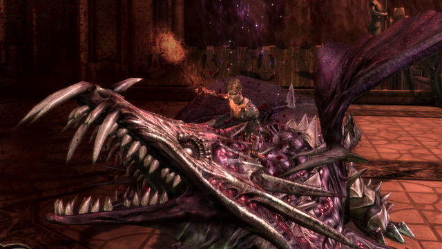

Back to: [West Karana](/posts/westkarana.md) > [2009](/posts/2009/westkarana.md) > [November](./westkarana.md)
# Dragon Age Origins: Review (no spoilers)

*Posted by Tipa on 2009-11-21 10:05:59*

My character getting the kill shot on the Archdemon. Not a spoiler -- no matter what you do, it's gonna be you vs the Archdemon at some point, and you will kill it. Well, not 100% sure if it's going to be you that does it all the time.

That's the take-away lesson about Dragon Age: Origins. No matter what twists and turns your story has, you're going to end in the same place. Was it worth the trip? It definitely was. Would I do it a second time? I don't know.

After you finish the game and click through the stories of what happened to all the main characters once the main plot ends, your timeline is set to just before you confront the Archdemon, and your entire crew is waiting for you once again at the campsite, ready to take on some DLC.

But why? Why do I need to buy Warden's Keep to get some armor and stuff when the Archdemon is already defeated? Why do I need to return to Ostagar to get the old king's armor when the Archdemon is already defeated?

The country of Ferelden is a country caught in a bind of its own making. The various factions -- the humans, the mages, the dwarfs and the elves -- are all paralyzed by the all-consuming Blight, and without your help, they are powerless to set aside their own differences and unite to cleanse the surface world of darkspawn. In every case, you will find some solution that will allow them to move on. How that's done is more or less up to you. You can use the force of your own personality to bring people together, or root out the cause of their problems and settle them. You can become as dangerous to Ferelden as the darkspawn, if you like.

You can even use the threat of the Blight to take control of the entire country.

Most of the time, though, you'll be grouped with three characters of your choosing, chosen from the holy triumvirate of Tank, Healer and DPS. Each character has a dizzying number of abilities learned from the talent tree of their own class, plus up to two specialties that add a unique flavor to the mix.

You'll soon find a magic combination of characters that work best with your style. This is the best part of the game -- figuring out the key combination of abilities that end fights fast. My main, for instance, was a rogue. She would pull mobs with arrows from afar, and as they drew within range, the mage would insta-sleep them, then follow that up with a continuing AE damage/paralysis spell. DPS would take them down, and that was it for normal fights. Boss fights required different strats, but it's nearly certain that the strategy you eventually settle on will be uniquely yours.

You won't always have your friends by your side, though. Some events and certain puzzles separate you from your companions, and you'll need a whole new strategy for those.

Puzzles! Dragon Age: Origins has dozens of puzzles, from sliding blocks to mazes. I don't recall finding a mirror puzzle anywhere, but I may have just missed it. One puzzle put my character naked in a locked cell with no gear or help. That puzzle seemed uniquely made for a rogue. I almost got through the entire thing before I found out that I could have gotten my gear and weapons back early on if I'd been more observant. Rushing an officer with nothing but underwear and a borrowed long sword -- and winning -- was worth the embarrassment :)

So. the DA:O verdict: It swallowed my gaming time for the couple of weeks I needed to finish it. It's challenging, but not so challenging that you will need cheats or spoilers to finish it. Great story, good graphics. Well, the blood spatters all over everything were comically over the top. I turned them off for awhile, but decided to leave them on eventually because it looked so ridiculous.

While the story is a big win, the combat gets tedious and repetitive. Aside from those times when you cannot bring your go-to guys to a battle, the constant encounters offer nothing new from one to the next. Toward the end, the game even ramps DOWN the difficulty of the mobs so you can heroically wade through crowds of mobs without taking more than a scratch.

Each character has a tactics screen, determining their default actions if you choose not to control their every move. Despite spending a lot of time fiddling with the tactics screens, I'd often find my tanks refusing to fight, or my mages running in to melee. The tactics worked well enough for MY character, so most of the time MY character would be running on autopilot while I controlled the other three characters by hand. Left to themselves, my mages would blow all their mana as soon as they possibly could. That wasn't cool.

Beyond combat, your characters all like or dislike you to varying amounts. They'll do what you say as long as they are in the party, but they may disapprove of your actions and eventually choose to leave if you don't take care of their needs. Their needs for gifts, mainly. You can find or purchase gifts appropriate for every character to improve your standings with them. If they like you enough, they can unlock subclasses for you, give you additional side quests, or even want to get with you. I admit it, I had a fling with elf assassin Zevran. And I even took flack about it from the other characters, who would complain we were keeping them awake at night, and did I really want to build my life around that of a hired killer?

Bioware has already released two bits of Downloadable Content (DLC) -- the Stone Warrior quest which gets you a golem for your party (and came with the game box), and the Warden's Keep quest, which apparently gets some new armor and maybe some custom abilities. Though with the Blight defeated, why? Clearly what I had without it was good enough. The Stone Warrior quest DID have that cool sliding block puzzle, and I'm always gonna raise my hand for one of those.

So to recap, here are the lessons DA:O taught me:

1) Naked or mostly-naked women are probably evil.
2) No matter what path you take, you cannot avoid your destiny
3) Sex is probably a bad idea, all things considered.
4) All idols have feet of clay.
5) Nobody can solve your nation's problems better than a young, untrained stranger.
6) Even if you never talk, people know what you meant.
7) Dog loves you more than anyone.
8) All the good looking armor is massive plate.
9) Enchantment? Enchantment!
10) Nothing says "Whoa! Slow down!" like a Cone of Cold.

## Comments!

**[Ysharros](http://stylishcorpse.wordpress.com)** writes: Great review, and matches my path through the game (thus far) almost exactly, maybe because I'm also playing a rogue main. I have only one thing to add -- oh wait, too.

1. Alistair is apparently "not that kind of girl" (though maybe he just doesn't like me enough).

2. Enchantment! (Thank god for ESC to cut repetitive NPC babble short! I love most of the dialogue, but the whole "Hear me speak for 30 seconds before I open my shop to you!" gets really old, really fast.)

---

**[Ysharros](http://stylishcorpse.wordpress.com)** writes: Bah. TWO.

/slap self

---

**[Mordiceius](http://www.mordiceius.com)** writes: The point of the DLC is just to add additional depth to the journey.

Sure, it is not necessary but would you rather have DLC that was necessary to get the full story? I would rather have a full game and then some DLC to enhance the story rather than an incomplete game and having to buy the rest of the game via DLC to finish the story.

---

**PeterD** writes: The DLC really has little to do with defeating the Archdemon. Yes, you've already defeated the Archdemon, no you don't need that stuff to do it. If you enjoyed playing the game though, is there really any reason not to pick up some DLC to experience some more content? Warden's Keep is more than just a quest and a suit of armor. There are a couple of quests and you essentially establish a base of operations with additional vendors to buy and sell stuff. You also get to learn more about the history of the world, which is possibly worth it if you enjoyed the lore of Dragon Age.

From the sounds of things, DA offers a lot of replayability -- your playthrough is sounding pretty different from mine. I'm playing a Mage and many of my quests have played out differently. I also didn't get to do the block puzzle during the golem quest, I made a choice that removed that option :(

I haven't beaten it with my Mage yet, but I'm looking forward to playing through again with a Warrior, and maybe again with a Rogue (we'll see). I'm currently on an MMO hiatus (more or less), and Dragon Age is filling my time admirably. Once I'm done with it, I'll get back to Torchlight. By then it'll be February, and maybe I'll try STO. We'll see.

---

**yunk** writes: I have been saving before anything that looks big so I can try it a few different ways, which I guess limits the replayability (I can't wait to see what happens!). I have a hard time replaying things, other people put it on harder difficulty, I usually put a replay on easy cause I'm just looking around. I'd like to try and make a blood mage though. I just have a 2h berserker, maybe he'll go reaver.

---

**[Tipa](https://chasingdings.com)** writes: Considering how hated blood mages are, that might just be the way to go if you're playing on "evil" mode :)

---

**[Links of the week &laquo; Welcome to Spinksville!](http://spinksville.wordpress.com/2009/11/22/links-of-the-week/)** writes: [...] through earlier, but haven’t had time yet to marshall my thoughts. In the meantime, check out what the effervescent Tipa has to say in her DAO [...]

---

**Longasc** writes: Really nice recap list. I would not have minded spoilers, they usually make me more hot for a game than I already am, but I am probably in a minority in this regard.

---

**[Tipa](https://chasingdings.com)** writes: I'm not really sure there CAN be spoilers. Your starting and end points are fixed -- like in any hero journey, you start out weak and end up defeating the bad guy.

---

**[We Fly Spitfires](http://blog.weflyspitfires.com)** writes: Awesome review :) I just picked it up for my PS3 on Friday so been playing it slowly.

The only thing that's *really* bugged me so far is that I made my character to be an old, ugly balding man... and then I started the game and it turned out the story wanted me to be a young kid! Huh? I look older than my "dad"!!!

---

**[Dragon Age PS3 - First Impressions - We Fly Spitfires - MMORPG Blog](http://blog.weflyspitfires.com/2009/11/24/dragon-age-ps3-first-impressions/)** writes: [...] couple of good, thorough and insightful reviews, I’d recommend both Tobold’s review and Tipa’s over at West Karana.  Their reviews are for the PC version of the game though whereas I bought the Playstation 3 [...]

---

**[Bronte](http://arewenewatthis.wordpress.com)** writes: Fantastic review my friend. Very entertaining to read, especially #9 in your list above. That kid cracks me up.

You spoiled the ending though! We have to kill the Archdemon? WHAT?

Just kidding.

---

**[The End of an Age&#8230;a Dragon Age that is! &laquo;](http://themeatshield.wordpress.com/2009/11/25/the-end-of-an-age-a-dragon-age-that-is/)** writes: [...] over at Hadcore Casual had some of the same thoughts as I do, and Tipa at West Karana also had some more thoughts in her review of the game. Don’t get me wrong, I still think this is a great game and I [...]

---

