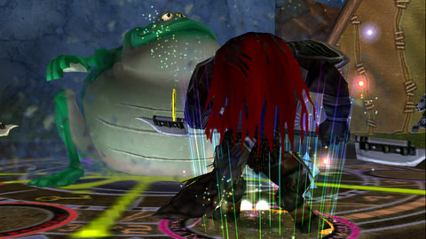

Back to: [West Karana](/posts/westkarana.md) > [2009](/posts/2009/westkarana.md) > [November](./westkarana.md)
# Wizard101: Mirkholm Keep

*Posted by Tipa on 2009-11-21 21:42:52*

The dynamic duo was on the prowl in Grizzleheim once more. The wolves of Mirkholm Keep, once at peace with the bears, have had their trust betrayed by raven lies, courtesy of the evil Munin. Munin was one of two ravens that the All-Father, Odin, used to keep tabs on the world. Even though he only had one eye, he managed to still keep the whole All-Seeing title by sending Munin and his brother, Hugin -- Memory and Thought -- around the world every night so they could report back all the things they'd seen.

But that piece of villainy had to wait. Because Marissa had just turned level 35, and that meant a change of clothes.

Tara had been wearing a set of the good stuff, the crown clothes from Mooshu before KingsIsle rethought the whole idea of just selling the best gear to people and replaced it with gear that was third rate, second rate at best. When she finally got the good stuff from Dragonspyre, she packed away those clothes until someone -- Marissa -- was high enough level to wear them.

But the last thing I wanted to see was another character wearing those same floppy codes for the next fifteen levels. Time for a trip to the vaults to find some nice, decent Marleybone clothes, followed by a visit to the seamstress to stitch those sweet Mooshu stats to them.

And look! Horses were on sale! I didn't want to spend crowns on a horse, but gold was an option, and I had enough, so gold it was.

With good clothes and a mean-spirited horse, I was ready to go. Allison logged on, and off we went to Grizzleheim.

The wolves were only reluctant allies to the ravens, and the bears were desperate to get on the good side of the wolves, so step one, we needed to kill us some wolves. And lots of them.

Somehow, killing lots and lots of wolves would eventually bring them around to the good side.

It turns out a well-played myth Humungofrog buffed up with all the goodies a balance wizard brings to the table is all you really need to lay waste to a pack of hungry wolves.

So eventually, I'd killed enough wolves so that they knew I was serious about being their friend. It was time to meet Mr. Memory.

I'd managed to scrounge up some dust that forced Munin to tell the truth in front of the wolf elders, and naturally they immediately wanted to become friends with the now-blameless bears. They were done with us. We returned to the mayor for our reward, and that was that. I guess we don't get to see the next chapter -- to meet the ravens -- until level 40.

So that's five more levels in lovely Mooshu :)

