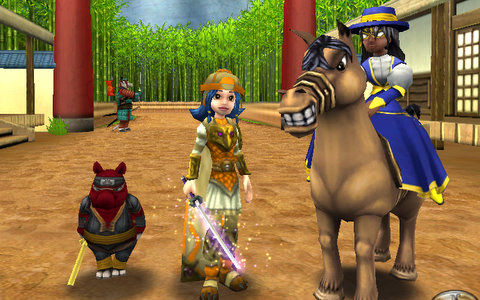

Back to: [West Karana](/posts/westkarana.md) > [2009](/posts/2009/westkarana.md) > [November](./westkarana.md)
# Wizard101: A Tail of Four Oni -- The War Oni

*Posted by Tipa on 2009-11-30 08:35:48*

I bought just one thing for myself on "Black Friday", the advertiser-created consumer holiday that kicks off the Christmas shopping season the day following Thanksgiving. That one thing was a $20 Wizard101 Crowns card from a Rite-Aid my sister and I stopped by. So if you're looking for W101 cards, the Rite-Aid in the White Plains part of the Bronx, just past the zoo, has them. The picture above shows Allison with the ninja pig pet that came with the card. The pig gives one Infection card that makes enemy heals half as effective, and the pig will occasionally bow to passers-by.

Sure, panda monks are cool, but they can't hold a candle to ninja pigs.

I returned home Saturday evening and fired up Wizard101 to continue the adventures of Allison and Marissa in Moo Shu.

My REAL goal here is to explore all of Grizzleheim, but Grizzleheim has been organized so that you can't play through all of it at once. You can play part of it in your 20s, a little more of it in your 30s, but to play through the most difficult encounters, you have to be at least level 40.

Moo Shu is just the thing. With good loot, great experience and a compelling story, it's a nice, relaxing (if sometimes tedious) ride before the challenge of Dragonspyre.

Moo Shu was a land in a delicate balance. Though it seemed peaceful, it was only the Emperor's strength that kept the warlords from each other's throats. When Malistaire swept through with the unstoppable power of the Krokonomicon at his call and struck down the Emperor for the Dragonspyre key, that fragile balance crashed to the ground. The three most brutal warlords sold their souls to the demons -- oni -- of War, Plague and Death. The Emperor's very life energy fueled the fourth, and deadliest, of the oni -- the Jade Oni.

The wizards of Ravenwood must meet and defeat each of the rebel warlords and their Oni and lastly free the Emperor from the Jade Oni before they can follow Malistaire to his Dragonspyre lair and erase his evil forever.

The War Oni is not one to sit idly by and watch events play out on their own. He must march through the world, gathering armies and laughing in glee as things burn. Hametsu Village was the first of his conquests. Our first tasks in Hametsu were seeing to the safety of the surviving villagers, putting out fires, and learning what had happened. The villagers safety assured, we were sent on missions to meet and defeat the forces of War wherever we found them. Our battles brought us to the front lines of the Crimson Fields, a battlefield stained with the blood of its tireless, but nearly spent, defenders.

Crimson Fields is why we can't have nice things. Way way WAY back in time, wizards could repeat instances as often as they liked, and get full experience each time. Most instances required many battles, but Crimson Fields was a little different.

The first parts of Crimson Fields require no battles at all. You run in, gather some wood, build some barricades, get a stone elemental to post guards, each time for a nice bit of experience. People would run the first parts of Crimson Fields a dozen times a day just for the easy experience. The Wizard101 forums were full of level 50 wizards who wondered, idly and loudly, why they should even bother finishing Moo Shu when they were already maxed out?

KingsIsle's solution was to give full experience the first time through an instance, half experience the second time, and no experience thereafter. This had the side effect of hitting the level cap before Dragonspyre was released essentially impossible. If you met a level 50 wizard before Dragonspyre, they almost certainly had made their level by exploiting Crimson Fields. Unfortunately, I'd leveled too slowly, and was still in Krokotopia when the nerf happened. I topped out at level 46 before Dragonspyre.

You'd think the War Oni would be a master of strategy and tactics, but it would be a lie. He relies on brute strength for his victories, and has few defenses against clever wizards. He soon met his end at our hands. I tossed some Crowns into the treasure chest at the end of the fight, and Marissa got a Sunbird pet out of it. 

The treasure chest is a neat idea. 50 Crowns isn't that much for a second chance at some of the rarer loot. I don't know how much I'll want to spend trying for the Myth robe when I finally meet Malistaire, but a second try at it won't hurt the wallet much. Allison already HAS the Balance robe, so she's all set :)

Though I did start along the path toward meeting the Plague Oni, Allison reached level 40, and level 40 means its time for New Things.

Level 40 is when you can use SWORDS -- the swords that give you a power pip for free at the start of every duel, and let you jump into the middle of the dueling circle for your attacks. You just GOTTA have a sword.

Oyotomi the Defiler in the Village of Sorrow is the best sword vending machine in the game. He stands alone in an area without other monsters, respawns quickly, and dies fast. I used Tara to bring my other two characters to him (he's part of the Death Oni quests), and with the occasional help of other wizards after his loot, set about making him die much more than he'd ever died before. Though he dropped many house items, he dropped no swords.

I (again) used Tara to bring them to meet the Jade Oni, the erstwhile final encounter in Moo Shu. After a few minutes of heated battle, the Jade Oni lay dead, but still no swords! Each wizard tossed 50 Crowns into the chest at the end, and Allison won the jackpot -- the Jade Oni's lightning sword.

Allison is now level 41, and Marissa is now level 38. I'm thinking Marissa will be 40 by the time the Plague Oni dies... and we'll finally be able to close the last chapter of Grizzleheim before finishing Moo Shu and moving on to Dragonspyre.

