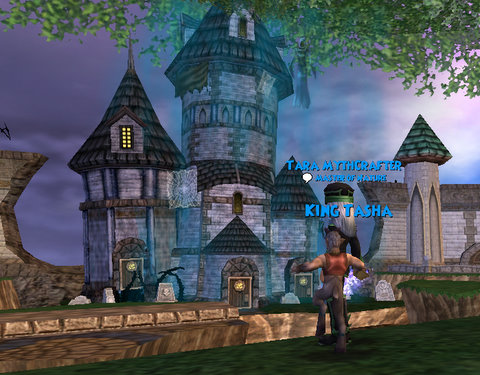
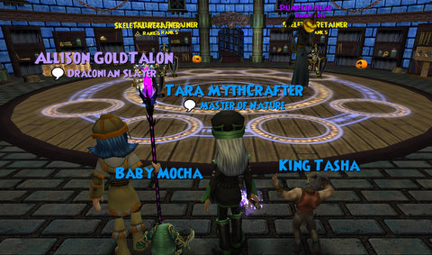

Back to: [West Karana](/posts/westkarana.md) > [2009](/posts/2009/westkarana.md) > [October](./westkarana.md)
# Wizard 101: My greatest failure

*Posted by Tipa on 2009-10-02 06:23:53*

It's the [Ides of Octember](http://books.google.com/books?id=zersWaUGvkUC&pg=PA53&lpg=PA53&dq=ides+of+octember&source=bl&ots=RF8cGUzppa&sig=cz6c-L9Wa8gvhhgHgln5c_kYJeQ&hl=en&ei=BtvFSpODOseV8AbWzJ1I&sa=X&oi=book_result&ct=result&resnum=2#v=onepage&q=ides%20of%20octember&f=false) in Wizard City, Spooky Bob is on the prowl, and a mysterious dark tower has appeared where the *previous* dark tower was, before it fell through Wizard City's basement to Nightside.

[It was all harmless fun last year](../../../index.php/2008/10/13/w101-halloween-in-wizard-city-and-october-patch-notes/)... until I found out the Pumpkin Head would (rarely) drop the mechanical spider that otherwise is only found (also rarely) at the end of the most tedious, lengthiest instance in the entire game, Kensington Park. So, half an hour vs four hours, right?

What could go wrong?

Well, last year I completed this instance about forty times -- no mechanical spider. I even started an alt, Allison Goldtalon, to help because those fights weren't that easy and at the time, I was only in my thirties. Allison leveled up to her twenties helping me with this dark tower to get that rare spider pet. That was her PURPOSE.

When Octember rolled through this year, I hoped that the tower would have gotten lost somewhere else as it wandered through the Spiral. But no, it found its way back. The site of my greatest failure.

You can't take a break in the Hard Tower. You can't port out for health and then port back to a friend inside -- you can't re-enter. There are some wisps on the floor before the boss, but they give you only two mana back, and mana is not really an issue after a certain point, anyway.

If you go by yourself, each level is only two mobs, both rank 4 or 5 elites with 500-550 health -- not too bad. Bring a friend, though, and there are FOUR, and that makes a difference. (BUT -- if one person goes up a level and starts the fight, then the other group members FOLLOW -- just two mobs. That's a pro tip there.)

That pro tip, I'd forgotten, and by the time both my wizards climbed to the top, our health ran out and -- FAIL. We were sitting outside Ambrose's house in the Boulevard of Shame, watching our health slowly count up from zero.

We returned to Ravenwood and that dark tower and did the entire thing over again, and this time Pumpkin Head fell.

No mechanical spider.

That's try #1.

## Comments!

**yunk** writes: I got a halloween outfit last night, I had to buy more crowns :) It is great because the tophat matches my rat magician. Though I mighy buy another outfit on my other account.

Hmm I think I have Tara Mythcrafter on my friends list, in addition to when I met up with Marissa. I wonder if it is you and when I met you. (Can more than one person have the same name?) That tara has not been on in awhile but I saw her last night.

---

**[Tipa](https://chasingdings.com)** writes: It was likely me :) I usually play my alt Myth wizard these days, but I wasn't sure that I could do it with her, so I went with Tara instead.

---

**AmberStargem** writes: Hey if you need help with the tower I'll be glad to help. I want that clockwork spider to.

---

**[Tesh](http://tishtoshtesh.wordpress.com/)** writes: Ooh, time to pop back into W101 for a bit. Mechanized critters make me happy.

(Scot Silverside, Balance/Death, should it ever come up.)

---

