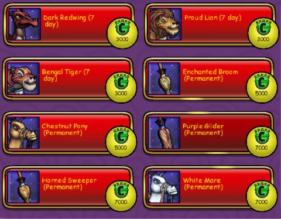
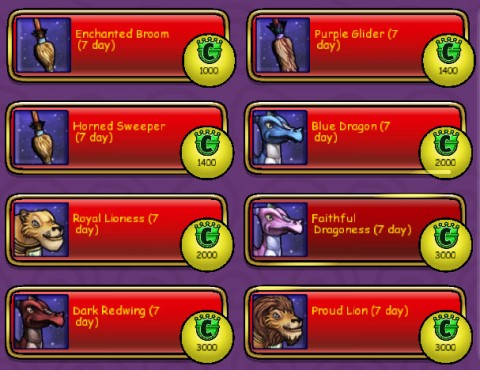
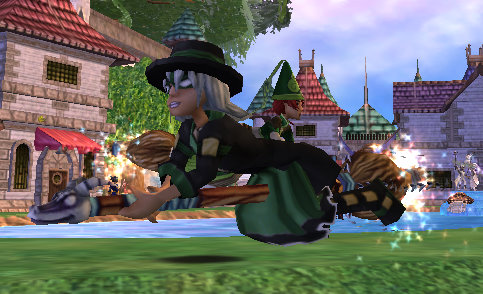
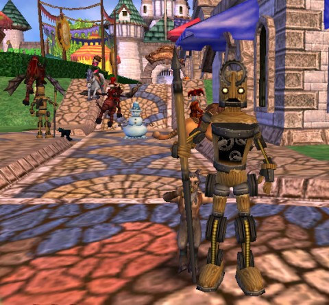
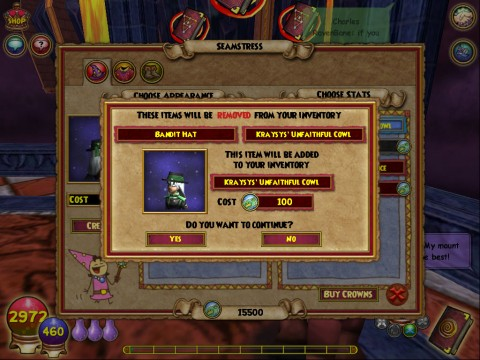

Back to: [West Karana](/posts/westkarana.md) > [2009](/posts/2009/westkarana.md) > [October](./westkarana.md)
# Wizard101: Mounts, Elixirs, Seamstresses and Henchmen

*Posted by Tipa on 2009-10-03 00:22:37*

The upcoming [Wizard101 mega-patch](https://www.wizard101.com/game/community/patchnotes) is up on the test server today, and we were there to look over the new changes. We'd known about the new mounts that were on their way, but that's not all KingsIsle had up their billowing sleeves.

First up: mounts. You'll see brooms, tigers, horses and dragons flying around. You automatically use the mount when you purchase or rent it; to unmount, either wait until it expires or go into your inventory screen, select the new saddle icon and un-equip the mount as you would a pet.

Here's the official word on mounts.

> 
 * Mounts increase your land travel speed significantly
> 
 * Mounts cannot be used indoors
> 
 * Mounts may be purchased at the new Crown shop or Zeke
> 
 * You will dismount when you are pulled into a duel
> 
 * One day rentals may be purchased with in-game gold
> 
 * Seven day rentals and permanent Wizard Mounts may be purchased with in-game gold or Crowns
> 
 * A countdown timer will appear on the description of rental items to indicate how much time you have left on that rental. Time is calculated in calendar days, hours and minutes, and time still counts down when you are logged out of Wizard101.
> 

> 

Zeke doesn't offer many mounts, but the crown store is always available via a new icon at the upper left of the screen. Most (but not all) items can be bought for either Crowns or gold. PILES of gold -- but you don't have to spend real money on these things if you'd rather just use in-game gold on it. Travel is MUCH nicer with a mount! Here's the mounts available from the Crowns store.

My favorite mount? The broom, of course!

Elixirs add short term benefits or effects to your character. KI says:

> Elixirs grant players what is called a Temporary Boost. These Boosts can increase the amount of gold you win during duels, the amount of experience, they can increase your power pip chance, your accuracy and many other attributes.

If a battle is going poorly, you can buy an elixir on the spot to help you through. Pretty nifty stuff.

Is being human becoming really dull? Shake things up with a transformation potion!

> Just in time for Hallowe'en, we have enabled players the ability to purchase a temporary costume that transforms the player one of many creatures found around the Spiral.

These Transformations can be purchased in the form of an Elixir, under the Elixirs tab on the Crowns Shop and can also be purchased for Gold on that same window.

So if you've ever wanted to run around looking like a Gobbler, now you can! 

Meh. I can see a use for them to make some cool comics, though.

You'll never be alone again with the new henchmen, wizards you can hire to help you, one fight at a time. You can only purchase them while in battle, and they poof as soon as it's over. They aren't quite as skilled as players, but then, if there were other players around, you wouldn't need these. And they don't attract additional monsters to the duel! KI's take:

> Henchmen are hired Wizards that help you in a duel and they can only be purchased while you are in combat. They will come to your aid and behave similar to your Minion, only stronger and smarter. They will act in the same round that they are summoned by the player, and will disappear once the duel has ended. 

I guess that's more or less what I said. It's kinda cool -- fighting fire mobs? Summon a level 50 Grandmaster Ice Wizard! Always have the best kind of wizard for the fight :)

Galen Frostflower is a hired wizard. His ice spells all came out nicely, but he wasn't big on the buffing and debuffing.

Eloise Merryweather, the elderly lady who sells furniture next to Prospector Zeke, has been apparently going to night school and has learned to sew. She can sew the appearance of one item onto the stats of another, in fact.

> Have you ever found a clothing item you love the look of, but wish it had the stats of something different? Well now you can take the stats of one piece of clothing and apply them to another piece of clothing of the same type. Love the stats on your Dragonspyre hat but it doesn't match your Grizzleheim outfit? Find a Grizzleheim hat you like, and move the stats from your Dragonspyre hat, to the new Grizzleheim hat to complete your stylish look.

Eloise Merryweather, who can be found near Zeke in all worlds of the Spiral (including Grizzleheim) has been busy learning how to stitch! For a small Crowns fee, she will allow you to transfer the Stats of one item onto the Appearance of another.

Next time you talk to her, simply select the item you want to use as the Appearance, and the item you want to use as the Stats. Click Create and you'll have a whole new outfit with the look and stats you want combined into one.

Please heed these important things to note about this process:

 1. Both items will be removed from your backpack and replaced with the new item that will be created with the Appearance and colors of one piece, and the Stats and name of the other, as you specified
 2. The name of the item will be transferred from the Stats item, along with the bonuses
 3. The bonuses of the appearance item will completely disappear, and be overwritten by the bonuses of the stats item
 4. Once the transaction is complete, and you've purchased the item, it cannot be undone!
 5. This process costs Crowns

Here's a picture of the seamstress screen:

I bought one of the new appearance outfits and am taking all my level 50 gear and making it look like level 25 gear because I R CLEVR. Most of the outfits that you can buy for Crowns can be bought for far cheaper in the Bazaar, but naturally, the Bazaar clothes tend to have picky level requirements. They DO have some unique outfits, but ya know, if you run around in a store-bought ensemble, it's just going to be a fashion disaster if you see anyone else wearing the same thing.

I just... have always liked the Marleybone look. Hey, Marleybone is getting TELEPORTERS! All you rooftop-averse wizards should be jumping for joy!

> The dogs of Marleybone have studied the teleport technology first seen in Grizzleheim and adapted it for use on their world. Just like the teleport stones in Grizzleheim, these teleport machines will transfer players from point to point on the map, but you must first discover both points before you can teleport between them. 

So, I guess you CAN teach an old dog new tricks....

There was probably a few people, here and there, who LIKED it when Malistaire had 100,000 points and needed to be killed in four rounds or not at all. For those looking for that kind of challenge, there's an optional instance full of Mali's dirty tricks:

> There's a new tower in Colossus Blvd. The creatures within are far more powerful than anything Wizard City has ever faced.

Level 50 players can get more information from Sgt. Muldoon in Olde Town. Be careful as it is rumored the powerful boss creatures do not follow the normal rules of combat. They can cast multiple spells per round, interrupt other player's spells, and cast high level spells with little to no pip costs.

Should brave wizards choose to enter the Gauntlet of Woe, (and please remember, this is a completely optional area) be prepared for a very challenging encounter.

The real question is -- will the rewards live up to the challenge? Will we get better than Grand Spyre-level armor?

For those people who only fight things that drop stuff they need, KingsIsle introduces Second Chance chests. If you missed a roll on something really great, you can look inside this chest (for a fee) for another chance. HELLO, CLOCKWORK SPIDER TIME!

> Have you ever battled your way through a tough dungeon, only to be disappointed that you didn't receive the reward for your School? Well now players can pay a small fee to get a second chance at what's in the creatures pockets! Many final boss encounters will contain a chest in the room that offers players a second chance to get the item they wanted off the creature they just defeated. Simply use the chest after your initial duel, pay a few Crowns and you are given a second chance at the exact same rewards the boss drops normally. These chests can only be used a certain number of times per day per character. 

I suspect this will come in handy for any Malistaire fights from now on.

All this and it's not even HALF of what's coming sometime this month! [Read all the patch notes](https://www.wizard101.com/game/community/patchnotes)! What feature are YOU most interested in?

## Comments!

**[Tesh](http://tishtoshtesh.wordpress.com/)** writes: The henchmen, Seamstress and house previews are what caught my eye. It's good to see King's Isle continually improving the game!

---

**[Sierra Starsong](http://www.modernautomagic.com)** writes: I really like the Seamstress idea, though I wish it were cheaper, or better yet, gold-buyable. I could even see it as a variety of crafting. (There's another great feature, reducing the numbers needed for crafting quests.)

You can convert crowns to gold, I wish there was a way to do the reverse (buy crowns with gold). I know, they're trying to avoid WoW's gold farmers, but still...

---

**[Tipa](https://chasingdings.com)** writes: Another problem is that it took me so long to get my level 50 gear, that I no longer really WANT to hide it behind something else. It took a lot of time to get and I'm proud to wear it.

---

**[saylah](http://notadiary.typepad.com/mysticworlds/)** writes: I loved the Marleybone look too. I woild have enjoyed turning my outfits into combat gear.

---

**[Tesh](http://tishtoshtesh.wordpress.com/)** writes: Mmm... Marleybone. :)

Sierra, I've argued for the ability to buy crowns with gold before. I'd base it on the dual currency system in Puzzle Pirates. There are no "gold sellers" there.

---

**[MmoQuests.com » Wandering through Krokotopia (still)](http://mmoquests.com/2009/10/04/wandering-through-krokotopia-still/)** writes: [...] running through these areas alone. I think the mercenaries will be a great addition, but as Tipa mentioned they don’t fill the role of an actual [...]

---

