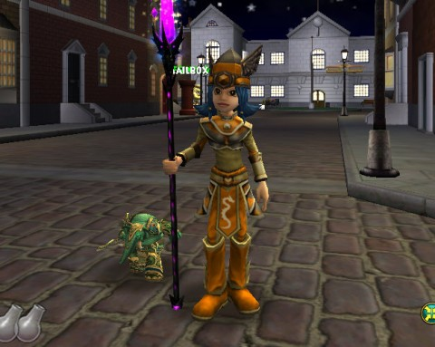
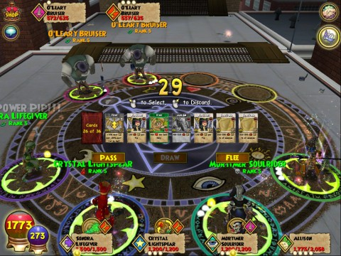
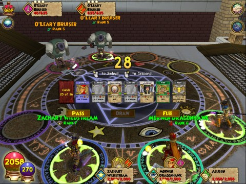

Back to: [West Karana](/posts/westkarana.md) > [2009](/posts/2009/westkarana.md) > [October](./westkarana.md)
# Wizard101: Questions about the new stuff? We have answers!

*Posted by Tipa on 2009-10-03 13:53:19*

**Is it possible to sew the appearances of clothing that you can't wear because of school or level restrictions on to clothing you CAN wear?**

You bet! In the picture above, Alison has taken her Malistaire robe, her level 50 Kraysys hat, and some level 45 shoes -- none of which she can wear -- and sewn their appearances on to the level 30-35 Grizzleheim clothing she was wearing.

Caution, folks: don't destroy your high level armor like this. Almost every high level clothing model is available on cheap, throwaway junk you can find for pennies in the Bazaar. So you can LOOK uber before you ARE uber without dipping into your bank to tear apart the good stuff you've been saving.

**Hi! I don't believe that they put teleporters in Marleybone! Also, I LOVE Thundercats -- does this expansion have anything for me?**

I hate to be the one to tell you, but they do indeed have teleporters in Marleybone. You might have missed them because the hubs are NOT at the start of the zone as you get off the balloon taxi, but on a rooftop a little ways in. For instance, Chelsea Court's hub is near Chelsea Tower.

Thundercats fans should have a lot of fun with the lions and tigers available as mounts. Alison is riding a 7-day Proud Lion.

**Henchmen act like minions, and you can have only one minion at a time. Can you only then have one henchman at a time?**

Nope, as the picture above shows, you can summon up to three other wizards to help you in your time of need. Summoning a storm wizard is much fun -- you can almost hear the little cries of frustration as they fizzle and fizzle.

**But, can you only summon henchmen around your own level?**

Heaven forfend, no! You can summon level 50 Grandmaster wizards if you want. In the screenie above, Allison has summoned a level 40 and a level 50 wizard to help. This becomes a rather expensive way of playing Wizard101, though. Also, the henchmen apparently don't work much on their gear, so you'll likely end up tanking anyway.

Any other questions? Let me know!

## Comments!

**[Sierra Starsong](http://www.modernautomagic.com)** writes: Buying higher level henchmen sounds like a bug, the patch motes specifically say you can only hire henchmen at or below your current level.

---

**[Tipa](https://chasingdings.com)** writes: Could be right! I have to admit that I didn't remember that from the patch notes, but it sounds reasonable. In fact I assumed that was the case until I tried it.

---

**robotlover** writes: do you know if when you buy the wizards do you keep them permanent?

---

**[Tipa](https://chasingdings.com)** writes: No. Sadly, you have to buy them when in a fight, and they disappear when the fight is done.

---

**[/AFK &#8211; October 4 &laquo; Bio Break](http://biobreak.wordpress.com/2009/10/04/afk-october-4/)** writes: [...] Tipa re: Wizard101 – “Thundercats fans should have a lot of fun with the lions and tigers available as mounts.” [...]

---

**[Wizard 101: Hallowe&#8217;en &laquo; Exploring War Like Worlds.](http://exploringwar.wordpress.com/2009/10/04/wizard-101-halloween/)** writes: [...] West Karana has a post up about the new items and the new [...]

---

**[MmoQuests.com » Wandering through Krokotopia (still)](http://mmoquests.com/2009/10/04/wandering-through-krokotopia-still/)** writes: [...] myself running through these areas alone. I think the mercenaries will be a great addition, but as Tipa mentioned they don’t fill the role of an actual [...]

---

**[Teagan](http://www.motomaca.webs.com)** writes: Hi! im on wizard101 and im going on in a little bit but im Terri frostsong(level 9) and i have no more missons how can i gain a level if i cant go in cyclops lane and fire cat ally?

---

