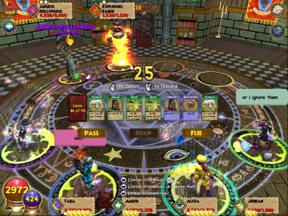

Back to: [West Karana](/posts/westkarana.md) > [2009](/posts/2009/westkarana.md) > [October](./westkarana.md)
# Wizard101: Briskbreeze Tower and the Gauntlet of Woe

*Posted by Tipa on 2009-10-03 22:32:35*

Ever wondered what kind of tricks KingsIsle has in store for those brave enough to step into their new instance?

Yeah, me too. The quest that starts in Olde Town leads eventually to a new tower in Colossus Boulevard -- Briskbreeze Tower. Now THAT doesn't sound too bad, right?

And it isn't. The first three floors are groups of four rank 7 and 8 elite mobs, so no worse than many ordinary trash mob encounters in Dragonspyre.

They're trying to lure you into a false sense of complacency. An NPC on the first floor of the tower warns you that the mobs in the tower will try and trick you, so as I, Amber Stargem and two other wizards I didn't know took on the first three encounters, we were very cautious. But -- no worse than many encounters in Dragonspyre and easier than some.

We KNEW the first boss would have a trick, but he was going down well and we were a little relieved, when he pulled out a minion.

We decided to stick with the boss and ignore the minion -- forbiddingly named Exploding Ember -- and take it on later, thinking he would summon more minions if we let him.

When, a couple of rounds later, the Exploding Ember exploded, doing 10,000 to each wizard in the group, we understood our error.

When I returned to Briskbreeze Tower, it seemed to be filled with a "GIVE ME TREASURE CARDS AND A PERMANENT HORSE!" party, with four or five wizards begging. Okay. First up. WHY do people always want TREASURE CARDS? They don't sell for that much and every wizard can make treasure cards from their own school, which are the most useful. I don't get it!

Secondly, WHY are people asking for permanent mounts when, even if someone were crazy enough to buy them one using the new gifting system, it's gonna vanish along with everything else when the test servers close in a week or two?

If this was bad in Briskbreeze, it was ten times as bad in the Commons and the Shopping District. You can buy these mounts with gold. If you play the game, you'll earn gold, and you can buy your OWN horses. Same with treasure cards.

Anyway. I couldn't see any groups going, just people darting on and off the pad as they try to hitch a ride with wizards who look like they could boost them through the tower.

I decided to see how far I could get using henchmen.

First three floors were no trouble. I discovered the limits to the hired wizards -- you can't use the same one too often -- and you won't know if your wizard isn't coming before you buy it. So the first two floors were just me, two henchmen and my faithful Spite Guardian, who moped a bit when she realized Thomas the Friendly Necromancer wasn't around.

A mid level wizard popped in, someone who was on my friends list but whom I didn't remember. They offered to bring their 49 Balance wizard. Sure, why not? We went up to the first boss' floor and I hired a couple additional henchmen to round out the group. I brought Allison along as well, but she stayed out of the duel -- only 36.

There was no way I could get the henchmen to attack the minion when it was summoned, but they worked wonderfully. The first time it was summoned, they took it down in a round. The second and third times, not so much, but us two PC wizards did the job. Then we all took down the boss and -- we won!

I got a fire deck /shrug. The gate to the next level didn't open -- apparently, bringing two players into the instance summoned the boss again. The instance was filling with low level wizards as the other wizard's friends ported in. I was dubious that we could live through the fight again and I KNEW this was just the beginning, so I decided to end it there and find a decent group when it hits the live servers.

So, new instance: Up to the first boss, Dragonspyre difficulty. I expect it to get MUCH harder. I can't wait to see what's on the higher floors.

You CAN port out and in to the instance, so people can take turns porting out for health and mana between floors if they need.
## Comments!

**[Wizard 101: Hallowe&#8217;en &laquo; Exploring War Like Worlds.](http://exploringwar.wordpress.com/2009/10/04/wizard-101-halloween/)** writes: [...] Comment! West Karana has a post up about the new items and the new instance. [...]

---

