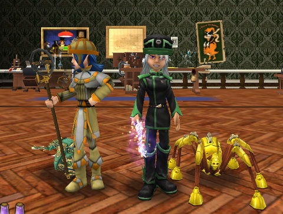

Back to: [West Karana](/posts/westkarana.md) > [2009](/posts/2009/westkarana.md) > [October](./westkarana.md)
# Wizard101: The Clockwork Spider DOES exist! And it's MINE!

*Posted by Tipa on 2009-10-07 21:46:46*

Fourth time through the Master/Hard tower, the big baddy drops the Spider Golem, which would be the yellow character there.

WOOT! I now have one of the rarest pets in the game!

NOW what do I do with my life?

Well, I went back to taking Marissa and Allison through Marleybone... Working on Knight's Court now. I can feel the wonderfulness of Katzenstein's Lab coming closer and closer... and then I'll go back to Grizzleheim, I promise. But I have to go see Doc Katz first!

## Comments!

**Samuel FireHunter** writes: Good for you! I cant seem to beat even the first level! Maybe its because i'm fire... Anyway when you beat katz lab could you help me with counterweight east? Thx and keep on Blog'in!

---

**[Tipa](https://chasingdings.com)** writes: It's a hard tower! This is why I started an alt, just so I wouldn't have to do this alone. Because even with a grandmaster life wizard, this tower is no picnic.

I'll help with Counterweight East any time! I love that area!

---

**[Ysharros](http://stylishcorpse.wordpress.com)** writes: Ohhhh very nice! Congratulations! NOw I can vicariously enjoy the fruits of a hard to get neat pet without having to do the dungeon over and over again, which is usually where my resolve fails.

Definitely a pet worth slaving for, though.

---

**yunk** writes: I peeked in there, kept seeing 4 guys attack me. People would jump in and start the tower with me then flee after a fight started. I haven't tried it since.

Isn't Call of Cthulu the game where you are always rolling up a new character because they never last more than on session? :) Actually I thought I heard there is a World of Darkness MMO coming, I think CCP is making it. Not sure it really counts as horror, or if it will be more like Twilight.

---

**[Tesh](http://tishtoshtesh.wordpress.com/)** writes: The hard tower where the Death school used to be, right? I've been through it four times now, and all I keep getting are robes and hats I can't use and other assorted stuff that's weaker than my gear (a middling level 33 in Marleybone old Crown gear... admittedly good stuff).

I wouldn't try to solo the tower, but packing along my level 17 Myth alt makes for a nice duo to take down the tower without much fuss. So long as nobody jumps in and screws up the whole sneaky "spawn two baddies *then* have the alt jump in" trick, anyway.

---

**carson** writes: congrats beating the tower. I finished all three yesterday. when you are done with conterweight east, I need some help with conterweight west.I can't find anyone to go with me.If you find me my name is Mason Nightblood and I am a level thirty-six necromancer and I am mostly in the Ambrose realm.

---

**[Tipa](https://chasingdings.com)** writes: Well, if you see me online at any time (Tara Mythcrafter, Allison Goldtalon, Marissa Spiritcaller), I'd love to help!

---

**BlazeDreamCoin** writes: I'm a necromancer that wears a black and white Martreys Hat, vestment of adverse, martreys boots, and a blood bat.I mostly teleport if you see me.

---

**BlazeDreamCoin** writes: I'm a mystery player so you probably won't see me.

---

**AmberStargem** writes: Good job! I know how much you wanted that! Now just to get me my own.....

---

**[Tipa](https://chasingdings.com)** writes: If you see me on, I'm more than happy to help!

---

**AmberStargem** writes: I'll do that! But I'm only friends with Tara Mythcrafter if thats ok! Thanks!

---

**carson** writes: we could meet in Mooshu.If anybody likes defeating the Jade Oni,its tons of fun.You could most likely see me in the more crowded realms during 3:00-8:00 central time.Remember I said my name and level earlier!

---

**frog master** writes: Sure I'll go with you,but first I need you to be my friend.My wizard is a level 50 storm and my name is Jason StormGem.

---

**[matt](http://westkaranawizard101)** writes: cool

---

**Zachary ThunderMancer** writes: WHAT ARE THE BONUSES from having the CLOCKWORK SPIDER PET?!!!?????

CAN you PLEASE POST A SCREENSHOT!!!!

:)

I Really want to know i beat the park but didnt get the pet

---

**[Tipa](https://chasingdings.com)** writes: The spider doesn't have any bonuses. Well, not the one I got, the Spider Golem. I'm not sure about the Kensington spider. I only did the park once, but nobody got a spider from it.

---

