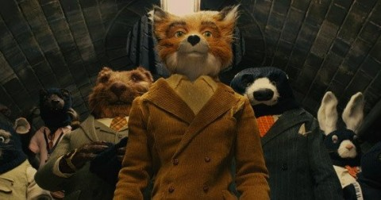

Back to: [West Karana](/posts/westkarana.md) > [2009](/posts/2009/westkarana.md) > [October](./westkarana.md)
# Daily Blogroll 10/10: Short Week edition

*Posted by Tipa on 2009-10-09 07:09:26*

I've been playing a bit of Earth Eternal since it went into open-closed beta yesterday. Since I think we're still unable to actually show the game, here's a picture of the upcoming stop motion/cgi film, Roald Dahl's [Fantastic Mr. Fox](http://en.wikipedia.org/wiki/Fantastic_Mr._Fox_%28film%29). Now, I don't KNOW that Sparkplay's gonna close down to go to the premiere, but I wouldn't be surprised.

Should kids gamble on the Internet? Evil Theurgists wonders why [KingsIsle is encouraging kids to blow their parent's moolah](http://eviltheurgists.blogspot.com/2009/10/slot-machine.html) spinning the virtual wheels of Wizard101's new slot machine -- where you spend 15 (and up) Crowns to win the usual prize of 20 gold. You get 15 twirls a day and the rewards are minuscule so... let's hope this is one feature that doesn't make it out of testing.

How long must you play an MMO before you can honestly review it? [Tobold thinks 5000 hours](http://tobolds.blogspot.com/2009/10/world-of-warcraft-review.html) should be just about enough to give World of Warcraft a good looking-at. His conclusion? It just might stick around awhile.

Come back in 2014 for Tobold's take on Champions Online and Fallen Earth :)

And in a similar vein, [Anton is wondering if anyone has heard about this new game](http://thallians.blogspot.com/2009/10/anybody-heard-of-aion.html), "Aion". Any good?

Dear Anton: Flavor of the month. In a year, they'll all be playing WoW: Cataclysm and Aion will just be a footnote. Bank on it. [Nobody leaves WoW alive](http://wiqdintentionz.com/studios/blog2/?p=602).

Think higher level players should (at the very least) be able to speak English well (if on an English server)? Spinks thinks [players should have to apply for more powerful characters](http://spinksville.wordpress.com/2009/10/09/applying-for-more-powerful-characters/) as they level. And why not? MMOs these days are MUCH more like jobs than games, right?

Now that Cryptic has launched Champions Online to great acclaim, Syp hopes the [lessons learned from the Champions launch](http://biobreak.wordpress.com/2009/10/08/what-star-trek-online-should-learn-from-champions/) can ease the way for their next MMO, Star Trek Online. Most importantly, when players complain of the smoke, their might possibly be a fire.

I have to confess to being a total STO newb. Assuming Star Trek Online doesn't limit ship names to sailing ships of the 17th and 18th centuries, I'll be captaining the science vessel "Newton" on an archaeological mission to learn more of the Progenitors, the ancient forebears of most humanoid races in the galaxy. Oh, not named after the famed scientist, ISAAC Newton. No, named after the suburb of Boston. Always loved that place.

MMO commentator Petter has a single word for those who buy gold: [asshat](http://blog.dontfearthemutant.com/?p=933). It's going on your permanent record.

Well, I guess that's enough for this morning. Too much Earth Eternal, not enough writing! I leave you with Dr. Horrible's Neil Patrick Harris as he [sings Batman to death](http://io9.com/5377506/listen-to-dr-horribles-batman+fighting-musical-number)...

