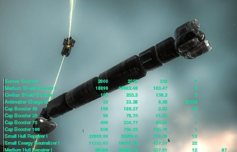

Back to: [West Karana](/posts/westkarana.md) > [2009](/posts/2009/westkarana.md) > [October](./westkarana.md)
# EVE Online: Spreadsheet Power

*Posted by Tipa on 2009-10-11 10:22:18*

There's an item in EVE Online, dropped commonly by rats in missions, that can be reprocessed with minimal skills and its component minerals sold for twice the cost of that item on the market. In fact, you can buy unlimited quantities of that item ON the market, reprocess it, and immediately sell the minerals for competitive prices and make a 50% profit. For that matter, you can put a buy order out for as many of this item as you can afford for a competitive price, and people will SEEK YOU OUT to sell you this item.

This almost sounds like a scam, doesn't it? I made nearly 24 million ISK last night just from buying, reprocessing, and selling the minerals of this item and two others with similar ratios. As I ran a mission, my wallet would flash as person after person sought me out to give me their money.

Thanks to my spreadsheet. I went through my hangar last night, took the usual prices for each item from the market, then looked at the minerals I could get from reprocessing it and the values of those minerals on the market, put them all into a spreadsheet, sorted by profit et voila. I sold all those items that sold for more than they would be worth reprocessed, reprocessed the rest, put that on the market and made millions. I put in buy orders for those items with the best reprocessing potential, and this morning reprocessed the completed orders and sold those on the market.

Playing the market is a career path in EVE, with associated skills (I started working on those skills last night). Sitting in Orgrimmar with Auctioneer up is essentially the same thing, but what if, in WoW, you could train some skills that would let you pay fewer auction fees? Keep auctions up longer? Play on the Stormwind auction house?

You CAN train those kinds of things up in EVE.

People say about EVE, that it's more like playing a spreadsheet than a game. And? Someone with a spreadsheet crunched the numbers for all the stats in World of Warcraft to use as the basis of the mods everyone couldn't play the game without. Knowledge is power, and spreadsheets are just a tool to gather knowledge.

Someone in my corp said this all sounded like a huge waste of time. I'd made almost 13 million ISK in fifteen minutes when he said that -- that could take me a couple of mission hours.

Something else people say about EVE -- that it's just sitting around watching a mining laser slowly eat away at an asteroid for a million mind-numbing hours.

You can play the game that way if you want to. I did, when I first started. That's peasant work, though. At some point you just have to stand up and wonder what's beyond these dry fields of dirt and despair, and head out for the horizon. If you should trip over a spreadsheet along the way, is that so bad?

## Comments!

**[Dusty](http://ofcourseillplayit.com)** writes: Back when I played Eve (and it was, admittedly, quite some time ago), it was that very spreadsheet-esque aspect of it that I loved the most. For me it was running trade routes - pouring over starmaps and the demand/supply charts, figuring out which systems had the best demand for the goods I could carry, and the amount of money and risk I would expend getting to those systems. 

The reprocessing gig is a great one, and its no different whatsoever than the people that buy greens and blues on the AH in Wow just to DE them, and then sell the DE components for substantial profit. And you can bet the makers of Auctioneer spent *substanital* amounts of time in spreadsheets, and the interfaces auctioneer gives you are spreadsheets in and of themselves. 

The only thing about a game like that, where knowledge is power, is it's just like any complex game where the dynamics are constantly changing -- in that you absolutely have to stay on top of the game, updating your knowledge base on a daily basis, or you will quickly find yourself losing. Just as you would with any collectible card game. It's not a bad thing, per se, just a fact of that type of gameplay. Fall behind, and you fall out. 

Buy orders in Eve are an incredibly good thing, and I have thus far completely failed to see a down side to them. So I continue to be astonished that more MMO's don't implement them in their auction house. City of Heroes did, and they're just as powerful and satisfying in that game as they are in Eve. Go figure.

Great post. Love hearing about your exploits in Eve without having to actually participate in them. :) 

Dusty, aka Dlangar

---

**Marcus Hamilton** writes: Dang it, that's MY unlimited no effort isk factory!

Seriously though, If your willing to learn the market and tie up some cash in buy orders you can make some very good money. It's a service your providing for the mission runners who just want to empty their cargo holds when they get back so they can start the next mission.

Also if that wallet flash starts to bug you, you can tun it off in the settings.

Fly safe.

---

**[mbp](http:mindbendingpuzzles.blogspot.com)** writes: Great Stuff Tipa. 

When I was playing EVE I bumped into a few successful traders who effectively play the game for free because they generate enough spare cash from their EVE businesses to pay for monthly time codes.

---

**[Magson](http://phoenq-magson.blogspot.com)** writes: I do that sometimes as well. I've found several common items I can reprocess for way more than the item itself is worth. I don't do it all that often, but lately I've been thinking I need to do more to gain "passive cash" and buy orders for reprocessing is one way to do it, so.... thx for the reminder. *runs off to Rens*

---

**Cj Didge** writes: The next step would be to do a region wide buy order, make yourself even more money by buying from the even more lazy :), be warned though doing it in a region like domain will end up you doing a lot of traveling.

---

**[Tipa](https://chasingdings.com)** writes: It's been a tense weekend, watching my money get stuck on market speculation. I even screwed up the buy price of one item with another, meaning I made no profit on the entire thing (probably lost money because of fees). With so much money tied up in the market, it's no longer clear if I'm actually turning a profit. I'm selling things fast, but also buying things.... very hard to keep track.

All this means that I spend a half hour of each EVE session updating my spreadsheet, for a profit I think I may be making. I am going to have to work on the financials some more....

---

**Graktar** writes: Lol, you had me intrigued with your post, and then blew away any interest with your comment, Tipa. I'll stick to running missions for now. And fiddling with EFT. Endlessly. 

I have to laugh at people who think playing EVE means endless mining. That may have been true when the game first launched, but with the mission system in place now you really don't have to mine unless you want to. It's safe money, and if you're skilled and equipped properly can be fairly fast money, but I prefer blowing things up and have done very little mining at all.

---

**[Tipa](https://chasingdings.com)** writes: Well, the business side of EVE means spreadsheets and poring over market data. It even has a bit of PvP, in a way. I was making a tidy sum making and selling ammo each day. A week later, I'm crushed by someone flooding the market at a price I can't match.

So that's gone :P

---

