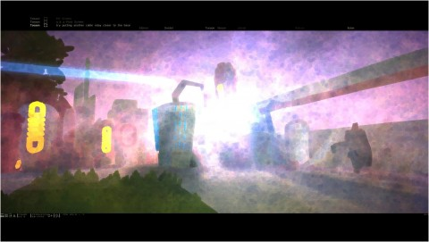
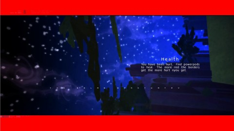

Back to: [West Karana](/posts/westkarana.md) > [2009](/posts/2009/westkarana.md) > [October](./westkarana.md)
# Lemons looks at Love

*Posted by Lemons on 2009-10-12 19:29:46*

*A guest article by [Lemons](http://www.xfire.com/profile/ham2/) :)*

---

A moderately multiplayer FPS by a single man? What an amazing feat, and when promised some of the best things, such as human-like AI and an almost dream-like virtual world ... one can get very excited over a game and follow it for a year or two.

The visuals look almost like watercolors painted on a life canvas. But then said game becomes playable and I spend the next two or three hours wandering around aimlessly in what seems like a mushroom trip without the fun or laughing but instead frustration and confusion.

The way it was shown during development made it seem so artistic and free. Then I pay my 5 dollars to play for 3 hours and the whole dream like quality that I was expecting crashes down with the sudden realization that this is not fun at all.

The point of the game is to find tokens that let you build cities and windmills to defend against AI seems kind of fun till you spend 3 hours just TRYING to find the tokens and end up with a headache instead.

This game seemed awesome till I was able to play it. I might just be playing it wrong or something, but it seems like there is no right way to play this at all.

## Comments!

**[Andrew](http://teethandclaws.blogspot.com)** writes: Remember that the game is in ALPHA right now - way before the beta stage. Usually we don't get to see games this early in their development, but because this is a one man job, the developer needed to get people to help out. 

The best thing that you can do is provide feedback, and work with the other alpha testers to mold the game into something both playable and fun.

---

**[Professor Beej](http://www.professorbeej.com)** writes: A one man FPS that has a unique look and feel? Oooooh, indie! Sign me up!

---

