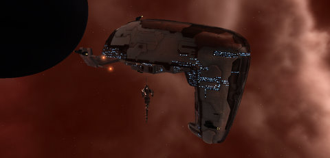

Back to: [West Karana](/posts/westkarana.md) > [2009](/posts/2009/westkarana.md) > [October](./westkarana.md)
# EVE Online: Wasting away in Teulolond

*Posted by Tipa on 2009-10-15 07:05:23*

This Devoter would be the last sight I saw before I was blown out of space by an unstoppable force. That's my Myrmidon in the background. It would be a twisted pile of tritanium before the night was through.

I need to assure you that the Devoter is, as far as I know, fine. So relax!

OtakuDyne had the rare opportunity to tag along with another corp on their Wednesday night ops run. This corp has rented space for a POS (Player-Operated Starbase) from a powerful alliance in the Providence region (yes, the region where we brushed with CVA a month ago), and they are about to join an alliance which will enlist them in the defense of a large portion of hotly-desired space.

So they are all about establishing their presence in the low-security systems.

Last night, we were going to set up a gate camp, and control who could travel through key trade routes with a little torpedo diplomacy.

We straggled one at a time into the target system and headed to the established deadspace safe point to group up.

We'd been spotted as soon as we entered the system. By the time people started arriving at the safe point, the first to arrive had already been probed down by the PvP corp "Pod Liberation Authority". We frantically hurried to form up as first one, then two and soon three ships heavily tuned for PvP efficiency locked down our ships while using their greater mobility to stay out of range of retaliation.

I'd brought my mission ship because I'd started out fairly far from my base, but my mission Myrmidon is NOT built for speed. It's built for tanking and for launching drones. Unable to close to optimal firing range, I sent out my swarm of drones and simply tried to keep within control range.

Though we did take out one of the enemy ships and caused many of them to warp out of the battle to repair, we'd never had a chance to group up and fight as a unit as some people were still several jumps away by the time the battle had more or less been decided.

After losing my drones and taking some potshots that had torn away my shields and armor, I warped out and holed up in a nearby system to repair and buy new drones. It was a huge and fun PvP battle, and lesson learned: you gotta be able to have the speed to move around the battlefield. Next time there's a PvP ops, I will bring my PvP ship, even if it means being a little late.

Yes, I survived that fight.

One of the fleet wanted to test out the range of his torpedoes, so the fleet leader in his Devoter put up all his shields while the bomber plinked him from system's edge, gradually moving in to find a good range. I was invited to test my weapons against him, so I thought it would be a good opportunity to get a feel for the effectiveness of my drones, so I sent those at him.

And that's when CONCORD -- the NPC police force -- took notice. I tried to bring in my drones and escape but it was far too late. A CONCORD ship showed up webbed me, scrambled me, and cut me to pieces. Then it webbed each of my drones, scrambled them, and destroyed them. It stayed camped above my wreckage for the 15 minutes I had to wait in my pod for the global criminal flag to time out so I could buy another ship with which to salvage the remains of the beloved Myrmidon "Death and Taxes".

So, important lesson number two: Just because you're in a fleet with a person, you still can't attack them unless they're in your corp.

I limped home with the crumpled remains of my ship in the belly of a rented destroyer. I'd insured the Myrmidon before I'd brought it into battle, so I had 40 million ISK waiting for me to help replace the ship. I spent the rest of the night gathering the minerals together for a new ship. Tonight will see the triumphant return of "More Death, Less Taxes", but it will never see PvP again. Next time, I'll warm up the jets of my PvP cruiser "Gun of Happiness". It's always been a lucky ship for me.
## Comments!

**[Akura](http://evemonkey.wordpress.com)** writes: I really love reading about your adventures getting into 0.0!

I'm sure you've figured it out after that fight but some 0.0 tips:

Don't travel alone.
if you have a destination to go to don't "straggle one at a time into the target system" - fly as a fleet.

make multiple safe spots
if there are hostiles in the system and you don't have a cloak - don't warp to planets, make multiple safe spots and warp between them. if you have a fast interceptor in your group they can make a "rolling safespot" by burning in one direction as fast as they can - when they are 150km+ away from your fleet, warp to them. rinse and repeat - you'll make it hell for the hostile probers.

perhaps try rail guns on your myrm for a bit more range?

---

**[Shirrath](http://shirrath.blogspot.com/)** writes: Unfortunately, rolling safespots are vulnerable to enemy interdictors. They can make people drop off warp sooner or later than intended if they drop a warp disruption bubble at the proper spot.

---

**[Wiqd](http://wiqdintentionz.com/studios/blog2)** writes: *sigh* I really need to join a corp like OtakuDyne that's active and works together. I've been stuck in nullsec for the past couple weeks because we made an incursion into someone else's space, pissed them off, now no one in our corp wants to do anything.

---

**[Callan S.](http://brokenmarrow.wordpress.com/)** writes: Sorry to hear you survive a PVP battle, only to lose to a missunderstanding of rules and NPC interactions! Ouch! Well, atleast you know for next time!

---

