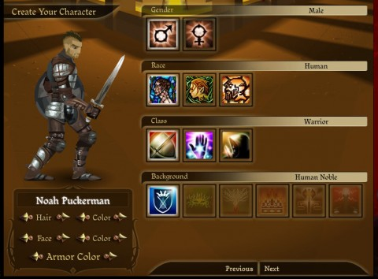
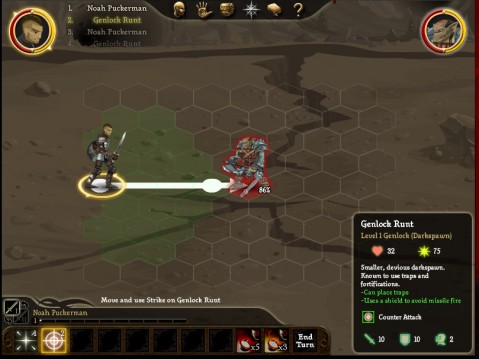
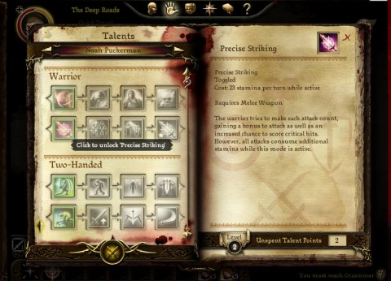

Back to: [West Karana](/posts/westkarana.md) > [2009](/posts/2009/westkarana.md) > [October](./westkarana.md)
# Dragon Age Journeys: More than just a tie-in.

*Posted by Tipa on 2009-10-25 22:48:50*

Tactical, party-based RPGs in a browser? For free? Yeah, it exists. For all that it is a tie-in to Bioware's forthcoming RPG Dragon Age: Origins, EA 2D's [Dragon Age Journeys](http://www.dragonagejourneys.com) is not only an introduction to the lore and characters of that game, but an excellent RPG in its own right.

In first chapter of three dealing with side stories in the DA:O milieu, "The Deep Roads", you come to the Dwarven city of Ozrammar to defend it against the Darkspawn that prowl the subterranean passages to and from the ancient city. The world above faces destruction by the magic-crazed forces of evil. By sealing off Ozrammar from the world, the dwarves felt their city would be a safe haven in a world gone mad. It's about to become an abattoir instead.

[caption id="attachment\_4368" align="aligncenter" width="480" caption="Click to enlarge"][/caption]

DAJ follows the common practice of giving you fairly few options at character creation time and letting you choose your own path and abilities as you level. Choosing between the dwarf, human and elf races determines the classes you may choose, and choosing a class from those on offer limit the selection of character origins - the specific story of your character. Like its parent game, there are only a certain number of stories to be told in DAJ. Your particular origin in DAJ doesn't seem to change the quests you are offered, however.

Mages are the healers and nukers of DAJ. They can buff the party, heal them, or turn their talents toward death and destruction. As far as I'm concerned, if a monster is dead, it isn't causing any damage to heal, and cone lightning looks so beautiful....

Rogues are specialists in non-magical damage, whether via bow or dagger. Although they can wear heavier armors, they will incur a severe penalty if they choose to do so. My experiences with rogue damage has been mixed. They hardly ever miss outright, but they quite often deal a "glancing blow" of 1-4 points of damage -- mostly useless unless it scores a crit.

Warriors are the tanks, and talents can add taunt and various debuffs on the opposition. Warriors have mobility issues, but they are at their strongest when they get the attention of all the monsters.

You will soon meet up with a mage and a warrior in your travels, so you may want to pick a rogue to start out in order to get experience with all three archetypes as you adventure through the dark tunnels.

[caption id="attachment\_4371" align="aligncenter" width="479" caption="Click to enlarge"][/caption]

Combat takes place on a hex grid that at times has randomly placed obstacles to provide cover and line-of-sight problems. Dragon Age Journeys proudly displays its old-school roots: Pen and paper Dungeons & Dragons was originally played on just such a map, and that carried over to SSI's D&D Gold Box RPGs and New World Computing's Heroes of Might and Magic.

Around the character portraits are thin borders of red, yellow and blue showing the amount of health, stamina (for melee classes) and mana (for mages) remaining. These sometimes recharge slowly while in battle, or more quickly via spell, potion, various objects in the game world or by resting in an inn. All characters have damage skills that use no mana or stamina when those run out, so no character is ever entirely helpless.

Combat follows the general flow of tactical RPGs. Characters are sorted by their reaction speed and, one at a time, they take their moves in phases. They first position themselves in the battlefield with no penalty -- you can change your position within your range as much as you like. Secondly, the character takes an action of some sort -- cast a spell, makes an attack, drinks a potion -- and their move is ended. Characters who take no actions have a chance to counterattack when an opponent strikes them.

Since wounds do not affect a monster's ability to cause damage, focus fire is definitely the best strategy. As the characters level and train in AE abilities, the strategy becomes one of bunching the enemies nicely before sending them to their eternal reward all at once (and there's an achievement for that).

[caption id="attachment\_4372" align="aligncenter" width="480" caption="Click to enlarge"][/caption]

Soon after you win your first battle, you'll level and get your first crack and choosing the general focus for your character's growth. Take a look at all the abilities and especially the ultimate ability in each chain, and work toward that. Waffling about what weapons to specialize in or what sort of wizard you want to be won't help. Pick a path and stick with it, or you'll be too weak for some of the later battles.

Nothing is more humiliating than having to have NPCs cart your lifeless corpse back to the city for revival again and again. This is personal experience talking, here. And speaking of experience -- when you're dead, you don't get any.

Old-school RPG classes and tactics blended into a rich story that rewards you with items for your characters in Dragon Age: Origins as you level? EA 2D's first title seems to hit all the right buttons, and I eagerly await further chapters in the Journeys story.

## Comments!

**[Spinks](http://spinksville.wordpress.com/)** writes: You can later pick up the bard to join your group, and he's a rogue (he also has awesome crowd control from his bardliness) so you'll be fine with whatever you play.

I've been enjoying this far too much. I keep thinking how much I like the classes too - would happily play any of them in an MMO.

---

**[Spinks](http://www.antiagingtricks.net/)** writes: You can later pick up the bard to join your group, and he's a rogue (he also has awesome crowd control from his bardliness) so you'll be fine with whatever you play.

I've been enjoying this far too much. I keep thinking how much I like the classes too - would happily play any of them in an MMO.
 Oops...forgot to say great post! Looking forward to your next one.

---

**[syncaine](http://syncaine.wordpress.com)** writes: Started playing this after you posted Tipa, having a good time with it, and I love that it's background story/lore in preparation for Dragon Age. Is it Nov 3rd yet?

---

**[Callan S.](http://philosophergamer.blogspot.com/)** writes: That looks like it's had some real money put into it's development!?

It's just there to promote the main game?

---

**[Tipa](https://chasingdings.com)** writes: Well, it promotes Dragon Age: Origins in the same way World of Warcraft books or the WoW TCG promote World of Warcraft.... They wouldn't exist without the game, but may be enjoyed on their own.

---

**[Callan S.](http://philosophergamer.blogspot.com/)** writes: But the TCG and books are sold for profit - they aren't free, they make a return on the investment made to make them, just by themselves. This is just free, isn't it? It's just surprisingly polished for a free promotional.

---

