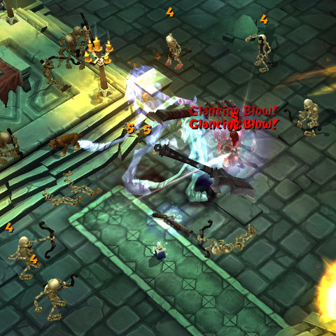

Back to: [West Karana](/posts/westkarana.md) > [2009](/posts/2009/westkarana.md) > [October](./westkarana.md)
# Torchlight: Just call me a Huntard....

*Posted by Tipa on 2009-10-28 06:04:23*

Oh, let's [call a spade a bloody shovel](http://en.wikipedia.org/wiki/To_call_a_spade_a_spade), shall we? Attack from a safe distance with a rifle? CHECK. Kitty pet that does all the hard work (including *running to town to sell loot*!!??) CHECK. Yeah. My Torchlight character is a hunter, no two ways about it. But in old Mythos fashion, she could have gone down other paths than Marksman -- she could have chosen to become a Rogue, a master of thrown weapons and two-bladed fighting, or an Arbiter, expert with traps and gadgets.

Similar to the much-missed Mythos, choosing between the three classes (Vanquisher, Destroyer (warrior) and Alchemist (mage) doesn't lock you in to a specific style of play. All three have elements of the other classes available.

Alchemists, for example, can specialize in Battle, which gives some weapon skills, Lore, which summons pets to fight for you, or Arcane, which grants the more traditional mage powers. Destroyers similarly can spend points in Berserker, the melee path, Titan, the ranged/nuke path, or Spectral, the pet-summoning path.

That's 3x3 or 9 separate paths, and you can spend points freely among the paths as you level. This is more choice than you're given in character creation, where your choices are limited to picking your class, the name and species of your pet, and the difficulty level of the game. While such little choice was understandable a dozen years ago when characters were just tiny, 2D pieces of animated pixel art, it's not 1995 any more.

I don't have time to write more about Torchlight right now, but expect to hear more later as I delve deeper into the Ember mines below the beleaguered city. Right now, Torchlight is just enough like Mythos to make me miss what could have been the best MMO of 2008, more than I already do.

## Comments!

**[We Fly Spitfires](http://blog.weflyspitfires.com)** writes: I think Runic are being very clever and obviously didn't have the budget to make an initial MMORPG release so plan on using the profit from this SRPG to make a MMO version. I, for one, can't wait. I'm really enjoying the game and it's style.

---

**KillTrash** writes: This little game caught a lot of people by surprise, including me. I'm having a lot of fun with it and the price tag is just sweet! I can't wait to see what the community will do with their editor.

---

**Zygwen** writes: Yet another Roguealike with Graphics Overlay (YARWGO)? or Yet another Graphical Roguealike (YAGR)

Either way, I like it!

---

**[Capn John](http://capnjohnsblog.blogspot.com/)** writes: Torchlight seems more of an updated version of Fate - http://en.wikipedia.org/wiki/Fate\_(video\_game) - rather than a Rogue/Diablo clone. It even includes the loyal Pet (which runs to Town to sell your Loot) and the Fishing mini-game to buff your Pet.

---

**[Capn John](http://capnjohnsblog.blogspot.com/)** writes: Not that Fate itself isn't a Rogue clone :D

---

**[Torchlight Fever &laquo; Mordiceius&#39; Gaming Blog](http://mordiceius.com/2009/10/28/torchlight-fever/)** writes: [...] (Wikipedia and GamersWithJobs) to find out about this game pre-purchase. I found the link to a GiantBomb gameplay video of Torchlight on the GamersWithJobs forums. They basically said it was the most Diablo game since [...]

---

**[Positive Peer Pressure and Torchlight &laquo; Bio Break](http://biobreak.wordpress.com/2009/10/28/positive-peer-pressure-and-torchlight/)** writes: [...] really wasn’t planning on getting Torchlight right away, but the constant and seemingly unceasing stream of comments and exaltations and gushings and general swooning in the blogosphere has [...]

---

**Zygwen** writes: hack and Nethack had pets. In Nethack you could polymorph your pet. The fishing reminds me of fishing in EQ.

---

**[Pete S](http://dragonchasers.com)** writes: And they offer a Hardcore mode, making it even more Rogue-like (well, I assume... I was too skeered to turn it on).

---

**[Hudson](http://hudshideout.com/blog)** writes: Tough call on what to spend my money on this month as it comes to a close

---

**[Tesh](http://tishtoshtesh.wordpress.com/)** writes: Considering that I liked Fate, Cap'n, I think this is a Good Thing. :) The pet who can run to town to sell your junk is brilliant.

---

**[kaozz](http://www.ectmmo.com)** writes: This game looks really cool. I loved Mythos, I will have to check this one out when I get some time.

---

**[Torchlight, torchbright, first torch&#8230; no, wait, that&#8217;s silly &laquo; Fool&#8217;s Age](http://foolsage.wordpress.com/2009/10/30/torchlight-torchbright-first-torch-no-wait-thats-silly/)** writes: [...] Posted October 30, 2009 Filed under: Computer Games | Well, inspired by the wave of positive reviews buzzing about the blogosphere, I picked up Torchlight last night.  It cost me [...]

---

**[&#8220;Traversing Torchlit Trouble&#8221; or &#8220;Deliciously Designed Dungeons&#8221; &laquo; Are We New At This?](http://arewenewatthis.wordpress.com/2009/10/31/traversing-torchlit-trouble-or-deliciously-designed-dungeons/)** writes: [...] can choose from one of three classes. But each class has three specializations, for a total of nine separate play [...]

---

**[Capn John](http://capnjohnsblog.blogspot.com/)** writes: After a false start where the download quit on me at the 10Mb mark a second attempt got me the full 3Gb+ file...which subsequently refused to run or install the game. 

So I booted up my copy of Fate. 

I spent almost my entire starting bank roll on a Fishing Rod then within 15 minutes made well over 1,000G when I sold my pack full of fish. I then outfitted my character with considerably better gear than the Axe he begins with, hit the Dungeon, completed the first set of quests, turned them in, then asked myself "Why am I playing this game again?"

Great concept, no story. I hope Torchlight do a better job, because without a compelling story there's no purpose to the (almost) unending Dungeon Crawl. I think that's where Diablo excelled, in providing an interesting history/story to why you're doing what you're doing.

---

**[&#8220;Novelty vs. Nostalgia &#8221; or &#8220;Innovation vs. Stagnation&#8221; &laquo; Are We New At This?](http://arewenewatthis.wordpress.com/2009/11/06/novelty-vs-nostalgia-or-innovation-vs-stagnation/)** writes: [...] it is an incredible experience, offers smooth gameplay and feeds on the far-reaching and widespread Diablo nostalgia that the gaming media has made no effort to [...]

---

