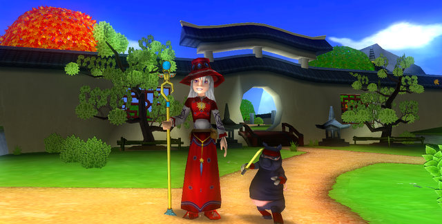

Back to: [West Karana](/posts/westkarana.md) > [2009](/posts/2009/westkarana.md) > [September](./westkarana.md)
# Happy Birthday, Wizard101!

*Posted by Tipa on 2009-09-01 22:56:59*

Back in July of 2008, I downloaded a new MMO, played for several hours, and barely managed [to tear myself away long enough to write about this still-in-beta Wizard101](../../../index.php/2008/07/10/1688/):

> It’s not the “perfect” MMO, but it’s definitely different enough to make it worth a look. Deck-building, strategic card-playing, turn-based combat? Check. Automatic grouping? Check. An absolutely INSANE amount of character customization? Check. A Toon Town-ish gameplay style that lets kids and adults play safely together? Check. Friggin’ baby dragon pets? Oh dear, yes, check!

I could tell right away that this game not only was something special, but was also a validation of indie game studios. The big guys fear innovation; they want an established IP, they don't want to surprise anyone, and they have their eyes fixed firmly on getting some of those elusive WoW-bucks.

Wizard101 had a funny and sometimes sad story to it; a man driven past his breaking point by the death of his wife, willing to destroy everything in order to bring her back. Young wizards sent to retrace his steps through world after world. And at the heart of it, a card game that appears at first to be rock-paper-scissors simple, but becomes incredibly strategic.

In the past year, KingsIsle has released two major expansions -- Dragonspyre, which finished the main plot, and Grizzleheim, which introduced a parallel mystery for younger wizards and also -- player housing! KI changed the loot given for defeating bosses and completing quests so that any given wizard would have dozens of items to show off in their home! Want several homes? No problem.

After I finished the main plot, leveled to max level, and got all my gear, I thought I'd probably take a break from Wizard101. But I couldn't do it. The game is just too fun, even now, and I really wanted to play in Grizzleheim and see Marleybone -- hands down my favorite world -- again.

I tell pretty much everyone who asks me what the best MMO for a casual player might be, and I always point them toward this game. A surprising number of those people play a little, play a little more, play a little more, get a few new cards -- and they are hooked.

I can point to half a dozen subscription MMOs which have only a fraction of Wizard101's community. This game has inspired dozens of players to take up blogging to chronicle their adventures. Wizard101 Central is the liveliest and most helpful forum I've seen in years. The development and community staff are some of the friendliest and most approachable people it's ever been my pleasure to talk to.

It's a perfect storm of MMO development, is what it is.

So, happy birthday, Wizard101! I can't wait to see what you have cooking inside those cloistered Austin offices. Celestia, right? And what's that secret project you have going there?

## Comments!

**[The Friendly Necromancer](http://thefriendlynecromancer.blogspot.com)** writes: *crowd goes wild*

Well said, Tipa, well said. :-)

---

**[Wizard 101: Happy Birthday &laquo; Exploring War Like Worlds.](http://exploringwar.wordpress.com/2009/09/02/wizard-101-happy-birthday/)** writes: [...] West Karana has a great Happy Birthday [...]

---

**[Ravious](http://killtenrats.com)** writes: Definitely a happy birthday to them! I think you are spot on, Tipa.

---

**[Tesh](http://tishtoshtesh.wordpress.com/)** writes: I love the header, Tipa. Very classy.

Happy Birthday, W101!

...now I need to do something nice for them... I *did* have an idea for a desktop bit of art...

---

**[Professor Greyrose](http://www.wizard101.com)** writes: Thank you so much Tipa, it's certainly been quite the year! It's community leaders such as yourself, TFN and Jester that really make Wizard101 a fun and safe environment for everyone. 

We do have lots of surprises in store, so look for sneak peeks and exclusive screenshots soon! 

It means so much to me to be able to work with people such as yourself, and to be in a community of players who love the game as much as I do. 

See you in Wizard City
Kiersten Samwell
aka Professor Greyrose
Community Manager - Wizard101
community@wizard101.com

---

**[mbp](http://mindbendingpuzzles.blogspot,com)** writes: I would have bet money on this game not succeeding. I still have no idea who exactly plays it. I guess that all goes to show that I haven't got a clue about what the gaming public wants.

---

**[Saylah](http://notadiary.typepad.com/mysticworlds)** writes: It's definitely caught people off guard, assuming it's just a kiddie MMO. It's pure fun and I still find finding a strategy to solo a dungeon the best part of it all.

---

**[Saylah](http://notadiary.typepad.com/mysticworlds)** writes: And yes, even though I dislike dark areas Marleybone was by far my favorite zone. Surprisingly it was Moo Shu that sort of sent me scurrying. The layout was rather bland and the circling back and forth around that dirt road track area got old. Does Grizzleheim have a comparable leveling zone?

---

**[Tipa](https://chasingdings.com)** writes: I can't speak for Grizzleheim's third tier, but the first two tiers were not stellar experience. The plot is kinda cool, and of course the outfits are all new (and make me wish EVEN MORE for appearance slots!).

I don't know how many tiers Grizzleheim has. I've heard four, I've heard five. And I've heard the higher level fights are incredibly strategic, so we'll see :)

---

**[/AFK &#8211; Sept 6 &laquo; Bio Break](http://biobreak.wordpress.com/2009/09/06/afk-sept-6/)** writes: [...] Happy Birthday, Wizard101! [...]

---

**yunk** writes: You convinced me to go back, I haven't logged in in awhile, but now am chugging along with Lucas Lotusdreamer. he is lvl 25 and still in Krokotopia, I will be glad to get out and see the later stuff. Last time I played there were no houses or crafting! I forgot how fun it is, it fits better into my schedule than some other games requiring more investment.

---

**[Tipa](https://chasingdings.com)** writes: We should get together and friend each other sometime!

---

