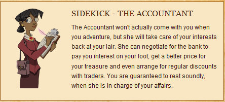

Back to: [West Karana](/posts/westkarana.md) > [2009](/posts/2009/westkarana.md) > [September](./westkarana.md)
# Daily Blogroll 9/3 - Sushi day edition!

*Posted by Tipa on 2009-09-03 07:58:02*

I've been thinking of swapping my sidekick in [Legends of Zork](http://legendsofzork.com/) from the Gent (who made me essentially immune to traps) to the Accountant (who earns interest on your stash) for awhile. It kinda disappointed me that they nerfed her -- it used to be that having her in your base would soon make you rich as Croesus. Not so much anymore, but as each upgrade now costs well over a million zorkmids, [I need all the help I can get](http://legendsofzork.com/heroes/32470-tipa). And I can switch back to the Gent later on, once I've reached my goals and seeded the clan bank with some good upgrades for others.

Hudson writes that [WoW's faction change service is now live](http://hudshideout.com/blog/?p=3300) -- you can go from Alliance to Horde and back again, as long as you stay within your class, you get a race change as part of the transfer. This is fantastic for Forsaken and Humans, who actually can get a LOT of RP mileage out of shrugging off their curse -- or being struck by the necrotic power of the Burning Legion. Night Elves can become swayed by arcane forces to become Blood Elves, or swear off their evil ways to veer closer to the Emerald Dream. But -- Taurens and Night Elves? Dwarves and Trolls? I'd like to see how the lore explains that....

Lore, that wild, wonderful backstory *to which games slavishly adhere** in order to give players a sense that they are part of a vast story that stretched endlessly behind and ahead -- until the devs decide to change it when it's convenient. Melmoth at KiaSA has a bit of fun with that legendary silent killer, [the ninja-esque Hobbit Warden](http://kiasa.org/2009/09/03/playin-for-keeps-is-still-playin-mon-ami-so-take-a-card/). Tolkein was probably going to write about the elite corps of Hobbit assassins in his NEXT book.

* this would have sounded more natural if I'd left the dangling preposition. IN.

Pushing back a little on the fannish fervor Champions Online's launch, Spinks, a lover of comic-book superheroes, wonders why superhero MMOs [only bring the dullest parts of comics to life](http://spinksville.wordpress.com/2009/09/03/why-superhero-mmos-have-failed-us/). Well, Champions DOES have the Nemesis system, so that's something new, right?

Anjin of Bullet Points [takes a look at Champions Online's odd way of balancing the game](http://bulletpointsblog.blogspot.com/2009/09/random-shots-philosophy-of-balance.html), and wonders why they did it THAT way.

> Okay, I don't understand. Why not try to hit your intended target instead of swerving back and forth in the hopes you find it accidentally?

Green Armadillo sees a trend in modern MMOs -- [a sharp veering from the onerous grind of doing an instance a hundred times to get a chance at a rare drop](http://playervsdeveloper.blogspot.com/2009/09/dropping-rng-from-loot-table.html). WoW, EQ2, Warhammer and LotRO have all added ways to slowly earn items you can't get to drop. And THAT'S a good thing. When I think of all the stupid guild drama a token-oriented loot system could have saved back in EverQuest. Who needs DKP when you can earn upgrades just by showing up? We used to have people drop from raids left and right once they'd gotten all they wanted. Only to show up with their vast DKP when we entered a new dungeon.

Malistaire has been defeated, but the grandmasters of Wizard City keep honing their wizardly skills, certain of the arrival of some new threat that will stretch their skills. But who? KingsIsle hints that someone is on their way. [The Friendly Necromancer hears mention of a mysterious Roberto](http://thefriendlynecromancer.blogspot.com/2009/09/roberto-is-new-malistaire.html)... could this be the new Wizard101 villain?

Did ya think that onerous death penalties were a thing of the past? Not so fast. Werit finds that in Aion's open PvP "Abyss" zone, [dying in PvP can strip you of vast amounts of the PvP currency, Abyss Points](http://www.weritsblog.com/2009/09/is-abyss-point-loss-bad-for-aions-pvp.html), while killing someone in PvP brings far fewer. This apparently leads to people only doing the PvE quests in the zone and avoiding PvP entirely.

Ever come across a hardcore raider in an MMO and wonder what happened to them to make them that way? Suzina of Kill Ten Rats [has the scoop](http://www.killtenrats.com/2009/09/01/i-wasnt-always-a-raider/) on how she and her husband were just casual players playing SWG for laughs and getting bored when, one day, Something Happened... and after that, everything was different.

And lastly, this has nothing to do with MMOs, but I like it because having just watched [Starblazers](http://en.wikipedia.org/wiki/Space_Battleship_Yamato) and its parody, [The Irresponsible Captain Tylor](http://en.wikipedia.org/wiki/Irresponsible_Captain_Tylor), seafaring battleships fighting space battles just makes me smile. This is the trailer for the new Space Cruiser Yamato movie -- Starblazers but done with modern animation techniques. This looks as if the Yamato crew meet up with the Comet Empire again.... I don't know if I like the departure from the unmistakable Matsumoto drawing style, but everything else looks so cool.

## Comments!

**[Spinks](http://spinksville.wordpress.com/)** writes: I'm really curious to hear more about the Nemeses in CO, I'm assuming they don't feature until higher levels so that's why no one has said much about them?

(Also with the tokens, the main point is that you still probably have to run the same instance 100 times ;/ )

---

**[Hudson](http://hudshideout.com/blog)** writes: Well still, the nemesis system doesn't disguise that the game is still a typical predictable quest driven MMO with really annoying zone constraining gameplay. Star Trek Online looks to be taking larger leaps in terms of gameplay with ships and away team action and the ability to level the ship crew. Sci fi for the win!

---

**[Melmoth](http://kiasa.org/)** writes: Thank you for the continuing excellence and interest of the daily blogroll, and also for the various pimpages of KiaSA that have appeared therein.

---

**Graktar** writes: I'm conflicted on the Starblazers remake. On the one hand I loved it when I was a kid. On the other hand, as an adult I have difficulty swallowing the preposterousness of space ships shaped like actual ocean-going ships, armed with energy cannons that looks just like conventional cannons. Nevertheless, my childhood fandom would be angry if they changed the ship, so I'm glad it still looks like a flying battleship.

Sigh.

---

**[Tesh](http://tishtoshtesh.wordpress.com/)** writes: Spaceships are marvelously flexible when it comes to design. You don't have to sweat aerodynamics or buoyancy, especially if you're building the things in space to start with. Structural integrity for maneuvers would be nice, but a flying battleship should be solid enough to handle those. At least it's more interesting than a Borg ship.

---

**Graktar** writes: Oh, certainly there's no reason why you COULDN'T build a spaceship that looked exactly like a battleship, it would work just fine. But why WOULD you? That's just making things harder on construction :p

---

**DeepSleeper** writes: Actually it's not supposed to be a spaceship built like a battleship, but the actual WW2 battleship refitted for space.

There is Story behind it.

---

**[Tipa](https://chasingdings.com)** writes: @Spinks people should be encountering their Nemesis pretty soon.

@Melmoth thanks to you for making KiaSA such a wonderfully enjoyable read!

@Fellow Star Blazer fans - The Yamato had been sunk for, what, 250 years when the gradual destruction of Earth's surface revealed it? It was a ship-shaped bit of rust. The original Yamato was a sitting duck that was discovered by Ally forces WAY before she was in position and was hit by over half a dozen torpedos and many dropped bombs before she went down. She was a fantastic achievement, but never sank even one enemy ship.

I can't think Yamato's hulk was all that useful to the Space Force. The S. B. Yamato doesn't even look like Battleship Yamato.

But yes, I understand that the S. B. Yamato was SUPPOSED to be built from the hull of the old Yamato.

Anyway, this S.B.Y. movie takes place thirty years later, and Susume/Derek Wildstar is now the captain of the Yamato and married to Yuko/Nova.

---

