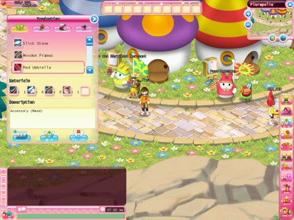

Back to: [West Karana](/posts/westkarana.md) > [2009](/posts/2009/westkarana.md) > [September](./westkarana.md)
# A First Look at: Hello Kitty Online

*Posted by Tipa on 2009-09-04 07:39:35*

Either the thought of playing in the world of Hello Kitty! makes you really excited, or you couldn't care less. Nothing in this "first look" is going to change your mind.

Still here? Then you're a Hello Kitty! fan, and just want to know what the game that you've already decided to play is *like*. Worried that you're too old to enjoy Hello Kitty? Worry not. Last night, the youngest person who admitted to their age was 20. Most were older -- one person joked that everyone seemed to be 40 or over. HKO is a social game, more than anything else. A *kaffeeklatsch* for fans of a bobble-headed kitten from Japan.

In the game's opening animation, you learn that Hello Kitty! and all the other denizens of Sanrio Town have gone missing. It is your mission to travel into your own dreams and find your friends and have adventures!

Character creation, typical for games of this sort, gives relatively few options -- but as is ALSO typical for games of this sort, you'll find lots of items to separate yourself from your clones in game. Numberless outfits, pets, masks, funny hats... the usual.

You start off on the docks of a small port town and then -- well, that's it.

Start walking! Any direction!

Because, unusual for a modern MMO and unheard of for a children's MMO, the game starts you off with no clear idea of what you should do next -- I couldn't find even one tutorial. You might be a savvy MMO player and immediately begin looking for NPCs with yellow exclamation points over their heads, and you won't wander too far (clicking to move) before you find one, who names a vague direction where you can find (after a considerable amount of walking) another NPC with whom you will conspire to choose the best lunch - sandwiches or hamburgers? (Hint: the area map shows NPCs and quest givers).

Don't touch those wandering monsters (yet) -- you have no weapons, and they will kill you right away. Do feel free to harvest those shamrocks you pass -- you'll need them. A LOT of them.

Eventually you'll be given a broken magic wand with which no monster in the first zone will be any challenge (right click on a monster and wait for it to die. Um, get knocked out). You'd get the impression that maybe combat isn't at the heart of Hello Kitty! Online. HKO is not about the fighting. It IS about the CRAFTING.

HKO is for crafters who like to make outfits, homes and stuff, and chat while doing it. While you'll ~~kill~~ knock down monsters for crafting components or just out of sheer evil joy, you won't be forming up in front of a meeting stone and heading in with 19 friends to defeat Badtz-Maru. But maybe you'll all have a dance party!

Crafting, again, has no in-game tutorial, so I'll take up the slack. Quests will sometimes grant you recipe books. Others are sold by merchants. However you get them, right click on them in your inventory to learn the recipe. Click on the Production button on your right action bar to bring up the Crafting screen. Select the crafting school (cooking, tailoring, carpentry or forging), select the recipe, and confirm you have enough of the ingredients shown in your inventory, then click the Make 1 or the Make All button to make either one or all you have ingredients for, and wait. Yes, it's essentially like crafting in World of Warcraft.

Many, may quests will have you making something, or making things to use as ingredients for other things. Most everything will send you out in the field to harvest the oddly shaped trees, bushes, flowers and local fauna. Most every recipe will leave you standing in front of the General Merchandise merchant, buying just one more stack of eggs and a cup of flour. *Et voila*, Chocolate Milk!

Just want to get away from it all, get back out into the country, get back to the land? Lucky you, you have a farm! Buy some seeds and fertilizer from the farming supplier, and talk to the farm manager about a quick teleport to your mule and 40 acres. Well, by "acres" I mean square feet. Your first farm is quite small. But why be content with that? You can visit other player's farms (with their permission) and give them helpful tips like, "those inharmoniously arranged plants disrupt the *feng shui* of this land" and "all your crops are dead. Why do you hate your plants?"

Quick tutorial on farming: right click on fertilizer in your inventory, then right click on an orange-colored plot of land to fertilize it. Right click on a seed in your inventory, then click on a green-colored (fertilized) plot of land to plant it. Click on the water can in your inventory and then on a square where there's a plant NOT on a blue-colored square. You already watered that one.

Pretty soon, your plants should be popping up like jack-in-the-boxes, and sometime after that, it'll be harvest time. I believe, by the way, that the mysteriously house-sized empty piece of land is where you will build your house.

Don't want to do questing, farming or crafting? Don't feel like chatting someone else up with gossip about Hello Kitty's boyfriend? Hello Kitty! Online has minigames for you.

Some quest lines end with the NPC really needing your very most urgent help with something. Tuxedo Sam needs you to do some fishing with him (he's so hungry!) Another character needs help with surfing! The minigames are pretty challenging -- that surfing one is a killer, as play alternates between ever-more frenetic "Simon Says" gameplay and twitch jumping. The fishing one needs ever more fish in very little time, where reeling in a fish consists of rapidly jamming the mouse button or going crazy on the space bar.

Like every other part of HKO's closed beta, there is no help. You kinda have to figure out what to do as you go along -- I imagine, by open beta, there will be tutorials and help available.

Since you ARE a Hello Kitty! fan (you made it to the end of this preview), I can't think of any reason why you wouldn't want to play this game. It's grindy, but not too grindy. Lots of people around, all of whom are also Hello Kitty! fans. You get to do a lot of non-combat related stuff, socialize, dress up, collect pets, build homes, meet your favorite HK characters. The game has you register with the SanrioTown Hello Kitty!-based social networking site, where you can post screenshots and videos directly from the game. The game is free to play so you don't have to feel you have to log in every day to get value for your money.

If you AREN'T a Hello Kitty! fan, then I can't imagine why you'd want to play this game. If you're a kid, there are plenty of games out there that are easier and more rewarding to play.

Here's the new trailer for the game. The game doesn't actually look like the trailer....

## Comments!

**[The Secret (World) Is Out &laquo; Bio Break](http://biobreak.wordpress.com/2009/09/05/the-secret-world-is-out/)** writes: [...] That’s right: Hello Kitty Online. [...]

---

**[A look into the world of Hello Kitty Online | WiiZeels.com](http://wiizeels.com/?p=39494)** writes: [...] Tipa over at West Karana has taken the brave plunge into HKO, and she’s resurfaced with a long post of first impressions from the game. While she goes in-depth with the combat, crafting, harvesting, and minigame aspects [...]

---

**[Hello Kitty Online: Sunshine &laquo; Exploring War Like Worlds.](http://exploringwar.wordpress.com/2009/09/17/hello-kitty-online-sunshine/)** writes: [...] Comment! Closed beta is ending 19th September. West Karana has an excellent first impressions post here. [...]

---

