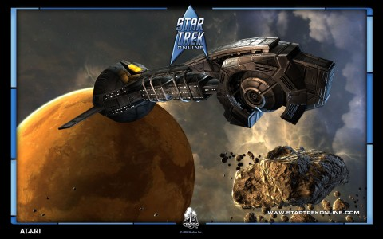

Back to: [West Karana](/posts/westkarana.md) > [2009](/posts/2009/westkarana.md) > [September](./westkarana.md)
# Gatheryn, Star Trek Online, Hello Kitty Online infomegadump

*Posted by Tipa on 2009-09-04 15:23:50*

I've gotten a bunch of emails telling about updates et al to a lot of games. Rather than write an article about each one, or ignoring them entirely, I thought I'd just combine them into a single post.

[Windstorm Studios](http://www.windstormstudios.com/), brainchild of ex-Age of Empires and Halo Wars dev Dusty Monk, has just released two bits of concept art from his unannounced evil giant super death robot massacre game, ~~Citizen Kabuto~~. Just kidding. The cries on everyone's lips, where is Ultraman? ... still just kidding. [Check out the awesome art](http://www.windstormstudios.com/downloads.html) and bug him for more info!

Cryptic has opened their beta registration page for Star Trek Online, so if you like spaceships and exploring and stuff, play EVE Online. BUT -- if you want actual walking around avatars in the game as well as the ability to rip off your shirt and roll around in alien mud going pewpew, well, [you probably want to apply](http://www.startrekonline.com/preview_application). Remember, the Prime Directive is really more of a guideline.

[Steampunk-themed casual games portal Gatheryn](http://www.mindfusegames.com/) says, with a sigh, that if people Really Want Quests With Exclamation Points, then they shall have them as they introduce (or reintroduce) a new (or at least revised) questing system:

> Long-time testers and new arrivals alike will have much to look forward to in this latest update. Several popular demands have been met, and enterprising Elymian residents will be able to enjoy a new economy with more generous minigame rewards. What's more, quests are making their way back into the game! We've re-added a very small handful of quests to Gatheryn, allowing players to get a feel for some objective-based gameplay, and the story and characters behind Elymia. Be sure to look for NPCs with quest indicators hovering above them for larger rewards!

---

The Playstation Network is exploring new realms in Software Quality Assurance by offering a prized SQA job to ~~someone who has studied quality assurance in school~~, I mean ~~an entry level game programmer getting their feet wet in a development studio~~, err, I mean some [random yahoo who can look creepy weird](http://www.us.playstation.com/psn/TheTester) like the people on Fear Factor. Saith PSN:

> This original program will challenge a select group of gamers in a series of challenges to determine if they have what it takes to make it as an official Game Tester. The elimination competitions throughout the series will not only assess the contestants' videogame knowledge, but they will also challenge the gamers' memory, stamina, dexterity, and overall mental prowess. Contestants must have the whole package to take home the coveted prize in this new original series: personality, skills, smarts and competitive edge. Our lucky winner will earn a contract position at Sony Computer Entertainment's Quality Assurance department in San Diego, CA, where he or she will get hands-on time with the most highly anticipated games in the industry.

... and you wondered how Sony shipped such bug-free code.

Dying to check out Hello Kitty! Online? Don't! Nothing dies in Hello Kitty! land, things just get knocked out. If you want to clobber defenseless starfish and make rainbow colored hoodies, [you need to join the beta](http://www.hko.aeriagames.com/)!

Okay, that's enough for now. My in-box feels so much lighter :)

## Comments!

**[We Fly Spitfires](http://blog.weflyspitfires.com)** writes: The whole spaceship part of Star Trek sounds interesting but I gotta wonder if they're going too far with it. I would've been happy just to have seen a ground orientated game - both is too vast. Plus, it kinda goes against the Star Trek genre. The ST ships were massive with hundreds of crew, not just a single pilot :)

---

**[Tipa](https://chasingdings.com)** writes: You have Bridge Crew in STO, and their skills affect how the ship flies. It's not 400+ people, but it's not just you alone.

---

**almagill** writes: Must.
Resist.
Teh Kitteh...

---

