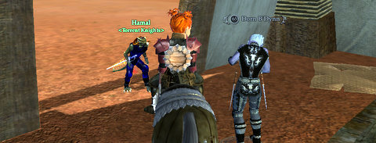

Back to: [West Karana](/posts/westkarana.md) > [2009](/posts/2009/westkarana.md) > [September](./westkarana.md)
# Daily Blogroll 9/10 - Launch Madness edition

*Posted by Tipa on 2009-09-10 08:00:41*

Was there ever a mob that you really, REALLY hated as a low level, that you just HAD to go back later on and just kill, kill, kill? Well, old Dorn in North Ro was that mob for a lot of us EQ players. Seeing him CRINGE before me now in EQ2.... Worth the ride!

One of the things that made EQ so memorable was that there was really nothing like it at the time. They could pretty much try anything, because, what else was there? Not like these days, where there's so MUCH choice, so MANY good games, that it's hard to stick with just one, and so game devs do whatever they feel they must to grab and keep players.

It doesn't help that so many really good MMOs are starting out this month.

Aion brings its lush, saturated graphics to our shores September 22 after a summer-long beta, following WoW's lead in that as in so much else. And again, like WoW, Aion's North American servers will be segregated by time zone, although not by RP/Non-RP servers. Naamah of Aionic Thoughts [has the complete scoop on the server names](http://aionicthoughts.wordpress.com/2009/09/09/list-of-aion-launch-day-servers/) and preferred time zones, as well as NCsoft's reasoning behind not naming roleplay-preferred servers.

Post-apocalyptic MMO Fallen Earth went live for pre-order customers yesterday, though it goes live to regular players on September 22... same day as Aion! Weird. Pete of Dragonchasers [jumped into the game and loved its old school feel](http://dragonchasers.com/2009/09/09/fallen-earth-day-1/), but had trouble finding a place to park his ATV. You think gas is cheap after the fall of civilization? Not so much.

Maybe he can chase a fuel-carrying tanker across a desert for it?

Autumn Duskhunter just can't keep off the interwebs. After shuttering W101 blog [Homework in a Graveyard last month](http://autumnaldusk.blogspot.com/), she pops up now on the Friendly Necromancer's blog with an article about [letting players control some of the monsters](http://thefriendlynecromancer.blogspot.com/2009/09/player-controlled-mobs-by-autumn.html) in the worlds of Wizard101. Friendly adds a postscript about EverQuest's experiment with this when they did Monster Play a few years back. It wasn't pretty :P

With Champions Online and Age of Conan rumored to be coming to consoles, DC Universe Online and The Agency almost certainly joining them, and as PC gaming continues its slow decline, what happens to the most common means of communicating with other players -- text? Can voice chat really take over the load of communicating with hundreds or thousands of other players? Spinks thinks voice COULD work, if games contracted enough that you never had more than a few people to talk to, [but leaving text behind entirely would be a terrible thing](http://spinksville.wordpress.com/2009/09/10/sorry-maam-i-dont-speak-text/).

Level and achievement games rule the MMO roost these days, but it can make it difficult for new players to join more advanced friends when there's 80 levels and tons of achievements and a truckload of gear separating them. What if it were possible to just play a game without huge barriers between new and experienced players? Syncaine tells how a new Darkfall player returned to the game and that very day was [fighting alongside guildies and contributing in that game's end-game content](http://syncaine.wordpress.com/2009/09/09/day-one-accessibility-from-an-unlikely-source/).

Ferrel of Epic Slant [looks back on his adventures in Lord of the Rings Online's Moria expansion](http://www.epicslant.com/2009/09/moria-review/) and asks, did the awesomeness of the ruins of Khazad-Dum do enough to outweigh the grind? On the whole, he says, Moria was worth the effort.

And lastly, Syp of Bio Break reminds the world that [Turbine's Dungeons & Dragons Online has gone Free-to-Play](http://biobreak.wordpress.com/2009/09/09/roll-a-20-ddo-is-free-to-play-for-all/), but he's having trouble deciding upon a class to play, and isn't a big fan of one of the inevitable launch-day bugs.

Play us off, 50s hip soul piano cat!

[The Cat Piano](http://vimeo.com/3985019) from [PRA](http://vimeo.com/user532199) on [Vimeo](http://vimeo.com).

## Comments!

**[Rer](http://insert-awesome-aion-name.blogspot.com/)** writes: *Snaps Fingers* Hip Cat is Hip

---

**[Ferrel](http://www.EpicSlant.com)** writes: Thank you for the mention! There are a whole lot of choices available right now and I've been having trouble making up my mind. I do think I'm going to avoid the PVP-focused titles for the time being.

---

**[Tesh](http://tishtoshtesh.wordpress.com/)** writes: What an interesting little short film. I've noted it elsewhere, but my BFA degree is in computer animation. I've seen a LOT of animated films, short and long. I like the style of that one, even though I might quibble with some of the subject matter. There is a lot to like professionally about that film. For one, the strong shapes and colors work very well with the excellent animation. I may well have to recommend it to my old professors. :)

Thanks for the link!

---

