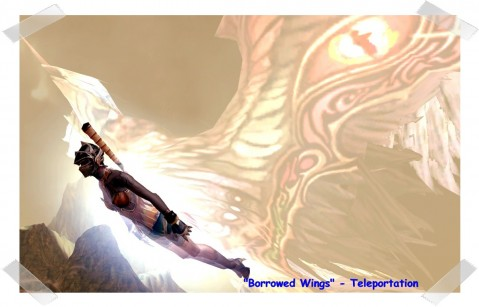
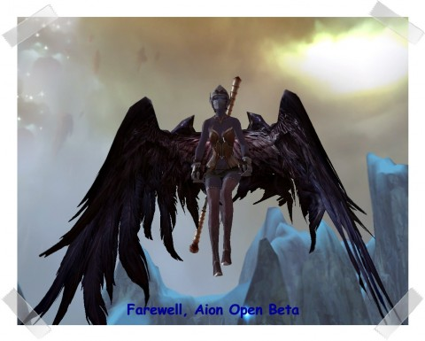

Back to: [West Karana](/posts/westkarana.md) > [2009](/posts/2009/westkarana.md) > [September](./westkarana.md)
# Farewell, Aion Open Beta

*Posted by Saylah on 2009-09-14 19:11:12*

*I am so very pleased to welcome [Mystic Worlds](http://notadiary.typepad.com/mysticworlds/)' Saylah as a guest blogger while she lets her blog lie fallow for awhile. -- Tipa*

Aion wasn’t on my radar - at all.  I didn’t have any preconceived notions going into the Open Beta (OB) other than the game looked attractive from all the screenshots I’d seen.  And I’d received enthusiastic emails from Mallika about her experiences in the Closed Beta.  I’m going to keep this accounting short since it’s being graciously hosted on West Karana.  I don’t want to kick-up any dust over at Mystic Worlds since I am by no means, ready to started blogging regularly.  *Smile*

**General Impressions**

There’s nothing new or earth-shattering about Aion.  Even player controlled flight isn’t new.  If you’ve used a flying mount in World of Warcraft then you’ve done player controlled flight except this version is considerably more restrictive and not in the least intuitive.  However, they have added a unique twist – flying combat.  Other than that, you’ll find what you’d expect in a modern fantasy MMO.

 * Good character customization

 * Gear customization options

 * Holy Trinity class selections

 * Class build/spec customization

 * Adequate PVE – quests and dungeons

 * Robust crafting system – LOTRO-like

 * Beautiful and stunning vistas – art direction that is a cross between Vanguard and LOTRO

 * Grinding for gear, loot and currency – nothing new here

 * PVP – consensual duels, arena style PVP, open area FFA PVP zones and fortress captures

When someone releases a fantasy MMO aimed at a mature audience that is not these things, we’ll be sure to let you know.  For good or for bad, today is not that day.  That said, Aion is a good game and I had fun playing.

I enjoyed Aion because I’m not looking for a Holy Grail MMO.  Every game that has promised to be “the one” since the huge success of World of Warcraft, has failed to deliver on the hype.  These days, I find myself content if a game is reasonably bug-free at launch, it runs smoothly, provides decent PVE content, diverse crafting, engaging environments and an interesting back-story.    Aion meets these requirements and wraps it up in art direction that is moody and full of ambiance.  The towns and cities are nicely conceived in representing a world where celestial beings exists.

**What I liked Best**

 * **Combat is smooth and stylish**, leaning toward WAR and AoC.  Some skills have optional combos that execute ferocious theatrical moves.  Combatants (avatars) have an attitude and sense of urgency when fighting which adds excitement.

 * **No rock-paper-scissors PVP**.  The average encounter takes a while and will border on feeling long for some players.  This however, is a very good thing for PVP.  You will not be subject to being killed with one, two or even three hits in combat.  This means that you have ample opportunity to employ skill and strategy!  Say what!?! Me likey!  The “whoever gets the first shot in wins” doesn’t exist from what I’ve seen.  I’ve watched players 5 levels lower than their opponents and not in great gear, consistently steal wins.  When I congratulated them and ask them about their background, they all came from PVP centric games.  It’s refreshing to see that skill can win over level and gear.

 * **Quest hubs are mostly towns**, not people standing in the middle of nowhere handing out quests.  This is one of the things I liked best about ROM as well, as it adds a pinch of RP to the experience.  Our people live here which is why I care about what’s happening in the surrounding environments.

 * **Art direction and visualization of this world is gorgeous**.  It’s hard to describe.  At times you could be walking around LOTRO, it has such a similar feel.  Yet it’s also very whimsical and there is what I consider steam punk elements splashed here and there that I enjoy encountering.

 * **Gear customization is very good**.  You have the visual option of dying your armor which is nice.  Beyond that you have slots that can be used to tweak the stats like gems from WOW or runes from ROM, which is especially useful for hybrid and healers.

 * **Players can put their avatars into a selling mode and auto-sell items they’ve listed for sale**, while off doing something else in real life.  Talk about making an area feel alive.  I think it’s a nice compromise between only having an auction house (WOW, WAR, LOTRO, etc.) and EQ2’s player housing that can be used as a store front.  EQ2 is the only fantasy MMO I’ve played that supports selling low-margin items in a hassle-free manner, without the risk of losing your tiny profit to AH expirations and posting fees.

 * **Uh yeah, I’ve been known to grind mobs**.  Some days, I don’t want to run around doing quests, I just want to kill stuff.  AC2 and WOW both supported this ability with tightly packed mobs in visually engaging areas.  Occasionally, I wander into an area and decide I want to kill these things for a while – I like the scenery, mob combat style, challenge or they drop good loot.  Aion had plenty of pockets to support this option.

 * **Champion/heroic level quests chains that explain the lore and give you nice rewards**.  EQ2’s brand of heroic quest chains made me hate all chains.  So much so, that I almost ignored these altogether but I’m glad I gave them a try.  They were worth the effort and weren’t monumentally annoying.

**What I liked Least**

 * **Oddly enough, flying hits the top of my dislike list**.  The mechanic used to implement flight has to be one of the least intuitive implementations I’ve run across in a long time.  If it were just a mode of travel I wouldn’t care very much but it’s not.  It can be used strategically in PVP areas and I don’t want to get my ass kicked because I suck at flying.  The base mechanic should have been mouse driven like flying in WOW.  You can of course remap all the keys.  However, since there are 5 basic maneuvers needed and they don’t toggle (ex. open wings/close wings), you must bind them to 5 distinct actions/keys AND account for directional movement AND be able to execute combat skills.  I spent much longer than I’d like trying different mappings before I could execute things rather seamlessly and it will still take time getting used to, which you don’t have much of in the beginning with all the restrictions.  I ended up using the arrow keys with Shift, Control and Alt modifiers to keep the finger reaches down to a minimum.  Let’s get real here.  I can’t be roaming all over the keyboard trying to fly when I’m fighting for my life!

 * **More skills please**.  Compared to other fantasy MMOs you don’t get many skills to work with in Aion.  This can make the combat become rather rout if you grind through it too much.  On the other hand, the classes feel VERY balanced.  This is perhaps the price to be paid for balance?

 * **Too many long distance Fed-Ex quests**.  Whoa! Wow!  This is the first game where these stuck out like a sore thumb.  Running back and forth long distances between NPCs for trivial messages is glaringly annoying, especially since you can’t fly to do it!!!!

 * **Large capital cities for the sake of having them**.  I’m over this – really over it!  Hoofing it around huge cities that are sparsely populated and running long distance back and forth for no good reason is SOOOOOOOO passé.  PLEASE stop doing this.  You don’t need them to be any larger than what you find in EQ2 or LOTRO.  NO ONE is going to have enough players, like the millions of players running around in WOW to populate these grand gestures to… what?  I’m not impressed after the first time I see the city when most of the areas are empty rooms, halls, cathedrals, markets, etc. that I have to traverse trying to get things done.  If you insist on building these grossly oversized areas then at least fill them with NPCs.  I swear it pisses me off running up, down and around buildings with dozens of empty rooms, save for one or two NPCs.

 * **The whole tram in the sky thing is genius – please make it more practical and useful** (frequency and wait time before taking off) like the ships in other games. It’s a wonderful way to see the city and travel within its confines but not at its timing.  It’s needs to run more like the frequency of the tram in WOW but more often and wait longer.  This could be a gem.

That’s it.  As you can see the list of dislikes is very small.  There is much to enjoy about Aion.  I’ve wanted to get into one of the longer haul games such as L2 or FF but felt it was much too late to catch up to veteran players.  I want the longer haul game since I don’t rush to the end-game.  I want the horizontal growth and options to dabble in when I don’t feel like leveling.  I think the PVP and crafting will give me that out of the gate in Aion and I hope for other options, as the game matures.

## Comments!

**[Pan](http://strictmachine.me)** writes: Nice overview! I've been playing Aion in China off and on early this summer and in NA since CBT #3. I agree with most of your points. Some notes:

* Flying - Yes, it does take some getting used to. They could have done a better job with the default key mappings. Gliding is incredibly fun when you get the hang of it. I find myself looking closely at the environment so I can opportunistically glide quickly through a region. 

* Large cities - I like the Asmodean city quite a lot, but I think the Elyos city is too stretched out and inconvenient. This was the tipping point for me in deciding to play an Asmodean at launch.

Which classes did you try? Surprisingly, I'm having a hard time picking a main class to start with as I find that so many of them are very well done. I'm leaning towards Sorcerer, Ranger, or Cleric, but I like several of the others as well.

---

**[saylah](http://notadiary.typepad.com/mysticworlds/)** writes: First - Much thanks to Tipa for hosting this post. It's very appreciated. I tried to keep silent but found that I couldn't. This was an excellent compromise for me. *Smile*

@ Pan - I think they should make flight time within that first fortress you encounter unlimited. This would allow players an opportunity to test the mechanics, remapping and perfect their technique without being annoyed by a timer. Or create a small flying area for that purpose.

I watched a lot of videos while downloading the beta client and read some forums. The Chanter jumped out at me immediately. Some of its mechanics remind me of my beloved AC2 Enchanter. I'm interested in the Sorcerer next. I might try Spirit Master but my WOW days as a Warlock for 2.5 yrs straight before my 1st alt, plus all the time raiding only as that class burned me out on that sort of role.

---

**[Winged Nazgul](http://wingednazgul.blogspot.com/)** writes: Hey stranger. Glad to see you back and blogging. I knew Aion would be a perfect fit for you but didn't want to say anything since I knew you'd get around to trying it anyways. 

If you're looking for a good guild, I'm planning on rolling with http://www.theempyreans.com/ come release. I think you'd enjoy hanging with these guys.

---

**Saylah** writes: @Winged - thanks for thinking of me. I just saw your post about Mystic Worlds the other day. Your sentiments are appreciated. I will check them out.

---

**[Tesh](http://tishtoshtesh.wordpress.com/)** writes: Aye, thanks for popping up, Saylah. And thanks to Tipa for being a generous host.

I'm pretty much off the bandwagon for MMOs of late (exceptions for W101 and DDO; yay non-subs!), but it's good to hear that Aion is doing some things right. Here's hoping you have fun with it!

---

**[Winged Nazgul](http://wingednazgul.blogspot.com/)** writes: Urgh, I hadn't realized the CoW's were planning on going to Aion. In a stunning twist of fate, they've decided to roll Asmo on the same server my new guild is going to as Elyos. 

/sadface

---

**[Saylah](http://notadiary.typepad.com/mysticworlds)** writes: Oh COWs are gong too. Okay will check in there because I want to play Asmo which was my chief concern when I checked the guild you linked.

---

