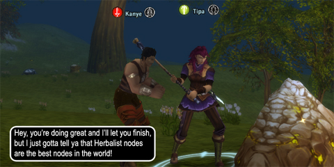

Back to: [West Karana](/posts/westkarana.md) > [2009](/posts/2009/westkarana.md) > [September](./westkarana.md)
# Daily Blogroll 9/17 - Kanye edition

*Posted by Tipa on 2009-09-17 21:34:53*

Guy just keeps popping up everywhere, don't he?

I am playing Runes of Magic now because, hey, WoW is coming out with a new expansion that I probably won't play, so why not reminisce about good times in WoW by playing some other game? Runes of Magic only allowed me to pick from two races, Elf and Human. I thought they had some short folk in the [character concept art](http://img.neoseeker.com/v_concept_art.php?caid=7948), but I guess those were just meant to be children. It'd be kind of cool, by the way, to start of as a child in an MMO (optionally, anyway), and play children's games of crafting, socialization, war and magic while slowly aging and learning more of the wider world and your place in it.

I'm a little late to the Runes of Magic scene, but I won't let irrelevance slow me down. Expect a "first look" in a week or two.

Raph Koster is at the Austin Game Developer's Conference this week (and I'd love to be there, too, to hear about all the new Wizard101 stuff!), and he's been working his fingers to the knuckles transcribing various panels -- he just posted a fascinating transcription of [a panel about monetizing online games](http://www.raphkoster.com/2009/09/17/agdc-opportunities-for-monetizing-online-games/).

Because "Free to Play" doesn't mean free. They expect between $5-$50 ARPU - average return per user per month (I believe it's by month).

Speaking of modern gaming's loose and liberal use of the word "free", Free Realms is having a double Station Cash weekend Friday evening through Sunday night. Buy a Station Cash card, redeem it after 7PM PST Friday but before Sunday midnight, and they'll match your donation. You have to redeem it within Free Realms, but you can use it in any SOE game that takes it. This puts a character transfer for your EQ2 characters at $12.50 each, effectively. Or you can spend it all on [dressing your kitty like a pirate](http://www.freerealms.com/article/detail.action?articleId=333) for [International Talk Like a Pirate day](http://www.talklikeapirate.com/).

If your F2P tastes run more toward stubby-legged cherubs than big-headed fairies, [Dragonica Online has some Arr Ye Matey pirate wear](http://forums.thqice.com/showthread.php?t=7291) in its cash shop, too. And of course, this is like [Christmas Day for Pirates of the Burning Sea](http://www.burningsea.com/page/news/article&article_id=11298)!

Here's a little Pirate Alphabet to get in the mood:

Ravious at Kill Ten Rats has a fantastic interview with some folks at ArenaNet, the people behind Guild Wars and its forthcoming sequel, Guild Wars 2: Electric Boogaloo. Find out how the Wizards of the Coast folks have it so easy balancing Magic: the Gathering compared to the way tougher card game of primary and secondary skills, what the purpose of all those different classes is anyway, and what they're keeping in mind for GW2.

Rer at (Insert Awesome Aion Name) was worried that the news that Aion's Fortresses would only be allowed to be taken on that server's prime time [would really hurt legions (guilds) with members across time zones](http://insert-awesome-aion-name.blogspot.com/2009/09/truely-unacceptable.html). Looks like NCsoft has taken that into account with a lot of tools to tell when a fortress is available for attack, which ones ARE being attacked and so forth to make it easier to get people together for those. Also, [looks like the West Coast servers are gonna be the hot ones](http://insert-awesome-aion-name.blogspot.com/2009/09/fort-times.html).

I used to twink my EQ alts by logging the alt in this little corner, dropping stuff there with my main, then logging in really quick and hope nobody had stolen it or it hadn't just decayed. Was that cheating? *I* don't think so. In EverQuest, that's pretty much why people kept going to the old zones. Twinking -- and farming stuff to sell -- was the root of EQ's social culture. It was the battery that kept the whole thing going. Gordon of We Fly Spitfires, alas, sees things differently. [Is twinking just another form of cheating](http://blog.weflyspitfires.com/2009/09/17/twinking-is-just-another-form-of-cheating/)? Or is it a way to keep older zones active enough so that newer players can more easily find groups?

Syp thinks grinding has got a bad rap. In fact, it brings you to an almost zen-like state of relaxation. Seriously -- [grinding might be good for your health](http://biobreak.wordpress.com/2009/09/17/a-case-for-grinding-redux/)! So grind another rank of faction for your kids, because they love you.

If you're gonna get that zen-like state going, what better reason than living through the apocalypse? Well, not quite living, not if you're in Fallen Earth. You're a clone of a DEAD person (oops, spoiler alert). Pete of Dragonchasers isn't sweating the genetic stuff, he's out scrabbling through the ruins looking for bits and pieces with which to make [horrific weapons of destruction and finger-lickin' fried chicken](http://dragonchasers.com/2009/09/15/starter-towns-empty-out/). Well, at least the fingers of one of those hands is lickable.

Spinks has words for those scallywags who pre-order a game just to get into the open beta, but then feel free to cancel it if they don't like what they see. And those words are: [go ahead](http://spinksville.wordpress.com/2009/09/16/gambling-with-pre-order-bonuses-and-beta-access/)! The game company gets good PR for all those pre-orders, and you got to see if you liked a game without shelling out big bucks.

Spinks is also liking what she hears about [the new Captain's Log in Star Trek Online.](http://spinksville.wordpress.com/2009/09/16/captains-log-stardate-whatever/) Yeah. The more I hear about that game, the more I like it. Please PLEASE I hope they take a cue from their Champions Online and make the STO universe a shared universe.

Openedge1 is [stirring in his stone mausoleum](http://simple-n-complex.blogspot.com/2009/09/may-return-discuss.html)... be frightened.

And Keen is agonizing over [the server choice he must make for Aion](http://www.keenandgraev.com/?p=2954). Every time it gets harder, whether for Pirates of the Burning Sea, or Warhammer, now this... at least Darkfall had just one server. Me, I just wait six months or a year these days. If the game still sounds like fun by then, I go for it. That's what I did for WoW. Wizard101 lets you change servers at will. I don't understand why more games don't design their games around server pools. Dividing friends among different servers shouldn't be a revenue stream. It's a problem that needs fixing.

You know, if Lord of the Rings were anything like Lord of the Rings Online, Radagast the Brown might have had a little more trouble with the birds and beasts of the field than he let on.... and Melmoth of Killed in a Smiling Accident has [the sad duty to write it all down](http://www.kiasa.org/2009/09/16/what-really-happened-to-radagast-the-brown/). My problem with him, in LotRO, was -- he was the one in charge of those annoying spying birds? When I met him in game, I wanted to ask him why he didn't call those annoying pests OFF. But that wasn't one of the conversation options.

Hudson [writes about the closure of a dozen Star Wars Galaxies servers](http://hudshideout.com/blog/?p=3348). I don't think my server is among those, but I have long forgotten in which server I played. I suppose SOE is finally able to let go, now that news about their follow-up, [Star Wars Babies](http://www.tentonhammer.com/node/73904), has come to light.

The Teal Nine Ring Highway Hazard has gotten subscribing to several MMOs down to a finely honed science. [Get out your spreadsheet and follow along](http://playervsdeveloper.blogspot.com/2009/09/juggling-mmorpgs-and-budgets.html) and you, too, can play five MMOs and pay for only one sub at a time.

Ardwulf, he of [the one word Aion review](http://ardwulfslair.wordpress.com/2009/09/10/worlds-shortest-aion-review/), bids [a fad sarewell to NCsoft Austin's Dungeon Runners](http://ardwulfslair.wordpress.com/2009/09/16/yet-another-title-meet-the-ncsoft-axe/). I liked the game fine, just got too repetitive, but I am sad to see it go. I remember when NCsoft Austin was started with bright hopes and magical moonbeams to work on a mysterious groundbreaking MMO by game royalty Lord "Richard Garriott" British. [I remember it just like it was Sunday](../../../index.php/2009/09/13/daily-blogroll-looks-back-2001/). Now, what's left of it? Gone, along with all our dreams.

The Friendly Necromancer spills the beans about [the special PvP armor you can earn in Wizard101](http://thefriendlynecromancer.blogspot.com/2009/09/alex-jaderider-wears-cools-clothes-what.html). -100% mana? Sounds like winning stats to me. But it does look cool, though making plate armor and metal helms kinda stretches traditional wizard-wear, doesn't it?

Keep gaming! I've had a pretty rough past couple of days IRL but I'm back now :)
## Comments!

**[Pete S](http://dragonchasers.com)** writes: Any idea what stores in the NE are still selling Station Cash cards? Last time I went looking (granted only hit Target and Best Buy) they had EQ2 Time Cards and Free Realms Starter Cards (and booster packs for the CCG) but no points cards.

---

**[Tipa](https://chasingdings.com)** writes: Last time I got mine at Target, I think. I'll be checking out some stores tomorrow.

---

**[The Elder Scrolls 3: Morrowind Game of the Year Edition | Daily Gaming Blog](http://dailygamingblog.com/the-elder-scrolls-3-morrowind-game-of-the-year-edition)** writes: [...] West Karana » Daily Blogroll 9/17 – Kanye edition [...]

---

**[rob](http://www.lostaneighth.com)** writes: Ahhh the good old days of dropping bags of loot in EQ for one of your alts. I had my secret spot in the top of the rocky cliffs outside Freeport in East Commonlands. In fact ... when the Nostalgia guild got me playing again, it was one of the first spots I hit after leaving the tutorial area.

---

**[rob](http://www.lostaneighth.com)** writes: Erm, I should qualify that: I went to the spot for old times sake, not for anything so nefarious as to twing my new character. I'm no cheater! ... plus we have shared bank slots now.

---

**[Tipa](https://chasingdings.com)** writes: We now know that shared bank slots are cheating :P

---

**[Andrew](http://teethandclaws.blogspot.com)** writes: On the subject of twinking as cheating, both Spinks and myself have weighed in recently:

http://teethandclaws.blogspot.com/2009/09/twinking-is-not-cheating.html
http://spinksville.wordpress.com/2009/09/18/twinks-heirlooms-and-morality/

---

**yunk** writes: The free to play model works, I spent $80 last month on w101 crowns because I pay for areas with crowns, if I subbed I would never be tempted to buy crown gear or gold. :)
Though I am slightly less tempted now that the crown gear seems to be of less power, though I imagine it will be more interesting to actually pay attention to what drops I get.

---

**[Saylah](http://notadiary.typepad.com/mysticworlds/)** writes: I remember dropping in AC1/2 as well. Finding a out of the way spot that you called your own, and logging in back and forth on different chars. Actually brings back fond memories.

I'm tempted to get back into ROM. I'd been waiting for this expansion before re-rolling. But since I purchased Aion I'll give that the little bit of undivided attention I have since I can play ROM later in the year, and it's still free. :-)

---

**[Tipa](https://chasingdings.com)** writes: I saw her response, but not yours. Thanks!

---

**[Tipa](https://chasingdings.com)** writes: Yeah, I guess they had to nerf the crown stuff, but it still hurts. Oh well. When my Myth wizard gets to 35, she can have all the old school crowns stuff I wore on my main all the way to 50.

---

**[Tipa](https://chasingdings.com)** writes: That's the best thing about F2P games :) But for me, when I am away from a game too long, it loses its hold on me and I rarely return. DOMO was like that.

---

**[Rer](http://insert-awesome-aion-name.blogspot.com/)** writes: Thanks for the mention! :D

---

