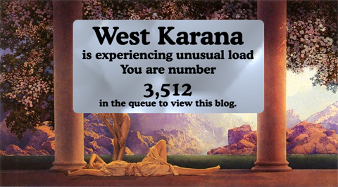

Back to: [West Karana](/posts/westkarana.md) > [2009](/posts/2009/westkarana.md) > [September](./westkarana.md)
# Please be patient....

*Posted by Tipa on 2009-09-21 21:52:58*

Picture is Maxfield Parrish' 1922 masterpiece, "Daybreak". Dad had bought an old print of that from SOMEWHERE and we had it above our mantle as long as I can remember. I used to think of stories behind that picture. The true story, that it was a painting done specifically to be reproduced using the then-new CYMK four color lithography process, never occurred to me.

## Comments!

**[Werit](http://www.weritsblog.com)** writes: Forget it, I'm canceling my pre-order :)

---

**[We Fly Spitfires](http://blog.weflyspitfires.com)** writes: LOL, awesome :)

---

**[Tesh](http://tishtoshtesh.wordpress.com/)** writes: Parrish's paintings are fantastic. We have some of his prints at our local library. They fit very well in the Children's Fantasy section. :)

---

**[/AFK &#8211; Sept 27 &laquo; Bio Break](http://biobreak.wordpress.com/2009/09/27/afk-sept-27/)** writes: [...] BURN! [...]

---

**[mbp](http:mindbendingpuzzles.blogspot.com)** writes: WTS 100 badly written comments. Don't bother sending tell as I am AFK till 7pm this evening.

---

