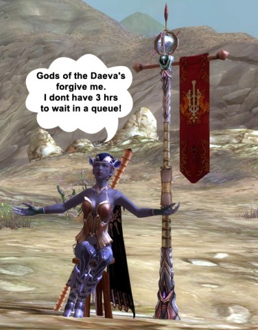

Back to: [West Karana](/posts/westkarana.md) > [2009](/posts/2009/westkarana.md) > [September](./westkarana.md)
# Aion - Living the Dream in the Ghetto

*Posted by Saylah on 2009-09-22 19:19:15*

*Can't stop Saylah from blogging :) - Tipa*

---

Leave it to the creative player-base to find a way around the 3-hour queues on the high population servers. Some have decided to stretch the “Personal Shop” feature that allows you to sell items while unattended, into a means of keeping their characters online 24x7. I mean – seriously, all I could do was laugh my ass off when I logged into the game and saw the sea of players who are mostly just AFK, setup as vendors. I felt like I was in the market district of some turn of the century ghetto. Mind you, somewhere in that mass of “For Sale” slogans and messages are quest NPCs and people that really have things to sell. Can anyone say, “Where’s Waldo?”

I can’t complain or blame them really. If you’re on a server in this situation but don’t want to leave your friends or legion behind, I suppose it’s every gamer for herself. Supposedly NCSoft is going to limit the duration of the inactivity of being in the “Personal Shop” mode to 24 hours, after that if you’re AFK you’ll be disconnected. If I had the time I’d check into how these shops play out in Korea. They are rather painful on the eyes even when people aren’t using them for queue avoidance. I like the idea of the shops but a few features like the ability for me to turn off seeing the signs/messages would be a good improvement. I’d also suggest that the AFK-timeout on them be somewhere between 2 to 4 hours, versus 24 hours.

And no, you can’t just tell people to leave high pop servers if they don’t want queues. Server and race access is very touch and go – minute to minute, making it impossible to migrate as a group. Our legion is now in limbo with some members sitting on the high population server progressing characters. While others reverted to the secondary choice so they could at least start playing. When we tried joining them on the secondary server, which was at least low population last night with no queues, we found that while low population, the server wasn’t accepting more players for our faction. Goodness grief. 

I only have this week to play much Aion. In a couple of weeks I’ll be away on business for 12 days and then starting the next writing workshop. It’s a tad bit annoying having to deal with this in my window of availability. I’ve decided to be a bad girl. I’ve succumb to using the unattended vendor trick to log into the game late in the afternoon, so that I can actually play when I get off work. It’s a comically sad situation but when in Rome…

## Comments!

**[Pete S](http://dragonchasers.com)** writes: In my experience, any game that offers "Personal Shops" looks like this anyway, even without the queue issue. Which is why I hate the idea of these things... blech.

But yeah, I guess I can't blame people for not wanting to get kicked off after they waited so long to get in.

---

**[Lars](http://www.mmomentofzen.blogspot.com/)** writes: I hate personal shops or having to sit around AFK to sell crap. It's not so bad if it's restricted to specific instances (such as housing in EQ2, or maybe a public "bazaar" area in another MMO), but if you can do it anywhere, people just end up blocking the high traffic NPCs or landmarks.

---

**[Anjin](http://bulletpointsblog.blogspot.com)** writes: Good for them! It may be a little thing, but I congratulate the players on their ingenuity.

---

**[Saylah](http://notadiary.typepad.com/mysticworlds)** writes: I actually like the personal shop idea for a game that doesn't have player housing. EQ2's version is the best of the best. Auction sales don't expire and you can turn your room/house into a store front. But without house and expiring auctions it's very hard to sell small margin items if you have absorb multiple posting fees.

I did find out that there is a command you can map a key to that while hide the bubble chat, the store messages AND you can map a key to hiding other players. hehe.

---

**[Pan](http://strictmachine.me)** writes: I like the personal shops, but there are a bit too many right now as folks work to avoid any chance of queueing. When I played Aion on the China servers earlier this year, personal shops weren't an issue. They're not an overwhelming presence there as they are right now on the NA servers. Since you pay by the hour for CN-Aion, it may be the primary balancing force over there.

I hope to see the store use diminish to reasonable levels over time. Reducing the personal store AFK timer to something reasonable would be nice as well. A couple of the ideas from CBT that I liked were:

- Channel instances that are "no shops allowed".
- The ability to make shops and the associated player invisible. Right now you have to turn off 'all' players (I think 'all' excludes those in your group, legion, and pvp enemy PCs). Being able to restrict 'all' to just shops would be a nice way to remove the clutter.

---

**[JC](http://phoenq-magson.blogspot.com/)** writes: Gone 12 days? don't forget to set a nice long skill in EVE ;)

---

**[Capn John](http://capnjohnsblog.blogspot.com/)** writes: I remember when I first started playing WoW and had to deal with queues I did the same thing as Saylah is doing now. I'd get home and log in because inevitably there'd be upwards of a 1-2 hour queue to get onto my regular server. I'd have time to take care of personal stuff, have dinner, get the kids ready for bed, and maybe, just maybe, there'd be less than a 30-minute wait to get in.

Then I'd get in, try to move and slowly rotate in 1/8th turns every 10 seconds, before getting lagged out. Log back in only to see "You are number 5,284. Your approximate wait time is 5 days, 16 hours, and 32 minutes."

Lovely.

Re: players AFKing as Stores to avoid the queues, I think there should be an /AFK Logout algorithm based on the number & rarity of items the player has for sale, whether or not they actually have any items left to sell, and whether or not the items they're trying to sell are readily available from in-game vendors. So someone trying to sell 100 Reels of Thread at 50s each when you can buy the exact same item from a vendor for 1s a piece would be AFK Logged Out very quickly, while the player selling the Holy Hammer of Thumpiness would have a considerably longer Logout timer because he's selling a rare-quality item.

I guess it doesn't occur to the AFK Store players that one of the reasons Aion has such long queues is because more & more people are AFKing as Stores to avoid the long queues, which wouldn't exist (or not be so long) if they weren't AFKing as Stores to avoid them in the first place.

---

**yunk** writes: WoW had the same problem: people would queue early and just tap the keyboard every 10 min or so, so that they'd be online for an hour or more before their friends got on. This only made the queues worse. But you can't force them not to. 

Actually it's typical hoarding behavior that occurs whenever something is rationed/price controlled and demand skyrockets, which is what happens in any new game, the game is priced based on demand in a few months not the incredible demand at the start, and there are only so many connections available.

Of course they could avoid the whole issue about adding/subtracting servers if they did it like W101 where the server really means nothing. I don't know why it's not done more often that way, maybe writers feel it "breaks immersion" esp. if there are world events, but part of your mythology could always be there are parallel worlds. In fact that would open it up for more stories plus give an explanation for why I have to kill Onyxia for the 100th time.

---

**[Wiqd](http://wiqdintentionz.com/studios/blog2)** writes: I like the personal store idea, but I wish they'd actually have a bazaar area like in EQ. However, I will say this: It makes the areas look a lot more alive with all the people sitting there. It's not really an eyesore for me as much as it is for some other people, apparently.

---

**Graktar** writes: If you want to avoid Aion queues, just play on the west coast servers. Apparently it's primarily the east coast servers that are having the problem. I've been playing every day since the beginning of the head start and haven't seen a single queue yet.

*shrug*

---

**[Zombie Writers &laquo; Tish Tosh Tesh](http://tishtoshtesh.wordpress.com/2009/09/30/zombie-writers/)** writes: [...] Aion:  Living the Dream in the Ghetto [...]

---

**Longasc** writes: I like personal shops. I also have not seen so many in one spot yet as on the pic.

The limitations they impose upon personal stores because of the QUEUES is silly. The personal stores are not related to the queues. If they would not be there, people would still not log out.

I cannot help, but I blame the Americans. Yep, I do. On my EU servers I have not seen massive personal shop clusters yet.

---

