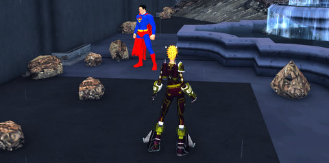

Back to: [West Karana](/posts/westkarana.md) > [2009](/posts/2009/westkarana.md) > [September](./westkarana.md)
# Daily Blogroll 9/25 - Apocalypse edition

*Posted by Tipa on 2009-09-25 07:08:45*

Adventuring after a mysterious apocalypse forever changed the landscape, with strange creatures everywhere and a refugee populace just trying to survive in a mutant world overrun with danger.... I didn't even know I'd gotten into the Earth Eternal closed beta. ~~Tails~~ Tales of my chubby little rat rogue, the kind that Cinderella did NOT want helping make her dress, once I've seen more of the game.

Back in EverQuest, unexpected adds usually meant a group wipe (unless you were specifically doing an AE group). Crowd control or a puller who knew how to split was really important. Modern MMOs ramp down the difficulty quite a lot, and [Spinks wonders if specialized crowd control](http://spinksville.wordpress.com/2009/09/25/crowd-control-the-marmite-of-mmos/) has any sort of place in World of Warcraft, given the tendency to just gather up a room and kill everything at once? And this is why WoW can't have nice things, like enchanters and bards :)

At Hudson's Hideout, Rock Hound looks at [the two kinds of people who roll up heroes in Champions Online](http://hudshideout.com/blog/?p=3383) -- Conceptionists, who have a backstory and a theme for their hero, and Minmaxists, who just go for the most efficient powers and stats. We used to call these role-players and ROLL-players back in the day.... and this argument has been going on for thirty years.

Jaye from Journeys With is pushing back against the grind. Having to essentially solo for weeks or months upon joining an established game to catch up with max level guildmates [has killed many friends' interest in playing EQ2](http://www.journeyswithjaye.com/?p=1459). With ten more levels coming in February, who could possibly be dedicated enough to go through 89 levels of mostly soloing? It's an issue for any established game, and I wonder what SOE is planning to help new players bridge the largest level gap of any subscription game. I'm guessing *nothing*, because there's one thing that SOE loves more than anything in all its games, and that's the GRIND. It's a holy mandate with them.

EQ2's Game Update 53 that introduced the Shard of Lurrrrv and lots of other coolness to the game has gotten Gestalt Mind's Rao [back in the game](http://raoworld.wordpress.com/2009/09/24/incoming-train-of-fun/). Being able now to pass appearance and quest armor among alts is a *nice* thing, and the new adventure zone that adjusts to the group level -- sweet.

Ogrebears is not so much of a fan, averring that the new WoW-like achievement system is turning everyone into [mindless, achievement-hungry zombies](http://ogrebear.com/?p=1351) who care for nothing more than wracking up pointless accomplishments.

Having trouble getting Age of Conan to look as good for you as it does on their web site? Worry not, [Openedge1 is on the case](http://simple-n-complex.blogspot.com/2009/09/age-of-conan-this-is-uh-setup.html), looking at drivers and settings for two different video cards to see how to best boost AoC's performance.

And lastly (and only because I have to run to catch a bus!), Andrew of Of Teeth and Claws has [journeyed back into the world of Spellborn](http://teethandclaws.blogspot.com/2009/09/dabbling-in-spellborn.html) and pronounced it -- AWESOME. Yeah, the game is definitely a feast for the eyes :)

## Comments!

**CD** writes: This brings up something that's bothered me for a while now; Music classes being MIA.

I realize EQ2 has them, but I always felt that was kind of expected being part of EQ and all. Loved them in DAoC and EQ1, and I play one whenever possible in table top RPGs as well. I suppose the lack of one in WAR and WoW can be attributed to a lack of them in the lore (although I'm not as familiar with the lore of those two worlds as I am others).

I dunno, just always bothered me that I couldn't be some kind of Bard-esque class in these more recent (western) games. Is it just mainstream subscription MMOGs that they're missing from? Or is it across western, eastern, subscription and free to play alike?

---

**jorden** writes: very good game

---

