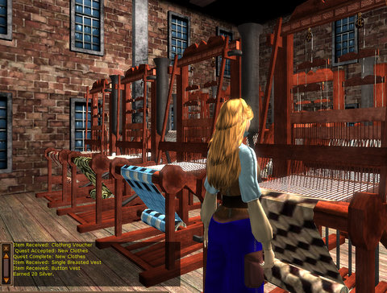
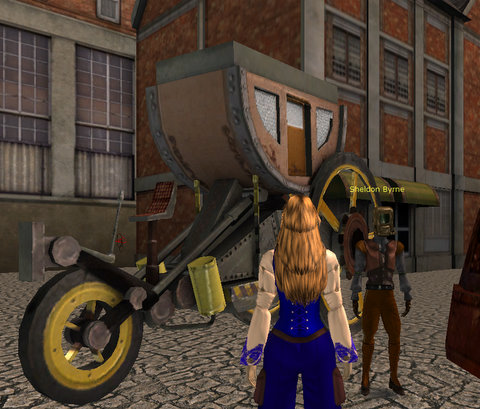

Back to: [West Karana](/posts/westkarana.md) > [2009](/posts/2009/westkarana.md) > [September](./westkarana.md)
# Checking back with Gatheryn

*Posted by Tipa on 2009-09-26 11:48:59*

The hissing of steam and rattling pipes greets me when I step onto Elymia's weather-worn docks. It seems ages [since I was last here](../../../index.php/2009/08/21/a-first-look-at-gatheryn/), though it's only been a month. So many things have changed since I've been gone from Mindfuse Games' [Gatheryn](http://www.mindfusegames.com/).

Gatheryn is still, at its heart, a minigame portal, but in the past month they (seem to have) added many more games that are integrated into the world -- weaving AKA Bejeweled, clockwork assembly line (where you shoot parts onto a twisting, meandering conveyer belt) etc. These games may have been in Gatheryn previously, with me just not FINDING them, and this is my main issue with Gatheryn as it trundles along toward release -- it's fun to explore the city and the docks, and sometime later, the lands beyond -- but if you mean to sit down and play some of the minigames upon which the economy depends, you have to tediously run around and find them.

They DO have a basement area where you can find many of the games crowded together like slot machines in a casino, but most of the games there don't pay silver (at least one does, but I suspect that's to be fixed). 

And you'll need silver, for that is the only coin of the realm, and the prices for goods are not cheap. Decent outfits and mechanical pets will set you back thousands of silver. You'll find you'll need to eat now and then, and you can find some edible trash here and there, but the residents of Elymia disdain garbage-dining tramps, as well they should.

Though you can find Sudoku and word search games most everywhere, you'll have to hunt up the weaver to use the looms, or the printer to try your hand at typesetting (timed word search) or play a few hands of solitaire (in a pub hidden in the hold of an old rusted ship on the docks). And you'll want to be doing this, because the payout for the common games is only a few pieces of silver, whereas doing well at the pest extermination game netted me 46 silver.

The best way of making silver, as it is in other games, is running quests. The game isn't run on the quest hub model common to WoW, EQ2 and most other recent games, but now and then you'll stumble upon a red exclamation-point bearing NPC who will point you toward money opportunities. An initial quest line greets you when you get off the boat from whichever lesser country was previously home, and that will bring you to the clothing district where you'll get some basic wear, and thence on a small tour around the city where you'll earn some odds and ends. By the end of the line, you will have enough coin to buy an outfit with some bit of style, and not look so much like a just-off-the-boat beggar.

Much care has been taken with the object search games, where you're sent into a room with a timer and a list of items to find. The items are usually devilishly hidden but the rooms are gorgeous, like the airship works above.

I spent more time than I expected this morning playing the minigames. Gatheryn is coming along well, but I do hope they learn from Brad McQuaid's mistake with Vanguard that resulted in a huge, but empty, world -- [overcrowding is easier to fix than vast emptiness](http://www.bradmcquaid.com/Brad_McQuaid/Blog/Entries/2009/9/22_Vanguard__Post-mortem_Part_4.html). If there was another person in Elymia today, I didn't meet them, and though I remained in the world while playing most of the minigames, I wouldn't be able to see anyone unless they stood right in front of me and tried to attract my attention.

No use earning all this silver and buying clothes nobody will see!

If they make the various games a little easier to get to, and fix the odd random bug (like getting stuck in the floor on the way to my printer devil job), I wouldn't hesitate to recommend Gatheryn to my casual game playing friends and my Sudoku-fiend stepmom. I'm thinking a nice taxi line to deliver you to your destination.

And that Da Vinci-esque flying machine? I want to fly that. Steampunk dogfighting would RULE.

## Comments!

**[Tesh](http://tishtoshtesh.wordpress.com/)** writes: "Steampunk dogfighting would RULE."

Yes. Want, please.

Nice shots and writeup! I keep meaning to check it out, but I've got too much else going on. Such is life. *shrug*

---

**[Daily Blogroll 12/2 &#8212; Rift-tease Edition - West Karana](https://chasingdings.com/index.php/2010/12/02/daily-blogroll-122-rift-tease-edition/)** writes: [...] a touch of fantasy set in the Victorian or Edwardian eras. It’s REALLY SIMPLE. Gatheryn had the aesthetic nailed. Sherlock Holmes with ray [...]

---

