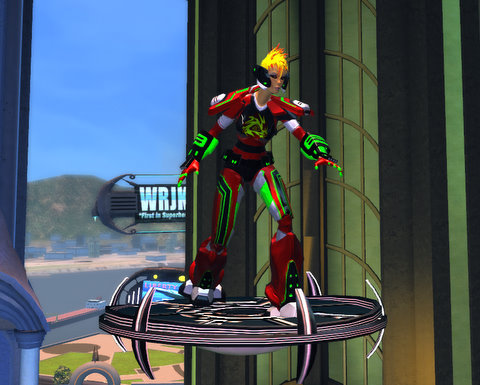
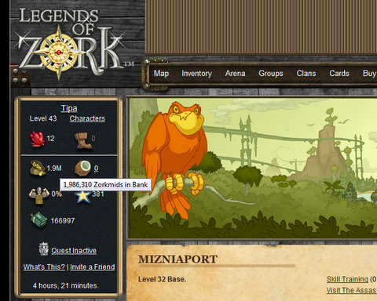

Back to: [West Karana](/posts/westkarana.md) > [2009](/posts/2009/westkarana.md) > [September](./westkarana.md)
# Weekend Gaming

*Posted by Tipa on 2009-09-28 00:12:16*

Sean E asked me why I wasn't playing Dungeons and Dragons Online. I hear DDO and I think "hey, another fantasy MMO with wizards and stuff". Why add a twenty-first to the twenty I already play or have played? And who has that kind of time? I guess it depends on who you play with; in an MMO, it's more about the company you keep than the merits of the game.

In EVE Online, my corp is factioning up to get the new Level 4 epic mission arcs. I haven't started on that yet... just as I was heading to the station where an Impetus agent who might speak with me dwelt, I got a mail from a storyline agent who had a ten part mission for me. So I headed back to Aunia for that, and accidentally took some normal Level 3 missions as well -- but all for the good. I understand turning in more than one mission at once really pumps your faction with the agents.

Tomorrow or the next day, we're having a lowsec ops -- going around low or null sec, looking for trouble. I have a cruiser, a Vexor, fitted out for PvP. I have had this same Vexor for over four months now, ever since Saylah gave it to me, and though I used it for most of my level 2 missions, I always brought it home.

Since I was getting really bored with mission running. I decided to give the Vexor a spin in lowsec -- a solo ops. I'd just fit a micro warp drive in it, and the drone bay was full of ECM drones I'd never really tried out. ECM drones interfere with the target's targeting -- and if the enemy can't target you, it's much harder for them to hurt you. Smart bombs and friend-or-foe missiles will still work, but I haven't seen many people or NPCs use those.

I headed to 0.3 space -- nearly lawless -- found a deadspace hideout and started directional scanning to find players hunting by themselves that I might be able to take. I did find a couple on the scanner, but I couldn't zero in on them enough to find out how to reach them, so I just went from asteroid belt to asteroid belt, hunting. I didn't find any players, but I did find some Serpentis pirates. A single went down easily enough, but the next group was two frigates guarding a Megathron battleship. I warped out, then decided to try out the ECM drones by having them jam the battleship while I took out the frigates. I got a little mixed up on the way back and ended up in a different belt, with two Serpentis cruisers guarded by two frigates -- two same class ships, the cruisers, plus cruiser-killing frigates. I sent the ECM drones against the cruisers and took on the frigates, but the frigates got in too close, close enough that my guns were useless. I had to call in some of the ECM drones so I could bring out combat drones. One cruiser stayed numb, but the other shook off its drone and came at me. I traded one combat drone for a third ECM drone to quiet that cruiser, took down the frigates, then took down the cruisers, one by one.

ECM drones are not the sure-fire killer I was hoping they would be... it was worth checking them out before we go against another player. I believe our plan is to double up on ECM drones, warp scrambling and webbing. But we'll see.

I recently finished Core Competency Standard certification and Gallente Soldier Elite, so my skills are coming along nicely. I'm working on battleship skills now.

I got my Champions Online character, a power armor hero named Radium Red after my most recent City of Heroes character, to level 14. This is the highest level I've gotten a CO character. She got through all the Canadian quests she could find, handling group missions solo without too much trouble. I'm liking the power armor builds, and I REALLY like being able to lift things like airships and toss them at enemies -- one shot kill if it's heavy enough. (If you're in the Powerhouse, this would be Gigantic-level objects). I felt pretty unique until I found the Science Invention store, and it was full of people in power armor. Only one looked like Iron Man, thankfully.

The missions in Millennium City REALLY remind me of City of Heroes missions, except, so far, the mission environments have been very much smaller. I don't like leveling MMOs so much these days, but I do want to level enough to meet my nemesis. In the City of Heroes world, R.R. was a villain, so here, I will make her nemesis upright and heroic as I can. Maybe Superman :)

In Legends of Zork, changing my sidekick to the Accountant is finally starting to pay off. When I dinged 43, she dinged 3 and my rate of interest is now 6.4% compounded nightly. I have a spreadsheet tracking my profits and most recently made 116.2K interest overnight. I'm on track to have 3 million zorkmids by next weekend and in a month's time should reach the interest cap, which is 635K per night. And then -- I can finally start spending money again. My previous sidekick, the Gent, helped me solve traps and fight, and without him, combat and puzzle solving has taken a real hit. My skill points have been going toward TMP (trap, maze and puzzle) solving, but levels only happen once every couple of weeks, so it's very slow going. Combat will have to wait until I can buy new weapons and armor. In two more levels, the Accountant will be giving me 9.6% interest compounded nightly, and after that, I should have no more money problems ever again.

I play Legends of Zork purely so I can enter the figures in my spreadsheet each morning. Way more fun than looking at my actual bank balance.

---

I played Gatheryn for awhile, and also Earth Eternal for a few hours. Tonight was our weekly Neverwinter Nights 2 group, and we've just uncovered a Githyanki plot. Many Githyanki died this night. I also dinged 7 and learned two new spells, Summon Monster III and Haste. Neither seems to be as useful as Fascination and Cloud of Bewilderment were, either of which serve to make everything in the area hate me. Everyone hated bards, why is that?

In Wizard101, my plan to move onward to Newgate Prison has hit a snag as Marissa is forced to go on a bunch of really trivial missions in Chelsea Court and Hyde Park. I may take a break and head back to Grizzleheim once I'm finished with those.

My house in W101 is shaping up nicely with all the quest rewards and random drops. I wonder how much space the new Life island will have? Or should I just let Marissa have an island all her own....?

## Comments!

**[mbp](http://mindbendingpuzzles.blogspot.com)** writes: Hi Tipa, Its been a while since I played EVE but it used to be generally accepted that ECM didn't work very well against rats. CCP use a simplifed model for npc ships than for player ships and certain things (like ECM and also Energy Drain) don't work the same on rats as they do on players.

---

**Maineiac** writes: Is your corp recruiting? I enjoy reading the exploits of your group, it sounds like fun! My corp is very dull at the moment. Nobody really talks and just runs missions by themselves all the time.

---

**[JC](http://phoenq-magson.blogspot.com/)** writes: Sounds like you're having fun in EVE! Now that I finally got internet at home again I'll be playing more myself.

I actually have spent the last 2 weekends checking out DDO. It's a bit more action-oriented than the other MMO's I've played, and for your basic melee classes it's pretty much all about the auto-attacks.... but most of your skills and feats and such are designed to improve your auto-attacks. The healers and nukers are the standard "stand in back and push buttons until you're out of spell points" type. You can "hybridize" them for better soloability, but then you have to interrupt your attacks in order to cast. Not too big a deal, overall though.

Still... it's only on my pc since it's F2P and I don't think it's gonna be grabbing too much more of my attention. Perhaps the occasional dungeon run a time or 2 a week, if that. We'll see.

---

**[Tipa](https://chasingdings.com)** writes: We're always recruiting, especially people who want to do fleet ops. Our director, Sredans, dreams nightly about having a fleet large enough so that people could fly specialized support ships.

We're OtakuDyne, look us up in game and send in an app. What's your pilot name?

---

**Maineiac** writes: I'll send you an EVE mail in game. :)

---

**[Saylah](http://notadiary.typepad.com/mysticworlds/)** writes: I've been thinking about getting back into EVE Online. If only there were more hours in the day. Preferably, a whole lot less working hours and more gaming hours. I like the sound of the corp you joined. Perhaps I could get an invite when I come back. I'm always up for some fleet ops drama. And still have the set of Tristans LeTrange built for me to PVP in that haven't gotten used yet.

Wow on the being up to level 4 missions. I'm very impressed. You've been working the PVE content to get there in what feels like a short amount of time.

---

