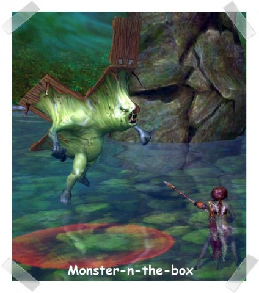
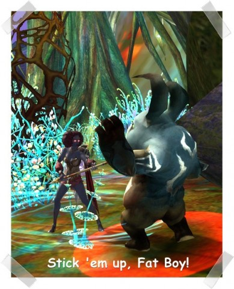
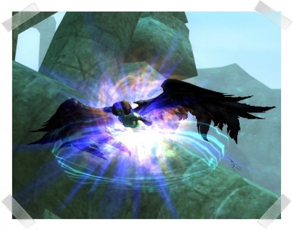

Back to: [West Karana](/posts/westkarana.md) > [2009](/posts/2009/westkarana.md) > [September](./westkarana.md)
# A Weekend in Aion

*Posted by Saylah on 2009-09-29 04:07:58*

Aion was my entertainment of choice this weekend. I spent the better part of Friday evening and Saturday playing it. I’ve rejoined MMO comrades from the [Casualties of War](http://www.casualtiesguild.com/) (COW) guild, first formed as a group of bloggers going into Warhammer Online. The guild has since branched out into a number of other MMOs, including Aion.

**Community**

Even if you prefer to solo, having a good in-game community is important. This is especially true in PVP oriented games. Being back among the members of COW is fun as always. They’re chatty, extremely helpful and generous. A good guild helps to offset the sometimes “Barren’s chat” atmosphere of newly released or heavily populated games. Your guild is your sanity buffer. 

**Exploration**

I play MMOs largely to exist in fantastical settings ripe with natural phenomenon, myth and magic. Aion is nothing if not beautiful! On land, air and sea, every corner of the world has been detailed with care. Original World of Warcraft was pretty to me. I especially loved the quaint zones like Goldshire, impressive cities like Stormwind and themed zones such as, Booty Bay and Darkshire. It wasn’t until Burning Crusade (BC) that Blizzard added vivid exotic zones like Zangarmarsh, Netherstorm and Terokkar Forest. And while I loved those zones, the abrupt transitions of the BC landscapes seemed awkward. Aion manages to deliver the same variety in zone design but with more fluid and natural transitions. I find myself roaming around new zones to take in the scenery before I begin questing.

**Progression**

**Leveling**

I did quite a bit of leveling over the weekend. The “dings” come slower than in a game like WOW. The XP doesn’t flow as quickly and combat takes longer. I haven’t minded the difference so far. If this is the “Asian grind” then it’s fine by me. You don’t get new skills like candy in Aion. The drawn out combat allows you to use your brain - strategy and tactics, to win a fight. You can’t win simply because you got in the first hit. In fact, you can kick a pending-defeat in the teeth by staying composed, thinking ahead and using everything that’s at your disposal, including the terrain. This game is the least rock-paper-scissors I’ve played to date and feels very balanced. You’re not meant to stand toe-to-toe slugging it out until one of you drops. Somewhat similar to Age of Conan, directional movement during combat will increase blocking or damage output. Those directional arrows at your feet have a purpose. *Smile*

I’m doing more quests than grinding which is a compliment to Aion’s PVE content. I must now concede that perhaps, I don’t actually hate quests. Everquest 2 and Asheron’s Call 2 being the exceptions, where I started questing, and how I came to believe that I hate quests. WOW’s quests past level 30 didn’t do much to improve my opinion of quests, which is where I really reverted to grinding and instances to level. In Aion, I’m mostly doing quests, as was the case with Age of Conan, Warhammer Online and Runes of Magic. Aion PVE isn’t perfect but it’s definitely good. If I encounter a quest series that has me running back and forth, I bail once I’ve had enough and move on to something else. At this point there’s been more content in a zone than I need.

**Group Content**

I did my first group quests with COW this weekend. It was an experience not to be missed. Dealing with the Black Claw Tribe is the first content that really requires a group. It’s an outdoor zone with elites, patrols and treacherous named-bosses roaming the area. Just getting to the NPC Quest Hub can be a death march the first couple of times. The previous content doesn’t prepare you for a zone of tightly packed mobs, with strong social aggro and a long chase leash. 

The first time I tried to reach the area I almost died. I was totally unprepared for how densely packed the mobs were and came running in with a train on my butt. It’s amazing how many mobs you can aggro trying to run just a few yards from the safety of the Altgard Fortress. It’s not a zone you can do at the appropriate level and solo. 

I have to admit that I liked the heightened sense of danger you don’t typically experience outside of a PVP setting. Black Claw has named mobs roaming around that can and WILL wipe a whole group if you don’t burn them down before a patrol comes along, mobs re-spawn nearby or someone moves around too much and pulls another pack. People don’t like dying in Aion. I certainly don’t like dying. I was proud of my 14 levels with no deaths status. I didn’t want the XP debt. I didn’t want to pay to have the death de-buff removed which get more expensive as you level. Besides, I usually have a nice stash of DP points accumulated for my special skills which you lose when you die. Doing the quests with the COW group was a piece of cake. There was only once occasion when things got out of hand and a few of us died – oh wait, we wiped. *Smile*

**Drama and Mayhem**

Late Saturday evening, I was sneaking around Black Claw, trying to turn in a couple of quests. I noticed someone in trouble and healed them. He invited me to group, asking if I could just escort him up the road a bit. Sure, no problem. On the way he started attacking random lone mobs and was shocked at how hard they hit. I told him that most of the mobs in the area were elite and to stay as close to the path as possible. Even that doesn’t give you a free run through the zone but at least the mobs near the path aren’t elites. On our way, we ran into a patrol whose route intersects the path. It wasn’t a piece of cake but we successfully dispatched them. I guess he got over confident. He started zigzagging the area killing mobs for a different quest. We were doing okay so I didn’t complain. The coin and loot was dropping at a nice pace so what’s to complain to about? Suddenly, in the blink of an eye, we had our Leroy Jenkins moment… 

It happened so quickly but felt like slow motion. I saw the Spellcaster biotch and her pet approaching (Elite mob pair). I started backing up while trying to type, “DO NOT attack her. Run!” But it was too late. Johnny Come Lately Gladiator ran in for the kill. Nooooooooooooo! I knew this was going to hurt. He was taking damage like stomped tomato. I de-buffed the Spellcaster with a couple of hits then start healing Johnny, which caused the pet to attack me. All I could spare for myself was a heal-over-time. Johnny was going down fast. I knew that if he went down, there was nothing between me and face full of dirt, so I kept healing. I drank a health potion and popped my BP shield (last-ditch-hail-Mary, on a loss ass regeneration that is based on building DP points that clear if you die or log out) skill, to soak up some damage while hoping to survive. “Stay alive! No matter what occurs, I will heal you!” *Snicker*

**Other Players are Helpful**

Another player noticed we were in trouble and joined the fray. I buffed the newcomer, applied more de-buffs the hell-raising Spellcaster and kept healing. A patrol arrived. Oh lord, we’re gonna die. Two more players rushed in to help. By this time my fairy sized character couldn’t see shit. Body blows and magic – BAM, kick, thrust, fire, smoke and block animations were flying every which way. They kept fighting. I kept healing. And we managed to survive. When the last mob feel we looted them quickly and scattered like rats. I jumped off a nearby hill and glided to safety. Immediately after my Gladiator friend whispered, “Damn, I guess BC is serious business!” I fervently agreed and got the hell out of the zone.

Our little escapade capped my Saturday evening in the game. I’d had all the excitement I could take for one session. I flew back to the capital city and began crafting myself into poverty, but that’s a tale for another day.

## Comments!

**[Andrew](http://teethandclaws.blogspot.com)** writes: Nice recap - thanks. =)

"I haven’t minded the difference so far. If this is the “Asian grind” then it’s fine by me."

Aion's leveling curve is nothing like the games that spawned the term "Asian grind". Anyone who tries to make that comparison has never played a typical Asian MMO for long enough to understand the term. =)

---

**[rob](http://www.lostaneighth.com)** writes: I think a lot of people worried that Aion would be Lineage 2 all over again. While it is hard to tell, it reminds me of WoW when WoW launched. Initial levels came fast, but slowed down pretty quick. Then again, I am only level 18, so what do I really know?

Aion has a "work order" system to level crafting. So you can accept a work order and are given the supplies to complete it aside from a few things you need to purchase. I know it is not the first game to do this by a long shot, but I do love it. I wish WoWs crafting system were not so "throw away".

Right now my main problem with Aion is that my buddies in WoW have sucked me back into it ( what can I say? I have friends there :) ), and I am dying to play more EVE. For me, Aion is so similar to WoW that I should only pick one, but do I stick with my group of solid friends, or stick with the new shiny and try to make new friends?

---

**[rob](http://www.lostaneighth.com)** writes: Also, I would just like to say that "stomped tomato" is some of the best mental imagery I have ever had for an overconfident tank. :)

---

**[Pan](http://strictmachine.me)** writes: Great shots; especially the Monster-n-the-box. Your character's hair scares me just a little bit :)

---

**[Saylah](http://notadiary.typepad.com/mysticworlds/)** writes: @Andrew - Thanks :-) The first 10 levels went by at WOW speed, and yes, then they slow down. But I still don't feel like it's a "grind". Perhaps it's because I'm in no hurry to reach the top and I do lots of things in between leveling.

@Rob - Yes, I've been using the work order system. It's very similar to EQ2's implementation. However, you still have to provide a base regent per combine, which is something like having to supply fuel in EQ2 except these regents can get a little expensive over time. Regards, I like the crafting. I like that i can harvest all and do all professions but can only master one. this is very similar to EQ2 which has my favorite crafting system.

@Pan - thanks. I'm enjoying myself. Only wish I wasn't going out of town next week. I wanted to get into the 20s and Abyss with the gang I've been keeping up with so far.

---

**[We Fly Spitfires](http://blog.weflyspitfires.com)** writes: Nice write up :)

I wasn't overly impressed with the first 10 levels and the newbie experience but I keep hearing so many good things about the rest of the game that I'm keen to stick it out.

I agree with you about the quests and exp too. I think getting a nice dungeon group going is better than quest grinding.

---

**Bhagpuss** writes: Very intriguing write-up. I've personally never been attracted to Aion, but since several bloggers whose blogs I enjoy have been anticipating it and are now playing it, I am building up what may be a misleading picture from their jigsaw pieces.

Everyone keeps saying how beautiful it is, but either it must just not be to be to my taste, or else it looks much better in-game than in screenshots and videos. Then, WoW turned out to look immeasurably better when I actually played it than I had expected. If they ever get to a free trial, I'll take a look and find out which it is.

The thing that does really surprise me, though, is how old-fashioned many of the game mechanisms sound. From the slower levelling to the densely packed, aggressive mobs to the zone sweepers to the harsh (by modern standards) death penalty, to the long leashes and trains, it all sounds remarkably like the status-quo pre-WoW. That would be nothing surprising for a niche game, but for something reckoned to be the next multi-million sub MMO it seems very odd. 

Of course, all MMOs start off much more unforgiving of error and incompetence than they end up, as it becomes necessary to draw new subscribers from a wider pool of potential players, who are less fanatical about the game and more likely to give up as soon as things don't go their way. If Aion can attract and hold a really large player-base ( near to 7 figures, let's say) for a year or more, and not sand off the hard edges, then it might have an impact on future MMO design.

Big "if", though.

---

**[Saylah](http://notadiary.typepad.com/mysticworlds/)** writes: @Spitfires - I put Aion in a similar category with Runes of Magic in that, if you already have a steady MMO love affair then there's not much point in trying Aion. It will be too similar in many ways to other games that are out. However, if you're looking for a new EQ2, AOC, WAR or WOW like experience - things that are already pretty standard but in a new setting, with world PVP that's a bit more meaningful and aggressive but in a fantasy setting, again Aion is worth a look. That's how I see things from where I sit. It's enough like what you already like but in a new setting with some twists if you're on the hunt for a new fantasy MMO with PVP. But I don't think it's different or brilliant enough to pull anyone from their favorite MMO where they've already invested in characters and the community. Just my 2-cents.

@Bhag - I've noticed the game doesn't do very nice screenshots. I don't know why. I haven't seen any options for controlling the quality of output. The atmosphere and the imagery is stunning - if you like that sort of thing. :-)

---

**[Saylah](http://notadiary.typepad.com/mysticworlds/)** writes: @Bhag - I forgot mention that while the penalties seem more old school in their harshness, perhaps the tide is turning a little for some players. I actually like the feeling of danger when I'm out questing in these particular zones. Not every zone is like what I described. Black Claw is designed for groups. It's not meant to be soloed. If you choose to do that then enter at your own risk. 

The normal questing areas are more in-line with other AAA MMOs. But yes, the death penalty is stiffer than some games and people are paying the price for throwing themselves against the wall repeatedly. Again, I think that's fine since it's a choice. If you can't solo it, by pass it or group up.

Personally, I'm enjoying added thrill when I'm roaming in more treacherous zones. The other night I made a 15 minute trek out to a new area. I shouldn't have been going there yet - level is too low. I made the decision to make the run anyway just to see if I could collect more quests with common/shared objectives before killing the mobs. 

I died a few yards from the NPC when my too low of a level aggro'd several mobs in the zone. I let out a growl over vent but what could I be upset about? I knew I was taking a risk so I wasted 15 minutes walking there and my death sent me back to where I was hearthed. The next day I made the trek in one piece because I knew in advance that the last leg of the journey had a patch of mobs that I would have to craftily fight my way through, which i did

So I don't think it's too old school or a big deal. You have to watch what your doing in certain zones. No one thinks anything of having to be careful in a 5-man or 10-man dungeon right? You can't roam around willy-nilly. You have to watch for patrols and re-spawns. Some of the Aion zones are like being in Zul'Gurub or Ahn'Qiraj. i think that's fun.

---

**Graktar** writes: Just regarding the "asian grind" as it applies to Aion, NCSoft specifically reduced the xp grind and sped up leveling for the NA release of the game. If you were to go and play the Korean version you'd find the grind much much more severe.

---

**[Capn John](http://capnjohnsblog.blogspot.com/)** writes: I love those moments when all hell breaks loose and it looks like you're dead but everyone keeps their head and focuses on doing their job and the longer the fight goes on the more you start to believe and think "We can do this!"

Sometimes those fights end in defeat, but I don't find them annoying like the avoidable deaths when you charge into yet one more fight, this time with low health because you're on a roll and forgot you're not really immortal or even invincible.

But like this time, those seemingly unwinnable fights can be won if everyone keeps their head and remembers how to milk the most out of their class during "crunch time". I did like how your new found friend messaged you to acknowledge that he should have been a little more careful in that zone with those Mobs.

---

**[Zombie Writers &laquo; Tish Tosh Tesh](http://tishtoshtesh.wordpress.com/2009/09/30/zombie-writers/)** writes: [...] A Weekend in Aion [...]

---

**[Saylah](http://notadiary.typepad.com/mysticworlds)** writes: @Capn - Yes, I chuckled too. The whole "this is serious business" is often a funny tag line in forum posts and chat. So I knew he was a "gamer" when he used that phrase and realized he done a big oops.

---

