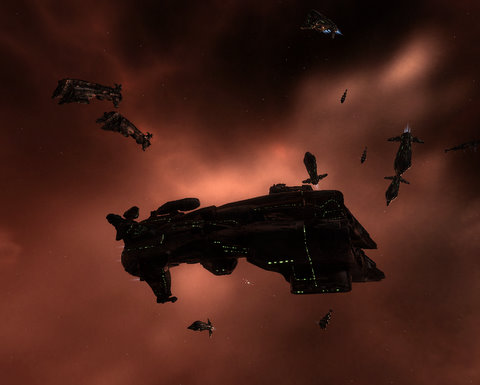

Back to: [West Karana](/posts/westkarana.md) > [2009](/posts/2009/westkarana.md) > [September](./westkarana.md)
# EVE Online: As seen by Hubble

*Posted by Tipa on 2009-09-29 12:00:08*

Ya know those [Deep Field](http://en.wikipedia.org/wiki/Hubble_Deep_Field) shots the Hubble took, where they point the telescope at a seemingly empty part of the sky and find [tens of thousand of galaxies in every shot](http://en.wikipedia.org/wiki/Olbers%27_paradox)?

That's pretty much how I was feeling when I fought my way to the last "room" of an EVE storyline mission and found little clumps of ships like this one scattered around. There's three battleships, six battle cruisers and four destroyers in that shot -- and if I fired at the mission objective, they'd be coming for me.

So I sent cheap drones to do the deed instead. Heh.

Tonight is our lowsec ops. Last night we finished fitting our PVP ships. I was advised to take along some repair drones (training for them now), but otherwise I'm good to go. Our jumping-off point was 20 jumps away, so I just set my Vexor on autopilot and watched Miyazaki's "[Castle in the Sky](http://en.wikipedia.org/wiki/Castle_in_the_Sky)" while it flew away.

This is my first PvP ops with the corp. It's gonna be fun :)

## Comments!

**[Saylah](http://notadiary.typepad.com/mysticworlds)** writes: Oooooooh the fun you're about to have is oh-so tempting but not yet. I can't come back to EVE just yet. And you're watching one of my favorite animation films. I still want to play a game that feels like that movie. That's part of what I loved about the early zones in Runes of Magic. I love that Victorian/Regency era but I also adore magic. May I pretty-please have both in one MMO? I think that's why I fell head over heels for Wizard101's Marleybone, even though it was always nighttime, something I don't typically enjoy.

---

