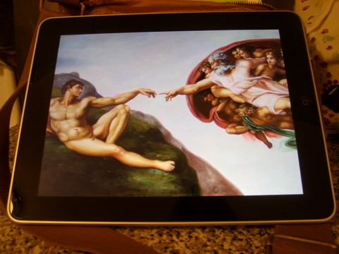

Back to: [West Karana](/posts/westkarana.md) > [2010](/posts/2010/westkarana.md) > [April](./westkarana.md)
# The iPad vs the Netbook, Parts I and II

*Posted by Tipa on 2010-04-07 19:06:35*

I've been a big fan of my Asus netbook for a couple of years now, and last week I got my grubby hands on one of Apple's new iPads. How do the compare? Is there any reason to have a netbook when you have a shiny new tablet? Or is there a purpose for an underpowered, single-tasking, locked down device when you have a free and open universe available to a netbook?

In my first vidcast *ever*, I go over some of the things I like to use my netbook for. In part 2, I put the iPad through its paces. Part 2 has better production values (slightly better) and I rap. No, really.

Part 1:

Part 2:

## Comments!

**[Amuntoth](http://manifestpixel.wordpress.com/)** writes: So do you think people will be watching movies on the iPad with it sitting on the table and your neck cranked to have your face facing down, or hold it up the whole time? Seems like the only reason anyone buys it is that it's apple. But I haven't gotten my hands on one to try it out. After a week or so, what do you think? Still liking it? It's got some cool apps, but it seems like it's just a bigger screen.

---

**[Tipa](https://chasingdings.com)** writes: It's lighter and smaller than a hardcover book (and much thinner), so if you are comfortable with those, the iPad won't feel unfamiliar. I find it easier to use conformably than the net book. Even though the Asus is hand-down the more powerful machine, the comfort and ease of seeing of the iPad makes it my choice when I don't need a socialized app found only in Linux.

---

**Jesse** writes: Browsing and commenting on blogs and the Internet in general is very easy on the iPad. I may even try blogging again since I have a mobile device with a keyboard that (for me) is easy enough to use.

---

**[Pete S](http://dragonchasers.com)** writes: I LOVE the rapping!! You never stop surprising me. :)

So far I'm loving my iPad, too.

---

**[Amuntoth](http://manifestpixel.wordpress.com/)** writes: About the feel of a hardcover book, thats not something many people have said. They keep saying it's heavy, but if it's about the weight of a hardback then it's something that could easily be held like a book, assuming you were reading and not needing to touch the screen. Did you get the kick stand?

---

**[Tipa](https://chasingdings.com)** writes: I have one on order, it should be coming soon. So far, though, I only felt I really needed a stand when I was doing the videos; for playing games, I find I prefer the thing lying flat.

---

**[mythokia](http://perpetuallybored.com)** writes: Love the rap!

Between the two though, I'd still go for the traditional laptop. The iPad just feels too limited and built only for a narrow, selective few tasks.

---

**[Tipa](https://chasingdings.com)** writes: You're not wrong about that, though OS revisions that allow mulitasking, integrated 3G and the inevitable accessories will help. I don't think the ipad and netbooks compete much at all.

---

**[MMOGamerchick](http://mmogamerchick.wordpress.com)** writes: I love the rapping too! And informative videos, I just got a netbook and I think I'll be happier with it than I would with the iPad. I love all new gadgets though, and I drool over anything Apple makes even if I don't actually have the intention to buy them.

---

**xXJayeDuBXx** writes: Great videos. I am not an Apple fan, but it was nice to see a comparison to the netbook, great work!

---

**[mbp](http://mindbendingpuzzles.blogspot.com)** writes: Nice review Tipa. From what you have said the Ipad is more of a competitor to Nintendo than to Asus although the price and the internet connection will probably exclude it from competing directly against the DS in the kids market. Knowing Apple though this device will probably create a whole new niche just for itself. 

The comic book app is interesting although I do think that comics per se are a small enough niche. However it does open up the possiblity of the Ipad becoming every-bodies favourite Ebook reader (complete with pictures!) which could then lead to an Apple I-Words store becoming every bodies favourite online bookstore. I can certainly see Apples tight control model being very popular with publishers.

---

**[mbp](http://mindbendingpuzzles.blogspot.com)** writes: Oops - sorry for the PS but I have had another thought. The overheating problem sounds serious. Apple needs people to be able to take this product everywhere and use it everywhere. Google seems to confirm that your experience is not unique.

---

**Mycroft** writes: That is disappointing to hear of the overheating ... I was considering it as an option for a larger iPod Touch for the back deck during nice weather. Now, I'm uncertain if that is a reasonable expectation for the iPad.

What are your thoughts on using it as an e-book reader? I currently have Stanza, eReader, and Kindle apps on my iPod Touch, but do not own a larger screened ereader. I recall you've gotten some good mileage out of using an ereader in the past. :)

---

**[Tipa](https://chasingdings.com)** writes: I think it"s fine fir an e-book reader if you don't have one. It is very pretty and a pleasure to read. But where I feel comfortable bringing my Sony Reader with me everywhere, the iPad feels very much more fragile, and I'd worry about breaking it.

---

**[Mycroft](http://airbornegator.wordpress.com)** writes: Walked into the local Apple store at lunch yesterday, walked out with a 16GB iPad.

 I surely do love the font resizing, and the larger screen over my iPod Touch. My initial e-book reader thoughts are that it is an ideal complement to my iPod Touch when used with an app that exists on both devices. The Kindle app has the benefit of not only having a version specific to both devices, but also syncs your progress between the two. So, if you are reading on your iPad at home, you can then easily pick up at that exact spot if you later find yourself unexpectedly with time on your hands and your iPhone / iPod Touch handy.

 Unfortunately, I'm concerned for my favorite e-reader app, Stanza, since I have not heard that their new owner, Amazon, has an iPad version in the works ... my initial experience is that size doubling is not a good solution.

---

