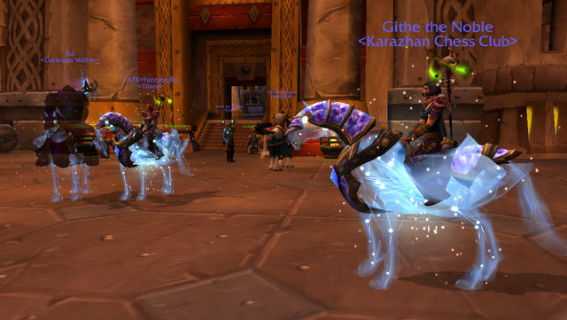
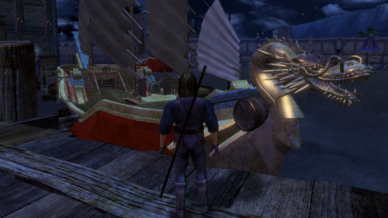

Back to: [West Karana](/posts/westkarana.md) > [2010](/posts/2010/westkarana.md) > [April](./westkarana.md)
# Quick Shots... WoW, Vanguard, STO, EQ2

*Posted by Tipa on 2010-04-17 16:18:27*

I logged into Ironforge and pressed the screenshot button. Didn't move, didn't turn. Three sparkly ponies! Suddenly my epic mechanostrider seemed rare and unusual.

Vanguard may be the only game I have ever played that lets you make such elaborate ships. I believe Ultima Online let you make them, and I know Darkfall lets you, and of course Pirates of the Burning Sea and Florensia have ship building as a big part of game play, but does any other game let you launch your ship and then walk away, leaving it docked in the world?

Folks on Twitter were saying the new Nimbus-class Deep Space Science Vessel in Star Trek Online looked a lot like the Battlestar Galactica. My fingers tripped over themselves logging in to see. This weekend is a discount weekend in STO so I was able to afford the new DSV skin; I had to sell some trash loot to afford the base ship in game. I told my bridge crew to get the hell out of their bunks and report to the new ship and we took it out for a spin in Earth orbit. Very nice. Then Longasc came by and we all transferred back to the USS Monterey, a recon science vessel, because, who flies a DSV?

Anyone seen a sparkle pony? My nightmare HELL HORSE is feeling a little peckish.

## Comments!

**[Spinks](http://spinksville.wordpress.com/)** writes: You should feed that poor hell horse! I can see its ribs.

---

**[kaozz](http://www.ectmmo.com/)** writes: Nice pics! I haven't had a chance to see the 'sparkle ponies' in WoW- they do look cool. I like the hell pony though, think I'll stick with mine instead! Is that your ship? It looks really cool, that is a neat aspect for a game. I never really got to see too much of Vanguard in the past.

---

**[Tipa](https://chasingdings.com)** writes: Nah, that was just one of three player ships docked there. I was just running around, saw this ship, knew I had to get a screenie.

---

**Longasc** writes: The ships in Ultima Online were rather generic, the bigger ones were just longer than the others. But it was fun for sure.

Another observation: There are for sure prettier mounts in WoW. But as soon as something gets expensive & exclusive, people wear/ride it.

This also happens a lot in other games, i.e. the trend to put black dye on every armor no matter how much better it could look with another color scheme.

---

**[Mycroft](http://airbornegator.wordpress.com)** writes: As far as the starpony, I would not be surprised if there different reasons for their attraction, as people are individuals, and I'm a little perplexed at some of the dismissive attitudes running around. It's not an exclusive mount, as Tipa has shown, but it sure is nifty.

If you look closely at the steed, there is a lot of love and attention to detail put into it. The way the stars come off of it, and the color kinda "flows" on the armored part, it's hypnotic. 8)

I don't think there is any doubt that it could be priced lower, how much profit does it take to fund the staff to put cool optional mounts in the store? Blizz has been "selling" mounts for awhile, I recall that when the spectral tiger mount came out that it was over 700 bucks on eBay, and thought at the time why didn't they just sell it themselves directly at a reasonable price rather than to promote their CCG? And, I don't think it's a coincidence that Blizz released it on Tax Day here in the U.S.A., it helps take the sting out of paying taxes to buy something impractical for yourself, and likewise with those getting some of their taxes that were over collected refunded to them.

Blizz has been doing this type of thing for over 4 years now, as documented in one of my favorite Penny Arcade comics, "The Consultant": http://www.penny-arcade.com/comic/2005/08/26/

---

**[Adventurer Historian](http://warpcorebreach.wordpress.com/)** writes: What ship type is flying information with your Nimbus?

---

**[Tipa](https://chasingdings.com)** writes: @Mycroft -- I don't have any problem with Blizz selling whatever they want to in their store. Go for it. It is their job -- by LAW -- to take their customers for as much money as they possibly can. If they DIDN'T do that, the stockholders could sue them.

@A. Historian -- That's Longasc's ship, I THINK it is a Star Cruiser, some cross between a Sovereign class ship and the other star cruisers.

---

**[Tipa](https://chasingdings.com)** writes: Correction, it is a T5 Assault Cruiser.

---

