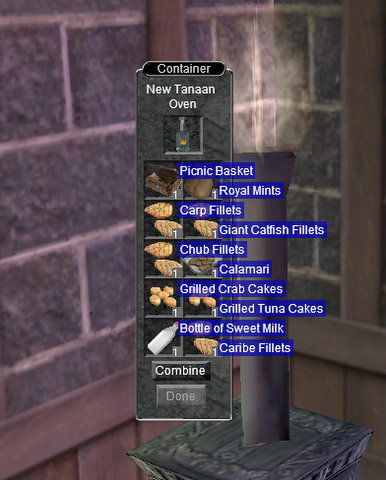

Back to: [West Karana](/posts/westkarana.md) > [2010](/posts/2010/westkarana.md) > [April](./westkarana.md)
# EQ: Rogue Epic 1.5 10% completed!

*Posted by Tipa on 2010-04-18 10:17:38*

After about a month of occasional work on it, I've completed the first task in my Rogue 1.5 epic. In that same time, I've gained 10 levels, from 71 to 81... This portion of the epic requires, for no really good reason, that the rogue master several trade skills. The first: cooking, which also required some skill in fishing, smithing, pottery and brewing. Thankfully, I had a character who is decent at tradeskills; back when I first started EQ in 1999, I had this idea that tradeskills could make me rich. I found out eventually that if tradeskills could make me rich, then being poor was okay with me. Such a mind-numbing -- and expensive -- grind. My then-main at the time, the halfling druid Etha, came away with decent skills in all the needed trades, so she handled the non-cooking parts of this first task.

The hardest part was leveling cooking up sufficiently so that I wouldn't fail making the individual dishes for the King's Feast. [EQ Trader's Corner](http://www.eqtraders.com/) was helpful, but its baking leveling guide is severely out of date, and had me farming for rare components when there were recipes added more than a half dozen years ago that were entirely store-bought. Once a guildie told me where to look, I finished the skilling up in a couple of hours, most of which was spent travelling to Jaggedpine Forest for cheese and making a non-stick fry pan in which to cook a hundred thousand patty melts.

Yersterday, I finished making the last few dishes for the King's Feast. I had Etha make the picnic basket for me in her sewing kit. I placed everything in the oven for the last combine, took a screenshot, and wondered what I'd do if the combine failed and I lost everything. (I suspect, though, that epic combines like this are no-fail... but this IS EverQuest, after all. You never can tell.)

The combine succeeded; I had a [King's Feast](http://www.eqtraders.com/items/show_item.php?item=16363). Off I went to Shar'Vahl to turn it in before I accidentally ate it. (Just kidding; my top bag is filled with fish rolls and patty melts. Tipa will never be hungry, ever.)

Rogue epic guides suggest being in an illusion of the same race as the quest giver, while wearing the [Occluded Sun Pendant](http://lucy.allakhazam.com/item.html?id=52009) that is the mark of a rogue on their epic quest. It raises faction with all the relevant rogue guilds when worn. Well, in my eagerness to turn in my quest, I forgot all these things. I was in a high elf illusion, the pendant was in a bag somewhere, I wasn't sneaking behind him (the rogue "secret handshake"), I just handed it to the cat, and he took it.

I guess he hadn't heard about the time I spent stalking the little kitty child Shanai for her nighty. Halflings typically are not allowed to wear robes; this is one of the few that can be worn. It's not visible unless you're in an illusion of a race that wears robes, but Shanai's Nighty is an essential part of the old rogue game of dressing up to look like another class. My specialty was dark elf mage, especially if I could get someone to follow me with the Earth Elemental illusion from Plane of Earth, or the Water Elemental illusion from Siren's Grotto.

I am pretty sure the kitty rogue didn't mean that he RETRACTED his claw to show me something. Perhaps he EXTENDED it? Quest has been in the game five years or more and still they have these issues....

Anyway, mission accomplished, I've completed the first step of my rogue 1.5 epic. Next stop: Rivervale, where the rogue guildmaster will insist I learn the art of brewing. This is a step that, being a halfling, I can skip for 15K plat. It's also one of the easiest steps. The other tradeskills I must master -- tailoring, smithing and poisons -- are tougher (I am already a grandmaster poisoner though, so at least I won't have to skill THAT one up).

## Comments!

**quimbius** writes: if I'm on I'll glady assist you, havn't done any epic stuff since my 2.0.

---

**Egat** writes: You shouldn't complain, halflings are supposed to love backing. After all, it is the path to endless pie!

---

**Egat** writes: Uhhh, baking also...

---

**[Tipa](https://chasingdings.com)** writes: True, but I learned to bake pies on just a few minutes!

---

**Noffin** writes: Whats sad is I prob had extra items on Noff for that

---

