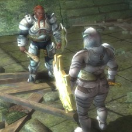

Back to: [West Karana](/posts/westkarana.md) > [2010](/posts/2010/westkarana.md) > [April](./westkarana.md)
# DDO: A Fighters' Tale

*Posted by Tipa on 2010-04-29 06:32:18*

[caption id="attachment\_5076" align="aligncenter" width="640" caption="Kobold-eye view of Derra the Fighter/Cleric"][/caption]

Last night, the OnedAwesome crew descended once again on the sleepy port town of Stormreach. There were five missions on the docket last night, but I didn't take part; I'm still on a mission of my own: to catch up in experience to the other two members of my static Sunday group. Every time I miss a night, I fall further behind. These Wednesday night get-togethers are fantastic for filling in the spaces.

I usually hire a tank mercenary when I solo. This lets me stand back and cast buffs and heals as needed, and it's better to have an NPC take the aggro so that I can play more tactically.

As a newly-minted fighter/cleric, though, I felt it was time to 'dwarf up' and move to the front of the party. Time to hire a healer. I could still heal, but I would be better focusing on staying in front and keeping things from the cleric.

That didn't work out TOO bad. Without the pressure of other people to keep me moving, I was able to sometimes do things like standing in a doorway, bashing with my shield and striking with my +1 Dwarven Waraxe of Pure Good (bought in the Market for nearly all my money). If there were a lot of enemies, I'd switch to my two-handed great axe for more AE aggro. Yes, after who knows how many months playing, I finally figured out how to make hotkeys to change my weapon loadouts automatically.

A lot of the quests in the Market (and elsewhere) are marked with the little red cup of a paid expansion pack; I bought my first last night, the Sharn Syndicate expansion pack, which has started off with some nice solo missions. It only took who knows how many months, but I have finally given money to Turbine for DDO :)

Kasul logged in around 10 and got a guild invite; the other reason I hadn't been joining any of the premade groups is because I was waiting for him. We were on track to do some of the Korthos Island adventures. I was looking forward to playing with him again; we're currently on different servers in EQ2 (I've been playing on Befallen recently) so there's little chance to meet.

I'd made an enhancement point, so I trained up the 2 point Dwarven Waraxe Damage skill and headed to Korthos.

There's two Korthos Islands; there's the one you go to if you have never been to Stormreach, and the one you go to if you have. I suppose this is to ensure that new characters start out grouping only with other new characters. But that wasn't our plan. Our plan was for me to help Kasul kill some adventures on Elite mode. We'd both get favor, and he'd get great experience and loot. After Kasul left Korthos and came immediately back, we started.

So it turns out that a 4/1 cleric fighter and a 1 fighter can get more than a little overwhelmed even in level 1 elite adventures. We did okay on the starter ones; as we got further in, there was more Kasul death. I finally had to haul out the cleric hireling, and that helped, but eventually his contract ran out and I started trying to do damage, tank and heal and... was just a mess. We ended the aqueduct mission -- the one with the jets of freezing ice and the block puzzle -- with only me alive, as Kasul had heroically thrown himself into the ice jets in order to kill a spider.

This, by the way, is why I terribly miss having a rogue in the party. Almost every trap, you have to either time things so carefully, or more usually, just run through and hope for the best (perhaps with help from a wand, scroll or potion).

Our last adventure was the Cannith works where the Warforged were first created. This ends with a massive invasion of Sahuagin. Our job was to protect the scientist, but we failed. If I'd just had my hireling still, we would have won, but it was getting late.... Next time.

Another fun night in DDO. The more I get into the game, the more I appreciate it. I still don't like how occasionally my UI stops working, forcing me to Alt-F4 quit and restart. I think it may be related to me using an XBox controller to control the game. It's REALLY convenient, but I think it is causing these problems. I didn't have these problems before I moved to the controller.

## Comments!

**Longasc** writes: I know a tank who would appreciate your fancy shield for sure. Sounds so fascinating, but unlike LOTRO DDO just did not "click" for me. I hope GW2 will suit you more than GW1. :)

---

**[Rob Tillotson](http://crypticlife.net/)** writes: Sharn Syndicate is a neat little pack -- not too long, but also not the typical dungeon crawl, and at level 4 it has some of the first decent weapon upgrades (the "nicked" weapons) you'll see without a higher level character providing hand-me-downs.

My only problem with DDO is I can't decide what sort of character to commit to. I always have a hard time choosing a class in any game, but the D&D system with its multiclassing and such paralyzes me in an altoholic coma :) I've currently got a monk, arcane archer ranger, warforged self-healing wizard, and favored soul and I can't decide which one I need to push ahead with, especially after getting my butt owned on the monk last night by the pirates in the Sentinels of Stormreach pack (another neat one, but a hint: bring DR and fortification) and not even getting one of the neat end items...

---

**[Brian 'Psychochild' Green](http://www.psychochild.org/)** writes: Heh. You should have said something if things were getting hairy. I'm sure someone in the guild would have helped out. :)

And, yeah, that shield is very nice looking. DDO definitely has some attractive art, although it's much more bland that LoTRO's.

See you next week. :)

---

**Anakh** writes: I've started playing this game, and really quite nice - I like that it has a different feel than many other MMOs, in a lot of ways - I love the emphasis on dungeon crawling, and the instanced outdoors areas are interesting, so far. I haven't done much except join one group so far - I think I will need to find a guild pretty soon and do a bit more socializing.

---

**[Tipa](https://chasingdings.com)** writes: It was toward the end of the evening, most people had left. We'll just do it again, it's a fun one!

---

**[Tipa](https://chasingdings.com)** writes: I've really liked the solo adventures I've done so far. A welcome change from wandering dungeons -- just for a little while, anyway :)

---

