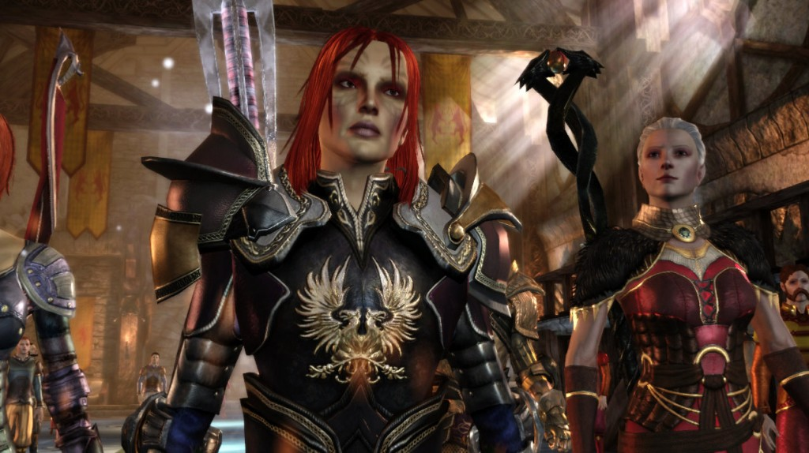
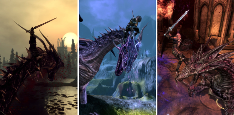
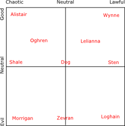

Back to: [West Karana](/posts/westkarana.md) > [2010](/posts/2010/westkarana.md) > [August](./westkarana.md)
# Dragon Age Origins spoiler: Everyone dies.

*Posted by Tipa on 2010-08-07 10:27:04*

Starting a Bioware game is deadly to your free time. To mine, anyway.

I played through Dragon Age: Origins for the first time last November, didn't eat, drink, sleep, just kept playing until I was done. I got to the end out of breath and exhausted, but with the blood of the archdemon on my twin blades and the taint of the darkspawn simmering in my veins.

All those saved games were lost. But playing a rogue through the first time was only one story, and to get ready to play the expansion pack, Dragon Age: Awakenings (and to anticipate Dragon Age 2), I decided to replay the game and make some different choices.

Each different race/class combination has its own, semi-unique, origin story. Human and elf mages share an origin in the insular Circle of Magi, where all budding mages are sent to find their place as either the tools or the prey of the Templars. Your dwarf can either be from the underclass or of the nobility; your human can be from the slums or the castle; your elf can be from the ghetto or the forest. All stories do converge once your are pulled from your old life by Duncan, the Warden-Commander of the Gray Wardens. The Wardens are a mystically bound order tasked with defending the surface world from the depredations of the Darkspawn, twisted creatures formed, says legend, from the mortals who invaded and tainted the Golden City of the Maker. With the Maker departed, his prophet and bride Andraste long ago dead, murdered, and the land on the edge of civil war, an Arch Demon has arisen to lead the Darkspawn on a Blight -- an invasion of the surface world.

Through the choices you make along the way, your adventure will bring you along roughly three different paths, once through the origin. Being helpful, kind, upholding the law and never making deals with the evil spirits of the Fade, you will follow the good path. Be self-serving and make deals to your benefit, and you follow the path of evil. Chart a middle course and nobody will really be that happy with you, but on the other hand, their expectations will be low. No matter what path you choose, your overall goal remains the same -- defeat the archdemon and prevent the Blight -- but your reasons may change.

My first time through, I played as a neutral. I wasn't good enough for the goods or bad enough for the evils, so I charted a middle course. My tank was Sten, a massive Qunari from a distant land. Morrigan, an enchantress from the Wilds, was my crowd control and damage. Wynne, a spirit healer from the Circle of Magi was the healer, and I was the rogue. A really poor one. Zevran, an Antivan assassin from the Crows, was my romantic interest. We were both elves and both rogues, so why not?

At the end of the game, Alistair was king and everyone at least tolerated me.

This second time, I stayed in the good side of the graph. I had Alistair as tank (and love interest), Wynne (again as healer) fully approving of me, Leliana (archer/ranger) so happy with me she sang me a love song, and my character as an arcane warrior -- a battle mage who can cast spells, wear armor and use weapons -- as damage and crowd control.

That caused some problems. By the end of the game, the evil characters in my party had either tried to assassinate me (Zevran) or left in a huff because I didn't want them to perform blood magic on my fiancé so that they could become a demigod (Morrigan). I had so few members left in the party that when I had to form two groups at the end, the second group was short one person and consisted entirely of fighters (Sten, Oghren and Dog). Because I refused to let Morrigan perform her ritual on Alistair, Alistair died killing the archdemon, taking King Cailan's sword and armor with him.

At least it really cut down on the lengthy goodbyes at the end.

**DLC**

I also restarted the game hoping to play through all the new downloadable content; I'd skipped it all but The Stone Warrior (which came with the game) the first time through. The second time, I skipped The Stone Warrior, but bought and played through several of the others.

**Warden's Keep** brings you to an ancient stronghold of the Gray Wardens. You are asked by the heir to an infamous Warden-Commander whose actions were so heinous as to get the Gray Wardens expelled from the country, to help clear the family name and retake the Keep. You learn more about the history of your order, make some decisions that will set you further on your path to good or evil, and obtain not only some cool armor (which my character wore through the rest of the game), but a huge "stash" where you can store stuff, and a smith who can UPGRADE most of your items as you level as well as smith up a unique sword, Starfang (which my character also bore for the rest of the game).

The stash and the ability to upgrade your favorite gear as you level makes this a MUST BUY.

**Return to Ostagar** AKA "I returned to Ostagar and all I got was this stupid armor!". Revisiting the darkspawn-infested battleground where King Cailian's army and the bulk of the Gray Wardens met their doom leads to a fairly short excursion with two or three decent battles -- and the golden armor and signature sword of the fallen king, as well as the arms of Duncan, the previous Warden-Commander.

**Leliana's Song** This prequel to the main campaign that follows Leliana from her days as a bard and a spy through her betrayal and eventual reform into a priestess of Andraste, contradicts many of the things Leliana tells you about her past in the main campaign. But, as she explains in a voiceover at the beginning of the adventure, she always changes the story a little with each telling, so who's to say how it really happened? You can assemble the pieces of a unique rogue armor through the adventure, but I wasn't using a walkthrough and missed two I couldn't go back for. The story was worth it, even without the special armor.

**The Darkspawn Chronicles** -- I haven't played this one. It plays through an alternate story where your character died in the Joining ritual and Alistair was forced to act alone as the sole surviving Gray Warden. Apparently, he makes a mess of it. You play as a commander of the Darkspawn, tasked with stamping out all life.

**So....**

Now that I've finished the second playthrough, I want more than almost anything to start on a third. I'd play a human noble, travel the evil path, and in the end, take the throne for myself, with Loghain, Zevran and my faithful Dog to keep the land crushed beneath my Dragonbone armor.

But, not right now. I really could use some sleep.

## Comments!

**Rob** writes: Great write up. Makes me want to play the game again. I never made it through to the end the first time I played. I absolutely hated hated hated the board where you have to turn into a mouse and run through mouse holes, and then defeat those ghost type things in a specific order so you get their powers (which you need to keep going). Not to sound dramatic, but for me that was the worst and most frustratingly annoying board I have EVER played in a game. 

Is there any way around this part of the game? Would love to go back and play with all the DLC and expansion now, but I cant stomach toying with that board again.

---

**[Tipa](https://chasingdings.com)** writes: No, no way around it, but the Dragon Age Wiki will lead you through it. It's not really that long a haul if you cut away the dead ends. My worst part is the Deep Roads.... took me FOREVER the first time through.

---

**xXJayeDuBXx** writes: Starfang is a great weapon. But it did me little good in the end because it went with Alistair once he was no longer in my party, errrgh.

---

**arbitrary** writes: I've just the Landsmeet and Arl Howe bits left to go on my second playthrough and it sounds like I did it the other way round from you; my first was arcane warrior my second is elf rogue!

I kind of agree about needing a third, but I really want to finish 2nd before I buy some of the DLC and expansion.. I did a couple of small DLC, but need to really finish this.

---

**TheRemedy** writes: Actually there is if you have the pc version, there's a mod called skip the fade which you can find here.

http://www.dragonagenexus.com/downloads/file.php?id=816

It'll give you all the stuff as if you had gone through it.

---

**TheRemedy** writes: Er that comment was in response to Rob and Tipa's comments.

---

**[Tipa](https://chasingdings.com)** writes: Cool, didn't know about that. I was looking at mods, but wasn't sure if I'd suddenly find all the women in the game nude if I tried one of the mega packs. It sure seemed to imply that that's exactly what would happen.

---

**TheRemedy** writes: Yes, there are about 50 mods dedicated to male and female nudity for Dragon Age so be careful.

---

