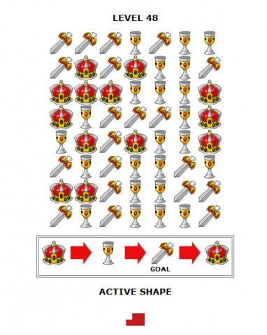

Back to: [West Karana](/posts/westkarana.md) > [2010](/posts/2010/westkarana.md) > [August](./westkarana.md)
# Neopets wants me to solve Shapeshifter again.

*Posted by Tipa on 2010-08-07 15:07:54*

I got a letter today from [Neopets](http://www.neopets.com/) (remember them? Facebook for kids?) warning me my account was about to meet the Great Blindingly Pink Maker if I didn't log in pretty soon.

Talk about obsessions.

Three years ago, I casually played Neopets to keep in touch with my nieces Jazzmin and Ilsa. It was fun to peek into the lives of nine year olds, but I couldn't help stray a bit and start playing some of the games.

Mostly reworks of classic arcade games and RPGs, of course but... Shapeshifter...

A seemingly innocent tile placing puzzle. The first few puzzles were trivial, then they got a little challenging, and then it got to... hey, I could write a program to do this!

That spark of inspiration will only bring you to about level 20, most dabblers soon discover. Some optimization gets you into the thirties, and there you'll have to start thinking of some truly evil ideas, because the game goes to level 100. And there are people on the high score list all the way up there! You MUST have their algorithms!

It's like the Da Vinci Code, except instead of some French girl and a professor, you have computer science majors and a children's social networking site.

[I started a blog specifically to discuss solving Shapeshifter](http://shewhoshapes.wordpress.com/). After nine months, I finished the fourth or fifth iteration of Shifter, a Python program that could solve Shapeshifter. You have to wait until the beginning of a month to get the #1 spot for the whole month, and mine came April 1, 2008. I spent the month as Shapeshifter Champion and got mega coins for it each day.

I was going to start up the ladder again, but there didn't seem much point (although I recognize at least three of the names on the high score list as people I competed with back then, so it might just be me).

Anyway, in the intervening couple of years, I've been thinking of new algorithms.... I have other programming projects I need to do before Shapeshifter gets my time again, but... could be happening.

## Comments!

**Michelle** writes: Wow! Impressive that you got to level 100 in Shapeshifter. I LOVE that game and my programming skills are getting better and better. Any chance you might help me? I'm stuck in the late 40's. Would love to discuss some of the programming techniques.

---

**[Tipa](https://chasingdings.com)** writes: If you can make it through the 40s somehow, the next 15-20 levels are a lot easier. How are you solving it?

---

