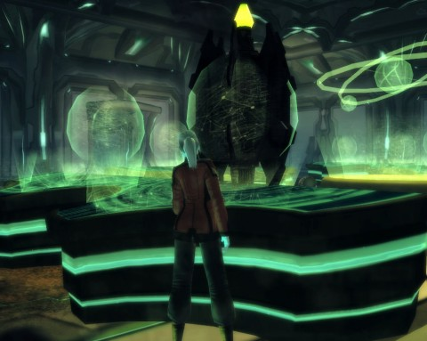
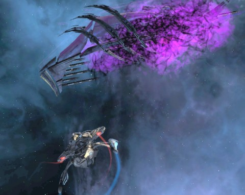

Back to: [West Karana](/posts/westkarana.md) > [2010](/posts/2010/westkarana.md) > [August](./westkarana.md)
# Star Trek Online, Undine Front: The Return (spoilers)

*Posted by Tipa on 2010-08-07 16:41:01*

Yes, desperately catching up on all the posts I should have made this week, but did not.

**Undine Front: The Return** is the second of the two episodes given you by Starfleet as you embark upon Season Two. It opens similarly to the other mission, [Undine Front: Assimilation](../../../index.php/2010/07/29/star-trek-online-assimilation/), with a sudden congregation of Borg ships causing some concern in the quadrant. Not only that, but there have been reports of non-Borg ships in the area as well. It would be terrible to lose such a fine crew, Starfleet assures us, but we need to head in and do what we can.

The USS Monterey warped in to find a Romulan science ship, the IRW Areinnye, on the losing side of a battle against some Borg spheres. The Romulan captain, Commander Taelus, does something that must have hurt her more than the Borg ever could... she calls for assistance from any nearby ships, and when we make contact, absolutely begs for Federation assistance.

Romulans are normally too proud to ever ask for help from another race, and they consider the Federation mortal enemies. What could be happening that would bring them to this end?

No time to chat; after helping with the Borg ships, the commander tells us that the Borg have beamed onto the Areinnye and have started assimilating the crew! All the crew that could escape are holed up in the science lab, but they can't beam the trapped crew members to the lab while the Borg drones are too near them -- some sort of interference. If the USS Monterey crew could manage to clear the ship of drones....

Well, we're nothing if not friendly, so we do just that, saving several Rommie scientists from a life in the Collective. We fight our way to the science lab, where the Borg have just about managed to defeat the force fields shielding the lab. If we weren't there, the Romulans would still be lost, but we ARE there, and we save the day.

How about a case of Romulan ale for that amazing rescue! But, Commaner Taelus, though thankful, asks if we would please leave the ship immediately, and under no circumstances analyze the mysterious devices standing on the lab benches. They aren't important. We should go.

But, naturally, we just HAVE to meddle. Our suspicions are soon confirmed; the Romulans have stolen tech from the Borg. This is why they were attacked, and this is why they couldn't allow themselves to be killed or taken.

The away team is contacted by the USS Monterey; Borg cubes are warping in, and we are needed back on the ship. Promising Commander Taelus that she will hear from us soon, we beam out and into a firefight.

Before the Borg get going, we get a hail from Commander Taelus, asking us to forget what we've seen and to let her, her ship and the stolen Borg tech escape. Romulus has no planet any more, and they need all the help they can get to rebuild the Romulan Star Empire.

Unusually, you're given three chat options, here -- perhaps the first time you've really had a say in how an episode plays out. You can choose either to let her go, beam the Borg tech to your ship, or just destroy the Romulan ship yourself so that no news of what was found can ever make its way back to the RSE.

I chose the first option, and I am now owed a great debt, says Commander Taelus, from the Romulans. The IRW Airinnye warps away, leaving two angry Borg cubes behind -- and a third, mysterious ship that does not attack.

Our photonic fleet (that I have been putting points into since I started leveling again) makes short work of the cubes. We close in on the mystery ship, which hails us. They are Obex, they say, and we should look upon them and tremble. (Speculation is that the Obex is of the [Iconian](http://stowiki.org/Obex) race).

We look upon them, and we tremble just a little bit. Then we're off to inform Starfleet of our adventure. Starfleet is very concerned.

