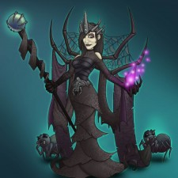
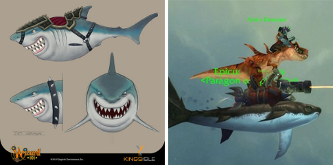

Back to: [West Karana](/posts/westkarana.md) > [2010](/posts/2010/westkarana.md) > [August](./westkarana.md)
# Wizard101: Farmville (and what of Celestia?)

*Posted by Tipa on 2010-08-08 20:09:04*

In a vain attempt to get my Myth wizard to 50 (so close!) AND also get the rest of her level 50 gear, I've been farming Yeva Spiderkeeper for her Myth hat. No luck so far after about ten tries, but I DID get the Queen Spider pet (seen above) on my first try.

So that's something.

The big question to my mind, though, is... where's Celestia? I was hoping it would be out in July, but we're approaching the middle of August and it's not here.

Well, more time for farming.

The latest Celestia reveal brings us a rather husky looking bulldog Marleyboner in waders and a fishing cap, smashing my faint hopes that there would be some sort of human protagonists in Celestia. Note that dressing as a fisherman when you're exploring an underwater realm populated by FISH (and crustaceans) PROBABLY won't win you any friends.

If you accuse me of identifying more easily with humans than canines, well, there you go. All these beast races get in a fix, and they call the human wizards to go rescue them. We've seen this with the lizards of Krokotopia, the pets of Marleybone, the farm animals of Mooshu, the drakekin of Dragonspyre and now the piscians of Celestia.... they just can't keep their house in order.

It's the [Magic Man's Burden](http://en.wikipedia.org/wiki/White_man's_burden), all over again. It's looking like the only Celestia folk that understand the responsibilities and pressures of being a human wizard, are the villains.

Wizard101 producer Leah Rubin writes in her inaugural [producer's letter](https://www.wizard101.com/game/producerletter/2010August) about her history at KingsIsle and a little bit about what we'll find in Celestia. Water! And SHARKS! Both mount and pet versions, and I just can't wait to be riding a shark around the Spiral. My main character, my Life wizard, is still making do with a broomstick. Next step: SHARK.

This caused quite a stir in the MMO community. When informed of KI's new "Shark Week" homage, World of Warcraft Lead World Designed Alex Afrasiabi [added flying epic sharks into WoW](http://www.wow.com/2010/07/30/the-maelstrom-is-probably-epic-enough-for-you-now). With laser beams. And dinosaurs. And an undead zombie playing metal guitar.

Nobody at KingsIsle was immediately available for comment at the time of this post, but we await an official response.

## Comments!

**PeterD** writes: In defense of Blizzard (omg, did I just say that?!) the shark thing was in response to a forum poster complaining that the Cataclysm Maelstrom zone wasn't "epic" enough. A Blizzard designer responded by adding the shark with laser and dinosaur.

---

**[Tipa](https://chasingdings.com)** writes: That was the article I linked :) I was just making a joke at WoW's expense. Whipping that epic shark rocket laser dinosaur undead bard thing together like that -- well, that pretty much defines epic!

---

**PeterD** writes: What, I was supposed to click the link?! I was reading on my Blackberry :P

---

**[Tesh](http://tishtoshtesh.wordpress.com)** writes: Ah, but can I name my shark mount "Bruce"?

---

**[Jessa Parker](http://www.facebookgamersguild.com/)** writes: What does this have to do with Farmville??

Are these Facebook games? They look good!

---

**[Tipa](https://chasingdings.com)** writes: It has nothing to do with Farmville. I was making a pun -- because I was farming so much in Wizard101. Wizard101 has often claimed to be a Facebook game, but it's a non-Facebook MMO.

---

