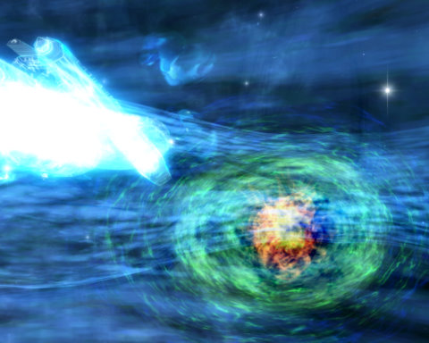

Back to: [West Karana](/posts/westkarana.md) > [2010](/posts/2010/westkarana.md) > [August](./westkarana.md)
# Star Trek Online: Fluid Dynamics (spoilers!)

*Posted by Tipa on 2010-08-09 21:38:51*

Having saved the Undine from forced assimilation at the hands of the Borg in the previous episode, [Assimilation](../../../index.php/2010/07/29/star-trek-online-assimilation/), Starfleet believes the Undine might be convinced to form an alliance with the Federation to remove the Borg from the galaxy AND from fluidic space, forever. Scout ships have reported a number of anomalies forming in the center of a nearby star ckuster, and the USS Monterey is to investigate them. If a safe portal to fluidic space is to be had, we are to enter it and make contact with the Undine.

Upon arrival, sensors do detect a number of portals, all caught up in some sort of plasma that makes remote investigation impossible. We will have to approach each anomaly to judge its worthiness. We soon find that the space in the area is crawling with Undine "Nicor" ships.

They attack; we fend them off and in the end flee into the plasma field -- which blinds both us AND the Undine. Free of direct attack while we are in the plasma field, we slowly feel our way from one anomaly to another. The last one is the only suitable one. We fired a buoy containing messages to loved ones in case we never returned, and then we entered the portal and found outselves in fluidic space.

We found the space to be not nearly as empty as we'd expected; aside from the eddies and currents in this infinite expanse of biomass, there were continent-sized masses of nearly solid matter. We found these to be very similar to the coral in Earth oceans; a resting and hiding place where life can flourish.

Sensors indicated Undine ships in the area. Sounding yellow alert, we closed in on their position, broadcasting messages of peace on all frequencies.

The Undine had no interest in talking with us. Once they had a fix on our position, they attacked, and we were forced to defend ourselves. We noticed some non-aggressive alien ships in the area, too, apparently mired in some sort of dense liquid held together by a force field projected from an Undine ship.

One of the alien ships hailed us, explained that they were the Hylasa, and could help us escape the Undine and return to baryonic space, if we would help free them.

We did so, agreeing to meet them at some safer coordinates when we were ready.

When we arrived at the coordinates, we were introduced to the Hylasa, a race that lives in symbiosis with great living ships called Gekla. The ship provides them warmth, food and protection, and the Hylasa keep it company on its long, ceaseless journey.

The Undine, it seems, had been attacking the breeding grounds for these living ships. The Hylasa, feeling they now owed us a debt, would travel to a thin bit of space and tear open a portal to our universe. Being damaged by the Undine, we would have to defend them against attack as they traveled.

After a medium-length escort mission, where Undine attacked us several times, we manage to make it to the weak point and after a promise of eternal alliance between our two civilizations, we cross back to home.

Starfleet was extremely pleased with the news of our new friends, but they are not quite ready to give up on the Undine, yet. We'll hear that story next episode.

## Comments!

**[Adventurer Historian](http://combat-archaeology.net/)** writes: ahhhh, I'm not going to say "stop posting on STO", because I think it's great that you're playing and enjoying yourself...

... but *seriously*, I'm not going to be able to read these posts for months! Be warned of an influx of "Man, you're right, that was cool!" comments 6+ months from now!

---

**[Oakstout](http://oakstout.blogspot.com)** writes: Great screen shots. The part I like most is the way they make everything look different even if I know in my soul that Cryptic, like every other Cryptic game, are using the same graphics over and over. I think they have figured out how to make things look great and new even if its all the same.

Did that make sense to anyone but me? lol

---

**PeterD** writes: Cryptic needs to give you a finder's fee or something. Based on your posts I checked out the free weekend last weekend, and based on that I ended up subscribing to STO (I won't say re-subscribe since I didn't last past the included month first time around).

Somehow it seems more engaging now, even though for me, at my level (lt. commander) I don't think all that much has changed . . .

---

**[Tipa](https://chasingdings.com)** writes: Very cool :) I do think Cryptic is doing their very best with the resources they have to bring the Star Trek universe to life. I've been waiting far too long for a Star Trek MMO to do anything but stand by this one, and I think the game is far better now than when it launched.

---

