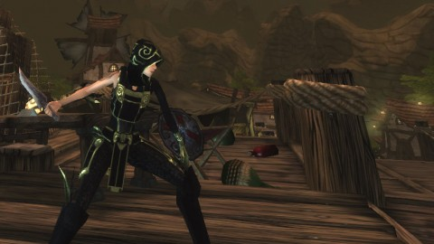

Back to: [West Karana](/posts/westkarana.md) > [2010](/posts/2010/westkarana.md) > [August](./westkarana.md)
# Chronicles of Spellborn: Anatomy of a Failure

*Posted by Tipa on 2010-08-19 06:48:52*

[caption id="attachment\_5498" align="aligncenter" width="480" caption="No other game looked like Spellborn"][/caption]

The Chronicles of Spellborn seemed to provide a wish list of what people want in an MMO. You could look cool from day 1; the gear you chose at character creation could be upgraded by slotting in runes to increase their power. You could still find or craft items with more or better slots, but there was never a time when your character would have to look anything but cool as sheets.

Combat was tactical on many levels. You could not access all your abilities whenever you liked; not only were most of them on cooldowns, but you could only choose from the abilities that were showing on a scrolling deck wheel that would shift whenever you used an ability. The abilities themselves were fairly weak alone; but if you built your deck well and arranged the combos in logical ways on the wheel, abilities could build upon each other to become truly devastating.

The art was state of the. Rendered in a uniquely European style, Spellborn looked like no other game. The lore told a story of a shattered world, populated by survivors rescued from the planet just before it went boom by benevolent godlike beings. The shards of the planet still swirl in winds of the Deadspell Storm, and the people live inside caverns carved within them. Voyages between them are only by taking passage on shard ships, which might themselves be attacked by denizens of the Storm as they make their way.

Players want combat mechanics that are more than "Press 1, 2, 3, repeat"? Spellborn had it. Unique world, graphics, and UI? Spellborn had it. Some of the coolest looking gear in any MMO? Nailed.

So, what happened?

Though the Spellborn devs had a long relationship with Frogster to publish the game in Asia and in parts of Europe, they had no American publisher. When they eventually made a handshake agreement with one, they were barred from revealing it for months, while they did some retooling on the game. After months of no news, the publisher was revealed to be Acclaim, a publisher most noted for its free to play games.

The game then went into further hiatus for five more months.

Eventually, in February of 2009, Spellborn went live in the US and the rest of the world. Instead of a standard subscription plan, players needed to by Acclaim's cash shop currency, and then redeem that for play time. It was fairly complicated, and since people would be spending different amounts to play the game depending on the deals they got for the cash shop currency, it was hard for people to figure out just how much the game cost, and whether or not they were getting a decent deal.

Acclaim promised heavy support for the game, but when it became clear Spellborn was not a hit, such support dried up. In just a few months, rumors arose that the developers, Spellborn N.V., had all left to find other work, and that the game would be moving to a F2P model with an item shop (for a game without a focus on items!) and other such paraphernalia. The game was to be relaunched to begin again as a MMO like most of the others in Acclaim's stable, but instead, was just set to be free and left alone, patchless, until the decision came to close the game down.

Spellborn Lead Developer El Drijver has posted a [complete (and more correct!) timeline](http://phpbb.acclaim.com/spellborn/viewtopic.php?p=49217#49217) on the Acclaim Spellborn forums. 

Even aside from Spellborn's issues with its publisher and the game's lack of heavy promotion, the game itself may have taken too many chances.

Though soloing was an option in the game, the game itself was fairly hard to play. Having to keep good aim on an enemy while avoiding enemy special attacks (most enemies had a unique 'tell' you could use to determine when they were about to unleash a heavy attack) meant it played far more like a third person shooter than an MMO. Slow travel times meant it could take a considerable amount of time to get somewhere new; shard ships ran on their own schedules and were sometimes dangerous to boot. There were no gates, hearthstones or teleports; it was a worldy-world.

Aimed directly for hardcore players, Spellborn had very little to recommend it for casual players, and this was probably its biggest mistake. By basing its combat on an intricate combat mechanic that demanded the player's full attention, Spellborn shut out the 90% of casual players that are absolutely necessary to populate the world. Without the casual players, even the hardcore players noticed the world was fairly empty. The PvP clique soon moved on to other games; the hardcore players leveled to the end game and then, with nothing left to do, departed; and the few casual players had already gone.

Hundreds of MMOs, it seems, are released every year, but few of them take as many chances and are as filled with new ideas as The Chronicles of Spellborn. Out of all the hundreds of MMOs, it seems, that FAIL every year, I'll miss Spellborn the most.

## Comments!

**Longasc** writes: I did not play it, but one of my buddies did and he did not like the "wheel" and somehow he did not get to love it. It also remained fairly unknown to most people, even hardcore mmo players.

---

**[Tipa](https://chasingdings.com)** writes: Promotion was definitely an issue for the game. It didn't really have a niche in which to fit in the MMO world, and didn't have enough weight behind it to build its own. Fantasy Shooter MMORPGs are still a young genre.....

---

**[Green Armadillo](http://playervsdeveloper.blogspot.com)** writes: I was in the closed beta for the game, and it was relatively obvious that things were not on a good track. The game went something like 9 months without a single change - I'm guessing that work was suspended for lack of funding, because relatively little had improved when they finally released a new build. I was never able to figure out how to play the darned thing either. 

It's too bad because I really liked the art style, but I guess it just wasn't to be. 

(I will also say that I've never looked at the major gaming sites the same way after that beta. All of the major sites would publish previews that said "we weren't allowed to actually play the game, but the demo the marketing guy showed us looks great and they say it will be finished soon". Meanwhile, the truth hiding behind the NDA was not pretty.)

---

**[Selachii](http://www.firigames.com)** writes: Great write up Tipa, I like your view on the project and will defo remember that :)

---

**[Drew](http://bmhunter.wordpress.com)** writes: It's a shame that I really never heard much about the game until it was closing. This really looks like something I would've enjoyed - a bit like FFXI in that it's a worldly-world (as you called it, I like), and a bit M:tG with building decks for the wheel, and who can argue with picking your outfit from the get-go?

---

**PeterD** writes: Acclaim and the idiotic "subscription" method was certainly a deal breaker for a great many people. You never never ever want to make it confusing for people to give you their money. You never want to make them jump through hoops. Acclaim did both. /facepalm

I played a little after release, and didn't really care for the skill wheel. I had expected it to be somewhat like a card game, where each time the wheel turned you got a random selection of your skills to choose from. Instead, the wheel had 3 sides (iirc) and the skills on each side of the wheel were static. So even though the wheel turns each time you use an ability, I typically found myself going 1, 1, 1, and 1, 1, 1, over and over which made the low level combat both insanely boring and frustrating at the same time (boring because there was really no randomness or decision making, frustrating because it was often hard to get skills to work properly and you were stuck with what was on the wheel at the time).

Essentially, the skill wheel ended up being little different than a normal hotbar with skill chains on it. Maybe at higher levels when you got more skills it got more interesting (actually, I'm sure it must have) but I couldn't stay interested long enough to get there.

---

**[Scott](http://pumpingirony.net/)** writes: I didn't get a chance to play Spellborn. Downloaded the installer but had issues creating an account once Acclaim got hold of the project.

Was the skill wheel *really* all that "hardcore" that "casual" players could not or would not be able to play? It seemed just like a normal hotbar only you create your combos on each tier of the wheel rather than positioning your skills in the order you prefer your combos and thus taking up umpteen hotbars. Same basic concept, different (and minimalistic) graphical layout, at least in the eyes of an observer who only had screenshots and gameplay videos to base that opinion upon.

I guess my ultimate point is we collectively make an awful lot of excuses and underestimate each other so much. I'm not guilt-free either but it is something that bothers me. People say "oooh this is too complex for all the casuals" implying all casuals (potentially re-opening the tired debate of "what defines a casual player?") are unskilled, with challenged intellect and hand-eye-coordination. And that's when we're being nice. Same with the "ooooh I'm 30 or 40 or... and can't play 'twitch' games with the young'uns because I'm too old and slow" which is also garbage. 

Whether we're demeaning others or ourselves, say it enough, or hear it enough and you'll start believing it and create your own self-fulfilling reality.

As for Spellborn failing I tend to put a lot of blame on the publisher who is responsible for the game. Spellborn was in a special circumstance with multiple publishers, which was a shame, and took forever for Acclaim to pick it up for the Western audience, but Acclaim did little to no marketing for it. Unless you hung out over an MMORPG.com and saw it on the "hype meter" or paid attention to blogs, a lot of players probably never heard of it. It sounds like they ran into a situation similar to Real Time Worlds where they secured enough money to develop and launch the game in whatever shape they could, but not enough money to keep the company afloat afterward, especially if the games launched in less-than-finished states and word of mouth damaged further adoption among gamers?

---

**[Tipa](https://chasingdings.com)** writes: I'm not suggesting casual players weren't capable of playing Spellborn, just that it would be difficult. 

Mobs would be weak against certain attacks and strong against others. Others would only be effective when one of the three energy bars was higher than the opponent's. You would need to bring in short term buffs against the damage being dealt while decreasing enemy resists vs your damage with short term debuffs. 

Multiply that by the number if enemies and, in some dungeons, almost continual adds, and you could have fights that lasted ten, fifteen minutes, and if you failed to keep a buff or heal up at the wrong time, you were dead. 

I may be wrong, but it is my belief that casual MMO players prefer shorter fights with a low chance of failure. 

---

**[Pete S](http://dragonchasers.com)** writes: Chalk me up as someone who never subscribed due to Acclaim's weird payment model. IIRC I was torn about whether or not to join the "Acclaim Club" so that I could buy a bunch of coins for a discount on some special weekend, or just buy enough for short term play.... or something. I just remember having to make a decision about how to get the best value for my money, and then never making a decision and so never subscribing.

Before I didn't subscribe, I wrote this post:
http://dragonchasers.com/2009/03/16/combat-in-chronicles-of-spellborn/

It's a rare thing for me to have to work through how to fight in an MMO. So I think Tipa is right that casual players might not want to dig into the system. Not that they wouldn't be able to do it, just that it might not be something they opted to put the time into.

Someone told me yesterday that anyone who played DikuMUD-based MMO and didn't like GW just wasn't playing it right because they were trying to play it like a DikuMUD-based MMO. :) I think Spellborn might have had that same opportunity for tricking casual players into not playing it "right."

---

**[Game Evolution: Power Corrupts (Up to Eleven) &laquo; Shadow of the Schemers](http://shadowoftheshemers.wordpress.com/2010/08/20/game-evolution-power-corrupts-up-to-eleven/)** writes: [...] Chronicles of Spellborn: Anatomy of a Failure (westkarana.com) [...]

---

**Fuzzy** writes: I tried this either during beta or shortly afterwards before it went down again.

Against a lesser woodland animal, it was a matter of spamming the same combo over and over again while dancing around them. Occasionally, you leveled up enough to get a new skill, at which point you simply augmented your combo and continued to spam ad nauseum.

Against humanoids (which tend to travel in packs)... let's just say that flying solo won't work.

I did manage to get to the second area (grassy fields, ooo), but at that point I didn't see any point in continuing.

I actually got excited reading about the battle system and watching the tutorial videos before the game came out. It just didn't work out as well in practice. The rotating bar simply meant that you only had access to a few skills at any given time, and battles boiled down to each character trying to max out whatever attribute results in massive damage for their skill set.

---

**[Tipa](https://chasingdings.com)** writes: Groups were a matter of judiciously using AE hold, damage, and multiplier abilities, plus the occasional anti-damage ability. But truly, humanoid enemies tended to be a mix of melee and range types, so that dealing with one kind left you vulnerable to the other.

---

