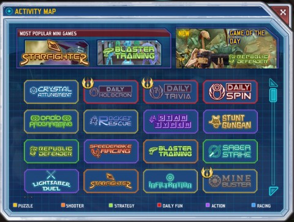

Back to: [West Karana](/posts/westkarana.md) > [2010](/posts/2010/westkarana.md) > [August](./westkarana.md)
# Clone Wars Adventures: You're in ar-cade world now.

*Posted by Tipa on 2010-08-19 23:56:50*

I wasn't sure what to think about SOE's Clone Wars Adventures when I first read of it. A kid-oriented, "freemium" MMO set in the Star Wars universe? With SOE's Star Wars Galaxies out for years and Bioware's Star Wars: The Old Republic set to tear things up next year, is there really any room for yet ANOTHER MMO set in the same universe?

Well, yes, there is. But then, Clone Wars Adventures is not really an MMO. It's more a lobby from which you can select Star Wars-themed minigames, show off your latest outfits and your home, build your own lightsaber and, well, save the galaxy, one Peggle at a time.

You start as a Padawan in the Jedi training facility on Coruscant, the capital of the Republic. Against you stand the Sith and the Separatists. With you stand all the good NPCs from the Clone Wars cartoon. You'll get your chance to fight them all.

It takes a few minutes to learn to control your character. Although the game is fully 3D, you can't move the camera at all. Your character can run toward or away from the camera, run left or right, but you can never get behind your character and see what it sees. Best way to think of it? You're watching a computer screen, not immersed in the world. That's not a bad way to think of it; very few of the games feature your character doing anything -- I believe Lightsaber Dueling was the only one I tried that did.

Thankfully, that's a heckuva fun game.

You won't find many truly new games in the CWA lineup. I haven't tried all of these, but the ones I have, I'll try and describe....

Crystal Attunement -- this looked like a Bejeweled clone. I hate Bejeweled. Didn't try it.
Droid Programming -- a block matching puzzle
Republic Defender -- tower defense, really well-done.
Lightsaber Duel -- pattern matching game, lots of fun.
Daily Holocron -- locked; for Jedis only
Rocket Rescue -- didn't try it
Speederbike Racing -- didn't try it, but I think I can guess what it is. You can buy better speeders in the store.
Starfighter -- a rails shooter somewhat similar to Rogue Squadron or Starfox. Very cinematic. You can buy better starfighters in the store.
Daily Trivia -- locked for non-Jedi
Star Typer -- typing game.
Blaster Training -- didn't try it.
Infiltration -- didn't try it.
Daily Spin -- didn't try it.
Stunt Gungan -- Gungan repel me. Didn't try it.
Saber Strike -- Peggle clone.
Mine Buster -- for Jedi only, but come on, I'm thinking Mine Sweeper.

I'll bet a dozen rebel credits that one of the games I didn't try is a Sudoku clone.

In the end, it's all about being a Jedi. In the movies, years of training, meditation, and coming to terms with your darker impulses can only begin to prepare you for the pressures and responsibilities of the Jedi Order.

It's a lot simpler in Clone Wars Adventures. In CWA, being a Jedi means you put your money in the promotion droid, and it coughed up a Jedi certificate, along with a card you can carry in your pouch along with your spare lightsaber crystals. A Jedi is a paid subscriber to Clone Wars Adventures, though as with its sibling, Free Realms, you will undoubtedly be able to buy time cards in order to become a Jedi on the installment plan.

All of the games I played went only so far and no further -- the higher levels for games are reserved for Jedi.

There are no levels in CWA, no experience points, no death, no raiding, no skills save what you bring to the game. It's nothing more, really, than a game portal, where the games are all themed with George Lucas' most famous franchise.

That isn't to say CWA isn't fun -- it IS -- nor to say it isn't well done -- because it IS. There's a back room in that cantina in Mos Eisley, and in it are all of these games, and farm boys come from all around to play them and dream of the day when they, too, can be Jedi masters.

I've embedded a video of a few of the minigames below.

## Comments!

**Garris Goldenforge** writes: It's like the most popular games at Newgrounds and Armor Games were given a coat of Star Wars paint. I just finished giving all of the games a shot, and humorously enough, Stunt Gungan is a clone of a catapault game that's robbed my office of productivity for the past few days. The whole package is certainly fun (and I'm perhaps too old to be playing, but whatever), but the language filter is baffling, to say the least.

Out of the attempted phrase "Shave and a haircut, two bits," only "##### and a haircut, ### bits" came through. If anything, it seems like bits would have been censored, but maybe I'm just being cheeky. I imagine cheeky wouldn't pass muster either.

---

**DraconianOne** writes: If Gungan's repel you, you may like Stunt Gungan. The aim is launch Jar Jar as far as possible and then make him crash into things that blow him up to make him go further. It's more cathartic than it sounds.

---

**[Tipa](https://chasingdings.com)** writes: That ######## ###### is ####### hilarious :)

---

**[Tipa](https://chasingdings.com)** writes: Oh, Stunt Gungan sounds like that PSN game, Pain, then....

---

**[Pete S](http://dragonchasers.com)** writes: Blaster training is a shooting gallery game. Y'know the kind of thing...targets slide out from the sides or from behind obstacles. You have to shoot the droids and not shoot the Jedi. It seemed fun enough for what it was, but I choose 'Easy' and it was way too easy and so went on forever.

I did achieve some titles though. But one of them was "Shiny" and suddenly I was looking for Mal Reynolds and his crew.

Anyway, here's the problem with titles like CWA, and I could wind up into a huge rant but I'll try to stay calm. :)

It's clearly not an MMO, and there's nothing at all wrong with that. But when marketing departments and/or game journalists (I'm looking directly at Massively right now) start calling these games MMOs it sets expectations that the games can't meet, and then hordes of angry internet gamers start throwing stones and rotten veggies.

I propose that if CWA was marketed as a Star Wars Themed game portal for fans of the series, it'd be well received. But people coming to this looking for the promised MMO are just going to be disappointed. I don't understand why their marketing department would set the game up to fail like it is doing.

---

**[Tipa](https://chasingdings.com)** writes: I've categorized it as an "Other Game" here at WK, because you're right. It is NOT an MMO. There's a tendency for the press -- not just game devs -- to start categorizing every multiplayer game as an MMO, and I have no idea why. Just slapping "MMO" on every game isn't a sure path to success. Lots of REAL MMOs are canned every year.

That said, I don't see where SOE has called this a MMO, so maybe it is just a creation of a wishful press. SOE is marketing it as an online companion to the cartoon.

---

**[Pete S](http://dragonchasers.com)** writes: OK, my bad then... I apologize to the marketing team. I just figured the press wouldn't be calling it an MMO if the publisher wasn't.

---

**[Tipa](https://chasingdings.com)** writes: I was under the impression it WAS an MMO, until I started playing it.

---

**[Scott](http://pumpingirony.net/)** writes: So not only is it not an MMO it's not even an RPG either? It's just a Star Wars casual games portal?

Here's a thought -- Free Realms seems much the same thing with the exception of having the 3D world to walk in, yes? Have we sunk so low that basically saying Battle.net Chat instead of a 3D Avatar Chat is the only thing keeping the Diablos and Starcrafts from being MMO's?

---

**[Scott](http://pumpingirony.net/)** writes: @Pete:  *I just figured the press wouldn’t be calling it an MMO if the publisher wasn’t.*

Two words: Guild Wars! They repeatedly told the press GW was not an MMO pre-launch and were all but ignored.

---

**[/AFK: New Experiences Edition &laquo; Bio Break](http://biobreak.wordpress.com/2010/08/20/afk-new-experiences-edition/)** writes: [...] Tipa swings a lightsaber through Clone Wars Adventures [...]

---

**[Adventurer Historian](http://combat-archaeology.net/)** writes: Tipa, I don't think I ever said this - but dang, I really dig the videos you make for your website! They're a really fun and engaging way to 'get the story across', as it were.

Thank you for clarifying the one question I'd had with this game - why Clone Troopers were wielding lightsabers. My offended sensibilities are coming back 'round - but seriously, if a little money is all it takes to become a Jedi these days, the Republic really *does* deserve to fall.

---

**[Linkage: Stories To Tell &laquo; Combat Archaeology](http://combat-archaeology.net/2010/08/21/linkage-stories-to-tell/)** writes: [...] on to the other Star universe, Tipa offers some spot-on insights into what Clone Wars Adventures is like. It’s a really fun read, and were I half the age I am, I’d probably love to play this [...]

---

