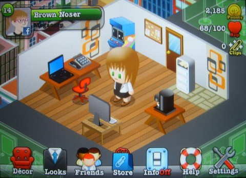
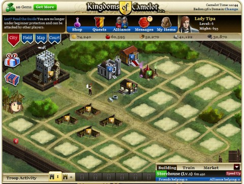

Back to: [West Karana](/posts/westkarana.md) > [2010](/posts/2010/westkarana.md) > [August](./westkarana.md)
# More Social Games: Office Heroes, Kingdoms of Camelot, Virtual Villagers

*Posted by Tipa on 2010-08-21 11:31:48*

If you're going to waste time playing social games, you might as well play a game that elevates wasting time to a paying activity. In Astroape Studios' [Office Heroes](http://www.officeheroesapp.com/), out now for the Apple iPhone and soon for Facebook, you'll spend your day tweeting, drinking coffee, updating Facebook, surfing the web and trying to look busy when your boss is around while moving up the corporate ladder. Heck, I think I LIVE this game.

Your goal is to level up your career via Career Points (CP). You'll earn these by filling your office with "work objects" -- computers, printers, phones, cabinets and whatnot -- and then performing tasks with them. Earn enough and you level up and perhaps gain access to new work objects.

Visiting friends and performing certain social tasks (like IMing a friend) earn you Reputation points. The more rep you have, the more CPs you make when you're not playing. Leveling earns you the ability to perform more efficient tasks and gives you "paperclips" -- the Office Heroes cash currency -- that let you buy elite work objects, special outfits and the nicest office decorations.

In Office Heroes, your office is your castle. The only real goal is to make your workspace look cool. Without any quests or requirements that friends help you with tasks (in fact, they couldn't if they wanted to), the game is more something fun you play a few minutes a day instead of a full-time job, like some.

If city building games are more to your liking, Kabam's [Kingdoms of Camelot](http://www.facebook.com/kingdomsofcamelot) might catch your interest. Gather and mine the resources of your kingdom and build castles, halls with which to attract knights to your realm, taverns, alchemist's labs and most of all, armies.

Once your kingdom has made a name for itself in the region, you will call upon your generals to muster their legions and make war upon your neighbors. If your city is powerful enough, you'll win. If not, your scattered armies will crawl their way home, and you can only hope your walls are powerful enough to defend your realm from the inevitable retaliation.

KoC has a good variety of quests to keep you on track toward building a balanced realm. By the time they give out, you have a fairly good understanding of the game. While friends aren't particularly necessary, they can visit your kingdom and help out with the construction of new buildings. While the simplest structures take just seconds to build, larger or more advanced buildings can take hours or days. Since you can only build one structure at a time, after a certain point, getting friend or alliance help is nearly required.

Friends and allies can also become generals and leaders of your own armies, lending their experience to build your power. A strong alliance with active friends will see your banner spread wide upon the world.

My only issue with KoC are the graphics -- they all seem as if they were seen through smoked glass to me.

[Virtual Villagers](http://www.facebook.com/apps/application.php?id=110804388941086&v=wall) is the Facebook version of [Last Day of Work's Virtual Villagers](http://www.virtualvillagers.com/index.html) series of games for the PC and Macintosh. The gameplay is similar in both, though the games are not connected.

In Virtual Villagers, a storm has smashed the boat of a simple, sea-faring folk against an unexplored island. Forced to build a life in a new land, your villagers will clear land, grow food, build shacks, and worship their god -- you.

The lives of the villagers are, after all, in your hands. You can heal them or punish them. You can demand worship and subservience or encourage them to find their own path. You can carefully instruct them on what tasks they should do, or watch and see what catches their interest.

Just as in the PC game, the villagers will continue to grow, explore, harvest and live their lives even when you aren't logged in. I suspect they do this not by having your village running in an offline server somewhere, but by making time pass by very quickly when you do log on again.

The game is still in Beta, and is very much unfinished. The quests run out fairly quickly, you cannot currently have more than five villagers, and they do have a tendency to die. Not even my life-giving powers can bring my villagers back from the dead, though sometimes when I log in, they APPEAR to be alive (but mousing over reveals that they are, in fact, still dead). With all my villagers dead and no way to make them live again, this is the only Facebook game I've played that actually has come to an end.

## Comments!

**[Pete S](http://dragonchasers.com)** writes: After playing Facebook games for a few weeks I've found their fundamental flaw for me. I don't really mind that you generally can't 'fail' them (I guess VV being the exception) or that they require friends to do well. But what does bother me is the time element.

On the weekends when I have plenty of time to play, I use up all my energy/actions/whatever and then have to find something else to do. On week days when I'm harried and can barely find time to keep up with blogs and twitter and stuff, the FB games feel like a chore that I 'should' be keeping up with. Now granted that's mostly my own inner personal issue... it's easy enough just to not start tasks/crops/buildings/whatever the game has you do, and then it'll sit and wait for the following weekend (again, VV being an exception..once their fire goes out they start to sicken).

I still dabble in Frontierville, and Office Heroes and Social City both have decent iPhone/iPad apps (which makes getting in and doing a few quick tasks about 5X faster than logging into FB and navigating to the game).

I'm also messing with CastleCraft on the iPad, which is roughly like Kingdoms of Camelot, and Lord of Ultima (ditto) which is a web game.

---

**[Pete S](http://dragonchasers.com)** writes: Hey Tipa, I sent you a City of Wonder friend invite... it looks pretty good so far. A bit deeper than more 'civ-building' games. We'll see how long that lasts...

---

**[Tipa](https://chasingdings.com)** writes: I'll give it a shot, thanks!

---

