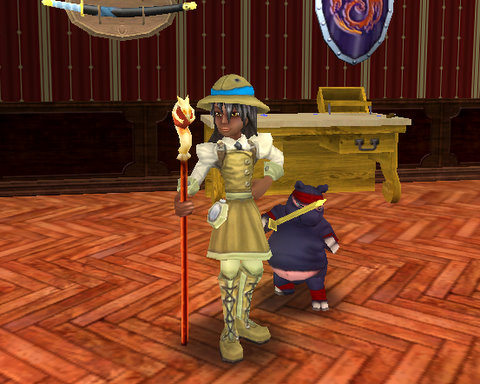
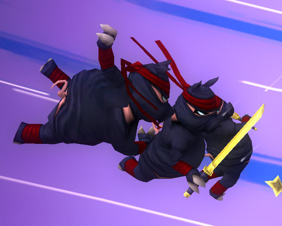

Back to: [West Karana](/posts/westkarana.md) > [2010](/posts/2010/westkarana.md) > [August](./westkarana.md)
# Wizard101: It's all about the Ninja Pig

*Posted by Tipa on 2010-08-23 22:49:33*

My friend Michael Stormpyre and I were farming for grandmaster gear the other night. I was on my myth wizard, Marissa Spiritcaller, and I was getting a little frustrated by the awful nature of the higher level myth spells. My Minotaur and Orthrus spells did a trap-destroying weak attack before the now-debuffed main attack. Setting up an attack required casting two myth traps, two feints and so on, so that, having wasted traps on the weak hit, I would still have some left over for the main damage. Otherwise, I would be very lucky to break 1K damage on blades alone.

You can't farm effectively on 1K damage, not in Dragonspyre, not even after the general hit point nerf meant to make DS more tolerable. I tend to run a very lean deck. For farming, nine or ten cards in the main deck, plus whatever ends up in the sideboard, is all I want.

What I really wanted was a ninja pig.

You get them occasionally as treasure cards; five pip myth spells that do 650 points of base damage in one attack. Since this attack doesn't waste traps, you can easily buff it up to 3K or more if you have a balance wizard helping (which I do). For a two mob fight like Yeva or Snowcrusher, I could eat the weak add with an Orthrus and still have fun with the boss.

Treasure cards are kind of hard to come by, and the good ones are never so common that you would be able to use them as a matter of course.

|  |  |
| --- | --- |
| 

 | 
 |

Then, I remembered The Hat.

The Wayfinder Hat, found at the top of the tower in Marleybone that is the prequest to Celestia. The Wayfinder Hat is part of the Wayfinder collection, which also includes a Uniform and Boots. In the top picture, Marissa wears the entire set. The only notable aspect of any of the pieces is the hat -- which comes with a Ninja Pig card.

Salvation.

I excused myself for a moment, ported home, got the hat and returned. I slimmed down my deck even more so that I would be certain to draw the ninja pig from the sideboard during any given fight.

The rest of the night was spent buffing up the ninja pig and debuffing the mob, and the pigs flew again and again and again. They were so effective that I decided to pack away the grandmaster hat, and use the pig hat. Sure, it's missing some stats... but the added damage MORE than makes up for it.

Solo, myth wizards are fairly powerful, due largely to our golem minion -- the first one we get. For zero pips to summon, a golem minion is the gift that keeps on giving, pumping out those 1-pip monsters turn after turn. Beats wand attacks seven ways from Sunday. But in groups, setting up a Minotaur or an Orthrus takes too long. By the time we have double traps all set, the other wizards in the group have killed the boss, all the adds, and wonder why we never bothered to cast a spell.

Well, because our best direct damage spell is Cyclops -- or Humungofrog, if we're facing a group. It's really embarrassing to see everyone unleash their scarecrows and dragons and ice gods and whatever, and then we pop Orthrus and it does 150 points on the first hit (as it swallows the traps) and then follows it up with a 1K kiss good night. And now all the other wizards are angry because we ate their feints.

So, Myth wizards... learn to love the pigs. They love you!

Michael said afterward that he just knew he'd be dreaming about Ninja Pigs. So, Michael, this one's for you.

## Comments!

**Noffin** writes: Ninja PIG!!!! And I agree our fights went along alot quicker now. Now I just need to get one of those hats ;-)

---

**[Mojeaux](http://yetanothergamingblog.wordpress.com/)** writes: Hmmm... that piggy reminds me of Chris Farley for some reason... didn't he play a Ninja in one of his movies?

---

**[Tipa](https://chasingdings.com)** writes: Maybe even all of them! In a sense....

---

**Noffin** writes: Beverly Hills Ninja!! Ok got my hat now just need to finish Briskbreeze Tower uggh (

---

