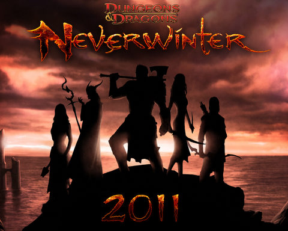

Back to: [West Karana](/posts/westkarana.md) > [2010](/posts/2010/westkarana.md) > [August](./westkarana.md)
# OMG! It's Neverwinter!

*Posted by Tipa on 2010-08-25 07:10:07*

I find, these days, that I don't make that much of a distinction between online RPGs -- even Massive ones -- and offline, single player RPGs. The only real difference is who I am playing with. Offline ones, I tend to chat with people about the game as I play on Twitter or somewhat slowly via this blog. Online, I chat with people about the game in game.

The experience, though, is the same. My character truculently departs the city to fight some awful mean thingies and then returns victoriously with the heads of the bloody beasts raised high. If they have heads.

I'm all about the RPG. Give me a world that needs a hero, and I will be that hero.

When Cryptic announced "[Neverwinter](http://www.playneverwinter.com/)", their new "Online Multiplayer Game" that would NOT be an MMO, but would be more of an open, city zone where parties would gather prior to leaving for an instanced adventure, my first thought was not "why isn't Neverwinter an MMO?" but, "how is this not Turbine's Dungeons & Dragons Online" followed by "so, how is DDO an MMO if Neverwinter is not?"

I'm not a big fan of MMOs. I love the concept of an immersive world of adventure, don't get me wrong. I like classes and leveling and all that. I even like quests. But what I don't like is the implicit assumption that I will want to devote hundreds of hours to this game, because I know that I will probably grow bored with your MMO long before the end. Very few MMOs of the dozens I've played have grabbed me enough to make me work for max level. EverQuest, EverQuest II, World of Warcraft, Wizard101 and Star Trek Online.

And look, there's a Cryptic title, right there at the end. Star Trek Online.

Some call it a failure, but every time I log in, I geek out with the "OMG I'M IN STAR TREK!". Cryptic nailed the look and feel of the universe perfectly. I may quibble about how they can't give with one hand without taking away with the other (was there REALLY a reason to weaken my Vice Admiral-level Intrepid refit compared to my Rear Admiral-level Luna?). I may want more story missions and better Klingon support. But I can't fault their ability to make a world.

Neverwinter sounds like the sort of game I'll really like. Quick, session-based play. A world that I've played in through Neverwinter Nights and its sequel. Likely not going to use that weird camera that ruined NWN2 for me, but will use the very good camera they have for Champions Online and STO. I do hope the rooms will be less cavernous than those used in their previous two MMOs. The original EverQuest could support small rooms without any trouble, why can't Cryptic's MMOs?

I digress. I'm excited for Neverwinter. It's going to have player generated content from the beginning, which means my static Sunday night group, currently in DDO as we wait for Diablo III, could possibly end up running an adventure that one of us creates.

I'm so totally THERE. So buzz off, haters. It's a great concept and I think Cryptic has a shot at making something we'll want to play.

## Comments!

**[RankNVile](http://ranknvile.wordpress.com/)** writes: Here, Here

I approve of NWN as a co-op online RPG. Thanks Cryptic.

---

**[MMOGamerchick](http://mmogamerchick.wordpress.com)** writes: Yeah I'm excited for this too. I wish Cryptic the best of luck, I know they can pull off a decent game if given enough time.

---

**[Jomu](http://www.justonemoreunlock.blogspot.com)** writes: i'm excited too; cautious about Cryptic making it, ill just do alot of research, but will probably still give it a try for a month or two; we'll play together :D

---

**[Neverwinter, an MMO minus one M | Multiplaying](http://www.multiplaying.net/2010/08/25/neverwinter-an-mmo-minus-one-m/)** writes: [...] and Tipa says, Neverwinter sounds like the sort of game I’ll really like. Quick, session-based play. A world that I’ve played in through Neverwinter Nights and its sequel. Likely not going to use that weird camera that ruined NWN2 for me, but will use the very good camera they have for Champions Online and STO. I do hope the rooms will be less cavernous than those used in their previous two MMOs. The original EverQuest could support small rooms without any trouble, why can’t Cryptic’s MMOs? [...]

---

**[The Best Of The Rest: Crocodile Dundee Edition | We Fly Spitfires - MMORPG Blog](http://blog.weflyspitfires.com/2010/08/29/the-best-of-the-rest-crocodile-dundee-edition/)** writes: [...] Tipa is excited about the new Neverwinter ‘MMO’. [...]

---

**[almagill](http://gudeman.co.uk)** writes: A Neverwinter MMO.... I've only been waiting for this since, well, the first time I played Neverwinter and thought "what this needs is more people..."

---

