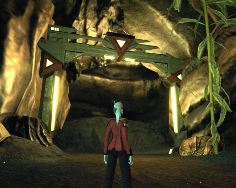

Back to: [West Karana](/posts/westkarana.md) > [2010](/posts/2010/westkarana.md) > [August](./westkarana.md)
# Star Trek Online: A Light in the Dark (spoilers)

*Posted by Tipa on 2010-08-26 23:01:21*

Where does this portal lead? It's a mystery -- but let's back up a bit.

The USS Monterey has her regular patrol -- exploring the expanses of the B'Tran Cluster to keep the systems closest to Borg space safe, the occasional mission for the Federation Diplomatic Corp, helping out on any fleet actions that may arise. This is the bread and butter of life in Starfleet. But on occasion, some brass with shiny medals plastered up and down their uniform sends an encoded transmission for My Eyes Only, and then we're off, and these entries in my Captain's Log are all the record there ever will be outside of the locked corridors in Starbase 01.

Our last expedition into fluidic space was a failure. The Undine are no more willing to talk to us on their own turf than they are when they find themselves in baryonic space -- our reality. We did gain some allies in the fluidic realm, masters of vast, living ships. While we appreciate friends where we find them, we must find a way to make peace with the Undine so that they will stop attacking our fleets and concentrate their attacks on the Borg.

The Borg are the ultimate threat. Reviewing Janeway's logs from the USS Voyager, I can't help wonder how she could have had several opportunities to defeat the Borg forever, and at each point, backed off from the final blow. Every time she showed mercy, how many billions more died or were assimilated as a result? And now, they are at our doorsteps, killing us all. If it were up to me, I would take that final step and save the galaxy.

Starfleet has summoned the Monterey to an obscure system in the Pelia sector. There, a fleet stands ready to respond to any new incursions from fluidic space. There also is a most unexpected ally -- a telepath from a race unknown to me, Celestara Mex -- who believes she can make contact with the Undine and explain to them just how friendly we are, if they only knew us.

I call my first officer into my ready room and ask her, rhetorically, how the Undine could have made an exact duplicate of Starfleet HQ, worked itself into leadership positions in the Federation, Romulan and Klingon factions, and fought us again and again without coming to know us as well as we know ourselves? Commander Dylla said nothing. She will go far in this Starfleet. She knows when to shut up, a trait rare among we Andorians.

We prepare the ship for transition to the fluidic realm, and follow Celestara's ship, the Seleya, through the portal. Navigation in fluidic space is a strange affair. We have never been able to analyze the liquid through which we glide. It is absolutely and utterly clear -- if there were even the slightest impurity, we could not see at all. The impurities tend to clump into massive, continent-sized globules that form the base for what life exists here. It is toward one of those that the Seleya swims. The Monterey follows as best she can.

Celestara Mex soon makes contact with the Undine. They return her greetings with weapons fire. We fight back as best as we can, but eventually the Undine overrun the Seleya and capture the survivors. We get a telepathic message from Celestara that resonates in every mind on the Monterey. She is being held nearby... but she is in great danger.

We follow her message to a strange base growing from one of the immense globs of semi-solid fluid that dot this realm.

With some trepidation, I form an away team. We meet at Transporter Room #2 and beam down at once.

Commander Longasc graciously consents to serve as tactical officer. Also on the away team are Commanders Sryn and Karas, and Dr. Maph is on hand representing the Science division.

It is our first experience moving about in fluidic space without the Monterey around us. The experience seems exactly the same as moving against a stout wind blowing from all directions. The gravity is unexpectedly strong; the mass of this clump alone can not account for it. Clearly, there is much we don't know about this realm. Our 2mm dynamic force field modules keep us protected from whatever harmful effects the fluid might have, but we will have to keep an eye on our shield generators. We do not expect to go long without being attacked.

Celestara Mex and three survivors of her crew are being held in semi-biotic cells; each are well-protected by an Undine squad, but they are dispatched without much trouble. The Undine have apparently not learned how to defend themselves against circle strafing and flanking damage. To their short-lived chagrin, no doubt.

When we rescue Celestara, she says she has psychically discovered the source of the Undine's anger. We follow her to an alien portal -- into normal space. 

We are immediately attacked by another Undine patrol, this one led by a powerful Undine captain, who screams angrily at us for attempting to invade his race's home via portals like the one before us. He won't accept that this technology is well beyond Starfleet's capabilities, nor that our only desire is peace and alliance. He meets all attempts at diplomacy with threats and violence. Battle ensues, and we defend ourselves.

Celestara Mex probes the gateway. She sees nothing but darkness and evil, an ancient threat, and a single word: "Iconian".

We must close this portal. Commander Karas sets the controls to overload; we beam to the Monterey and flee for normal space as, behind us, the base and its portal implodes, leaving dark eddies in our wake.

Iconians? As if the Undine, the Borg, the Romulans, the Klingons, the Hirogen and all the other races against us weren't enough. Sometimes I just want to point the Monterey toward the edge of the galaxy and peek outside it. It can't be any worse out there than in here.

