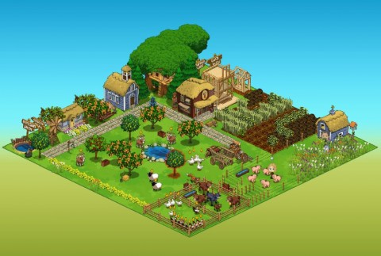

Back to: [West Karana](/posts/westkarana.md) > [2010](/posts/2010/westkarana.md) > [August](./westkarana.md)
# Thoughts on the social gaming explosion

*Posted by Tipa on 2010-08-27 18:52:43*

I quit Frontierville tonight. No big deal. I ended up playing it a lot longer than I thought I would, actually. I got to a point in FV where I'd just log in once in the morning and once again at night, harvest stuff, visit neighbors, see what folks were up to. Some people arranged their homesteads so that they just had mass herds of animals that they'd tend to; otherwise made gigantic farms; some folks just tried to make their homestead a pleasant looking place. There clearly could be a lot of creativity in the way the farms were laid out, and Zynga holds frequent contests to find the most innovative designs.

I was surprised to discover just how like an MMO Frontierville was. You level. You do quests. You group together with friends to do large tasks, but there's plenty to do on your own. And it never, ever ends. I'd like to say the only real difference would be the begging from your friends for help, but ... go listen to the general chat of any MMO out there. You'll hear that same thing.

It's not a mystery to me now why Richard Garriott is looking toward social gaming as the future. If a decent social game can keep someone hooked for a couple months, and a great one perhaps half a year, then you can make an entirely new game from scratch every six months and just ride the money wave. Such a quick develop/release cycle means you really have the chance to innovate and iterate -- a potent combination that could quickly move social gaming in directions we wouldn't expect from the glut of Farmville clones and city building sims that glut the genre.

Likely the most odious thing about these social games is the implied requirement to get lots of people helping you. I've seen people who must have fifty or a hundred people helping them; the forums for these games are jam packed with people begging for additional friends to help them along.

Play a few games that had you adding a couple hundred strangers to your friends list in order to progress, and Facebook will be useless for anything else, to you. Having quit Frontierville, I need to go through and unfriend people I only friended for that. But, they all seem like such NICE people, and why can't we be friends? And so I probably won't.

The example of All Points Bulletin, which blew $100 million on a game that lasted a month, shows only that when you fail on an MMO, you fail HARD. You could make hundreds of social games for that much money, and turn them out much faster.

With so many MMOs coming out these days, I'm feeling a little numb. Assaulted by screen shots; I can't remember the details from one to the other. I cling to a few high profile releases and no longer blithely install every F2P that comes my way.

A sheer overload of social games will do the same for the Facebook generation. There's only so many farms you can build, after all, and your friends won't follow you to every game you'd like to try.

So. I finished with Frontierville, Kingdoms of Camelot, Virtual Villagers and My Empire. Office Heroes will hit the paper shredder once I see if anything special happens when I hit max rep. City of Wonders has the rest of the weekend while I write an article about it. Then I'll be looking for something new, an RPG, perhaps.

If this is the future, I want to be a part of it.

*To answer my own question: Nothing special happens when you get to max rep in Office Heroes.*
## Comments!

**[Pete S](http://dragonchasers.com)** writes: They gotta get past the viral stuff. Or at least, shoving the viral stuff down our throats.

I was so sad to see Brenda Brathwaite announce that the company she's now working for (Lolapps) released their newest game on Facebook and ... it was yet another "island" game. Critter Island. I followed her link, looked at the game and just couldn't bring myself to even try it. Some coverage on casual gaming sites tell me it's very similar to other 'resort island' games. You build bars and other attractions and tourists arrive at your dock and start visiting and generating cash so you can buy more attractions. Add friends to expand your island or something.

But I feel like there is something here, but either we haven't found it yet, or no one has made it yet. But at some point someone needs to move past the point where a game's #1 purpose is just to force it's players to get their friends to play.

How about someone makes a game where our friends come to play because they hear how much fun we're having!?

---

**[Tipa](https://chasingdings.com)** writes: Take a look at Treasure Abyss; I sent you an invite.

---

**[Pete S](http://dragonchasers.com)** writes: OK that's pretty fun. :)

---

**[spinks](http://www.spinksville.com)** writes: When you put it like this, blogging is a sort of social game. You make a character (blog) and update it (semi) regularly. You can give gifts to other players by leaving messages on their blogs or linking to them. etc etc.

I think the feature that facebook is missing is some ability for people to mark whether they're interested in gaming messages, or some way for you to make a sublist of 'gaming friends' which could cover all the people in whom your only interest is to play social games. Aside from the fact I hate FB, the big thing stopping me playing these things is not wanting to spam all my friends and also knowing that means I'll never really get very far in the game unless I do.

---

**[Tipa](https://chasingdings.com)** writes: There's other kinds of social games out there that try for a different metaphor. I'm no fan of the spam your friends game, either -- and I quit FV largely because of that. Treasure Abyss seems to change that up a lot, though they may get more spammy as they go through the development process. 

I am now convinced there is a future for social gaming, but we are not there yet.

---

**[Pete S](http://dragonchasers.com)** writes: Spinks, the most frustrating thing is they took some steps in the (very smart) directions you suggest. You CAN make lists of friends. But using those lists is a cumbersome pain in the behind. Every time a game wants to post a message you have to select an option to send it only to some people, then enter in the name of the list (I mean, type it in), then search for that least to choose it, and then you can send the spam just to people who want to get it. Considering how often these games spam that gets infuriating pretty quickly... I don't know why they don't just let you set a specific list for each game. That'd make things SO much better for everyone.

Actually I do know why they make it so hard... the WANT the spam so the games will spread virally.

On the flip side, you can block getting notifications from a particular application, but it'd be nice if they just let you say "Block all game spam."

But again, their focus isn't on the convenience of the users; it's on the desires of the app publishers (and on FB itself, since they're trying to get games to use Facebook Credits as currency, so FB gets a cut of any RMT that goes on).

Sadly FB has such a chokehold on the market they don't have to give much thought to whether or not they're pissing people off...

---

**[spinks](http://www.spinksville.com)** writes: Huh, they have lists in FB, I never knew :)

Tipa, I do think you're right in that these things have a huge future. And it will be seen as part of the big continuum that includes MMOs as one stage. I also play a couple of pre-FB web games (not sure if we count them as social games or not, but they both depend heavily on massive numbers of users -- hattrick and HSX). I think they'd be examples of a different type of social game. But really just about every one I tried on FB did go for a spam your friends mechanic.

---

**[FrontierVille and social games are like MMOs](http://tamibaribeau.com/?p=130)** writes: [...] (Source: Tipa of West Karana fame) [...]

---

