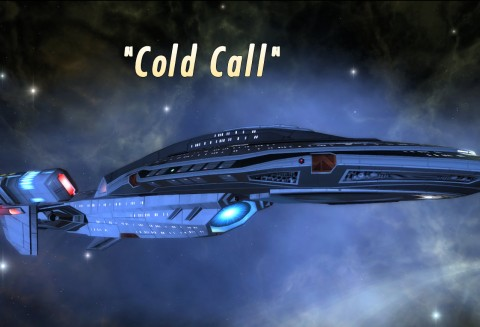
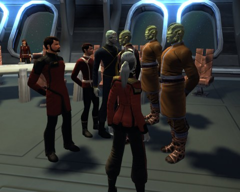

Back to: [West Karana](/posts/westkarana.md) > [2010](/posts/2010/westkarana.md) > [August](./westkarana.md)
# Star Trek Online: Cold Call (spoilers)

*Posted by Tipa on 2010-08-29 08:45:09*

"Cold Call" is the first of Star Trek Online's "[Feature Episodes](http://startrekonline.com/feature_episodes)". The first series deal with those cryo-suited Alpha Quadrant villains, the [Breen](http://memory-alpha.org/wiki/Breen). Staying more or less out of galactic affairs after their defeat along with the rest of their allies at the close of the Dominion War, they have returned.

Those Federation diplomats who negotiated a treaty between the Ferengi, the Rigelians and the Deferans in the Starbase 39/Sierra diplomacy mission may remember Ambassador Surah as the Deferen Ambassador. Klingons will be reminded of an ancient pact between the Klingons and the Deferens where the Klingons promised aid when asked -- that time has come. Though simply knowing that they would face the Breen would be reason enough for the Klingons to show.

A few years back, the orbital Hubble telescope pointed itself at a very small portion of the sky where there were no visible stars. In just that narrow slice of space's darkest sky, it found [clear pictures of 1500 galaxies](http://hubblesite.org/newscenter/archive/releases/1996/01/image/a/). 

Yesterday, gathered outside the Orellian Sector Block in Beta Ursae, you could see dozens of Galaxy-class cruisers any direction you looked. From the number of 50 person instances created at least 600 Federation captains were waiting to take part, along with an unknown number of Klingons.

The Federation News Service was there, along with some new allies; five Vice Admirals with the mission difficulty set to "elite". We'd come to regret that.

The episode was delayed a few minutes, much to the jeers of the people on the test channel. The call finally came; each ship received a transmission giving us permission to warp. Warp we did, and we descended upon the Deferan system like pigeons to a stale crust of bread.

Ambassador Surah greeted us from aboard his ship, the Jeska. He thanked us kindly for coming to his call; reports of unusual ships had made him uneasy about returning to Defera, and wondered if we might escort him to his home world.

Five Federation ships of the line accompanied him from the fringes of the system to orbit around the planet. Just at the end, sensors picked up the momentary traces of an alien ship -- a Breen ship. It warped away before we could respond, and its warp trail was masked so we couldn't follow.

Surah beamed down to the surface, and invited us to enjoy the hospitality of the capital city, at our convenience.

Defera is a beautiful world, full of life and activity. The Deferan people welcomed the unexpected transport of five of the Federation's finest. We even found a Ferengi selling odds and ends. For a peoples that had only recently started venturing beyond their home planet, Defera was remarkably high tech. They seem to have found a perfect balance between technology and nature.

We joined the ambassador in the main square. He began to tell us of the recently excavated ruins nearby, which showed signs of being artifacts of the [Preservers](http://memory-alpha.org/wiki/Preservers), an ancient race which distributed humanoid life throughout the galaxy and may have been [the distant ancestors of us all](http://memory-alpha.org/wiki/The_Chase_(episode)). 

His story was interrupted by a surprise Breen attack on the city. (Since this was on elite mode, I died instantly). We regrouped and fought the Breen throughout the city, finally pinning them down in the ruins outside the city, where we fought and defeated the Breen commander atop an ancient pyramid.

The pyramid is also the site of an ancient Preserver puzzle, which was puzzled out by FNS Senior Editor Longasc, and described in [his separate pull-out photo section](http://picasaweb.google.com/Longascimages/StarTrekOnlineS2E01ColdCall#5510637274654893794). The puzzle appears to be part of a longer holographic message; perhaps the other pieces will be found on other episodes in this series.

Ambassador Surah realizes it is not safe for him to remain on the planet, and returns to the Jeska to make his way to a better location. Before he leaves, he calls the fleet captains together and explains to us that he knows he should have told us about the Preserver artifacts ahead of time, so we could have become better prepared. He gives us the freedom of the planet and offers daily missions in the area if we have the time or inclination.

(The Klingons don't get this last scene).

We took our leave and went to do the new Deferan dailies. Unsurprisingly, they all dealt with protecting the sector against Breen attacks. Their cryo-based attacks were particularly devastating, leading many Federation captains wondering when they'd get cryo weapons for their own ships.

My ship, the USS Monterey, is furthest in the screenshot. Longasc's Excelsior-class ship, the USS Amgarrak, is next; Thumupp's escort, the USS Columbia, is closest.

The mission was so much fun, Longasc and I logged to our Klingon characters and did the whole thing over again!

"Cold Call" was a fantastic success. Player reaction on the forums has been very positive, aside from the usual trolls who don't like anything. I am very much looking forward to next week's episode, "Out in the Cold".

> While searching for a lost ship, the crew uncovers a plot to enslave the Deferi people.

Well, we can't allow that, now, can we?

## Comments!

**[Adventurer Historian](http://combat-archaeology.net/)** writes: It's a shame I'm not higher level, otherwise I'd love to come along on your daily patrols. One of these days!

I really enjoyed the mission - this is one of the first/one of the few missions I've played that has really felt like a Star Trek episode, even down to the 'down time' and the opening screen crawl (good catch with the screen capture, by the way!).

---

**[STO: You Can Cold Call Me Anytime &laquo; MMO Gamer Chick](http://mmogamerchick.wordpress.com/2010/08/30/sto-you-can-cold-call-me-anytime/)** writes: [...] out with something awesome. And the first ever feature weekly episode, “Cold Call” (detailed wonderfully over at West Karana), which debuted Saturday was an [...]

---

**[Star Trek Online: Out in the Cold (spoilers) - West Karana](https://chasingdings.com/index.php/2010/09/04/star-trek-online-out-in-the-cold-spoilers/)** writes: [...] last week’s episode, “Cold Call“, we were introduced to the Deferans, a race that believes in balance in all things. They, [...]

---

