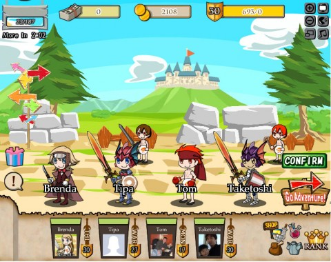

Back to: [West Karana](/posts/westkarana.md) > [2010](/posts/2010/westkarana.md) > [August](./westkarana.md)
# Treasure Abyss: Not your ordinary social game

*Posted by Tipa on 2010-08-31 07:07:29*

I thought I would never find a game on Facebook that tied together social gaming and RPGs. This whole experiment with Facebook games has typically been one spam-filled sim game after another. Frontierville, City of Wonder, My Empire, Virtual Villagers -- all share the same half-hearted copying of better single player games combined with a financial urge to turn the player into a whining beggar who is a burden on their friends.

If that's all "social gaming" is, then I don't care how much money Zynga is making, it's a dead genre before it's even fully born. Creatively dead, anyway. Even the most patient and enthusiastic player has to get bored with yet another sim at some point.

I asked Twitter if there were any actual, honest to God RPGs on Facebook, and @Caffo sent me a link to Namco Bandai's [Treasure Abyss](http://www.facebook.com/apps/application.php?id=110417579004579).

If you've ever tried to get a guild group together in a traditional MMO, you know how tough it is to get all your friends online at the same time, and also wanting to do the dungeons you need. Wouldn't it be so much easier if you could just hire their offline characters as NPC hirelings?

That's the concept behind Treasure Abyss. You form a four person party from you and three friends, then head into dungeons, kill everything you see, loot treasure, repeat. Every fight, the character with the most kills gets a "MVP" award, which gives them gold the next time they log in.

You start out as a generic warrior. After a short tutorial, you come to the main party selection screen, where you can customize your character as often as you like. You also can choose among the friends who play. There doesn't seem to be any penalty at the moment for grouping your level 1 character with level 30 friends, so go for it.

Your profession -- warrior, wizard, thief or monk -- is determined by the weapon you wield. Everyone starts out as a warrior. In the first dungeon, you will find the materials with which to make wizard staffs. In the second, you'll find hand stones; you'll make thief knives from those. The third dungeon hides fist stones that make certain monk weapons.

Alchemy is crafting in Treasure Abyss. All items looted are alchemy components. You can only make weapons and bits of candle at the moment, though. Armor, shields and headgear are bought at the store for in-game gold. The only cash item so far are candles.

Candles are the resource that keeps you from playing as much as you like. Each step you take in a dungeon reduces your candlepower by three. When it reaches zero, the dungeon goes dark, and any monsters you stumble into will become nearly impossible to hit. You, though, will become much easier to hit. Sufficiently strong characters will be able to continue on even in the dark, though you'll need at least a smidgen of candle in order to descend to deeper levels.

The game is in beta, and it must be an early beta at that. There's only three dungeons; some of the crafted weapons are apparently impossible to craft; the cash shop isn't open; it takes far too long for beginning players to earn enough gold to buy even the most basic armor. The game isn't 100% there yet.

But even in this early stage, Treasure Abyss has given me more RPG-style enjoyment than I'd any right to expect on Facebook.

## Comments!

**[Pete S](http://dragonchasers.com)** writes: My biggest gripe with the game was the loading times. Hope they can speed that up.

I had you in my party and you were a ton of levels higher than me (very embarrassing, you in your armor and me in a Namco Diaper - I think I might be one of the characters in the background in your screen shot) and we could do OK in the dark since you were tanking well. If a mob got loose from you and came after me (I was a mage) I'd die pretty quick.

Ironically, this is the first game where I've had my wallet out ready to spend money...and the cash shop wasn't open yet!

---

**Noffin** writes: Game reminds me of FATE without getting to add more players.

---

**Banayd (Ken)** writes: Hey Tipa ... HUGS !!!
Have you reviewed any IPhone apps at all dear?

Banayd (Ken)

---

**[Tipa](https://chasingdings.com)** writes: The loading times have substantially improved! Also, there is now another item in the cash shop, but still no way to buy it.

---

**[Eliot](http://www.massively.com/bloggers/eliot-lefebvre)** writes: And now I'm going to have to try this simply because it sounds surprisingly like an actual game on Facebook.

Between this and Recettear, someone owes you money for advertising.

---

**[Capn John](http://capnjohnsblog.blogspot.com/)** writes: Tipa, I've just hit level 13 and I've scraped together enough gold to where I can either buy the Thief's Leather Armor, or the Warrior's Iron Armor. Do you know if one of these classes is more preferable than the other? I've been looking for a Wiki or some sort of FAQ on the game with respect to weapons, classes, etc., and can't seem to find anything. 

Also I have the Thief's Butterfly Knife and the Warrior's White Sword, and the Butterfly Knife adds 23 Str. while the White Sword adds just 20, so I'm thinking I should possibly go the Thief route for now.

Can you offer any tips, advice, etc.?

---

**[Tipa](https://chasingdings.com)** writes: If it was a choice between thief and warrior, go warrior. Warriors have the best damage and the best survivability.

I have tried all four classes, and the only one that approaches the warrior is the monk. The thief and wizard do poor damage and cannot take hits.

---

**[Capn John](http://capnjohnsblog.blogspot.com/)** writes: Cool. Thanks, Tipa. I went with the Warrior and am glad I did. I also realized a 4-wo/man squad is crucial to reducing the grind (both for gold & gear), as is heading into the 2nd Dungeon as soon as you can, likewise the 3rd Dungeon. Of course it helped a lot that I had your avatar in my group :)

---

**[Capn John](http://capnjohnsblog.blogspot.com/)** writes: A new lvl 20+ Dungeon just opened and the level cap has been raised beyond 30 (I just dinged 31 so not sure how high it goes now). With your 30 Monk in my party, plus a couple of other teen level Warriors, I made it to the 6th Floor (which is not the bottom) but needed to use the +50% Potion I got from hitting 7s on the Slot Machine game (new item?). 

When my Lantern ran out and I kept advancing (instead of refilling it) we encountered a Shadow Party, made up of my own team members, and they kicked our Butts. It didn't help that I was already low on health when we ran into them. I'm wielding Flame Tongue and have the Silver Helm & Armor and the 1200g Shield and I still took a beating.

---

**[Treasure Abyss: I got eaten by a grue. - West Karana](https://chasingdings.com/index.php/2010/09/11/treasure-abyss-i-got-eaten-by-a-grue/)** writes: [...] from you and your friends, and battle monsters in a variety of dungeons of increasing difficulty. I wrote a little about it a couple of weeks ago. Since then, it’s been subject to continual balancing and has become a [...]

---

